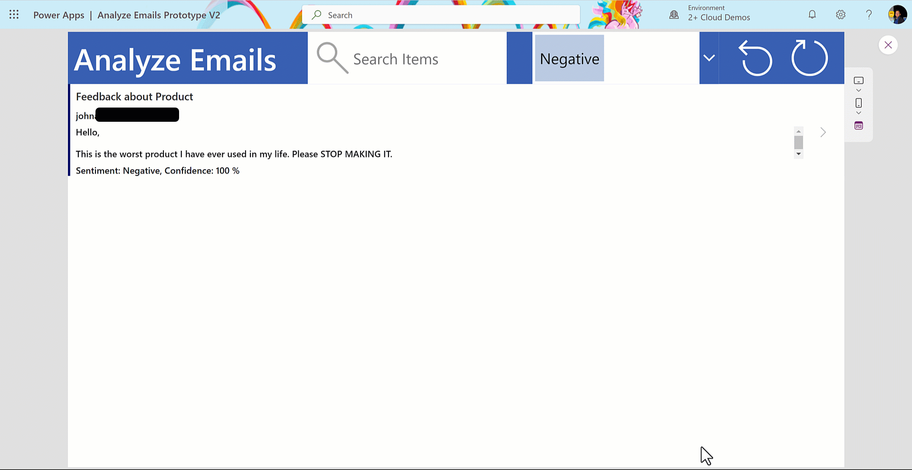
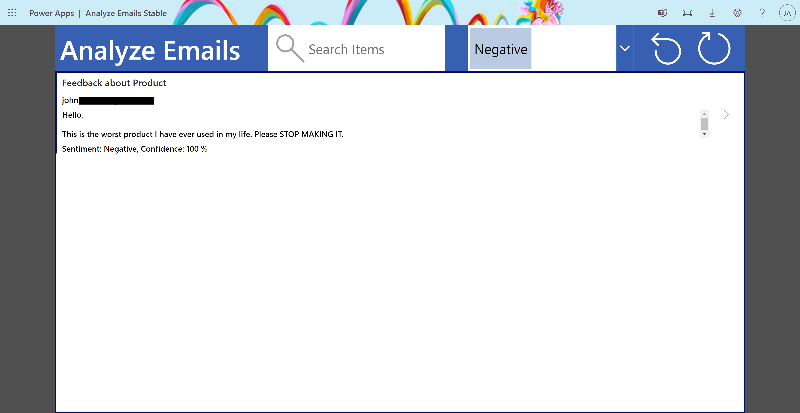
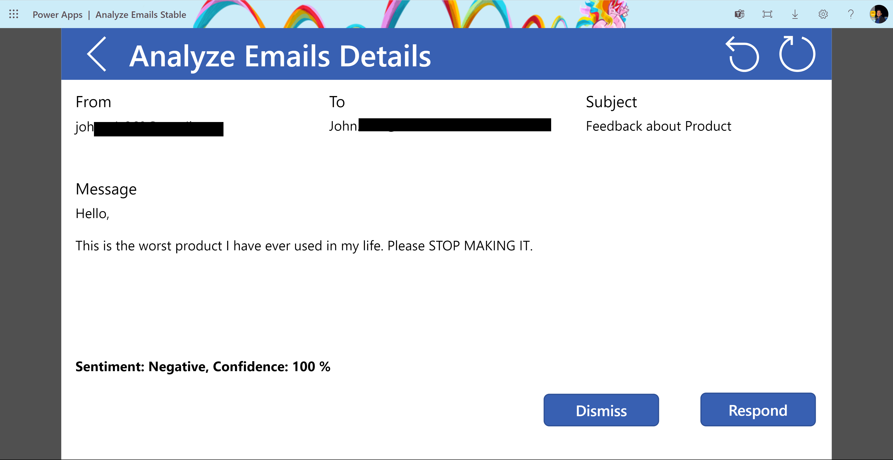
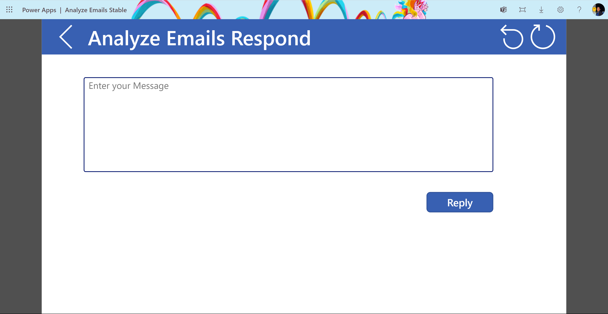

# AnalyzeEmails

## Summary

Sample Solution to analyze the sentiment of emails located in Feedback folder and respond to them using AI Builder.



### Screen 1 - Browse Emails



### Screen 2 - Detailed View



### Screen 3 - Respond to Email



## Applies to

* [Microsoft Power Apps](https://docs.microsoft.com/powerapps/)

## Compatibility


## Authors

Solution|Author(s)
--------|---------
Analyze Emails | [John Aziz](https://github.com/john0isaac) ([@john00isaac](https://twitter.com/john00isaac)), Gold Microsoft Learn Student Ambassador

## Version history

Version|Date|Comments
-------|----|--------
1.0|July 25, 2023|Initial release

## Features

This sample illustrates the following concepts:

* Get unread emails from Outlook using the Office 365 Connector.
* Integrate AI Builder to analyze the Sentiment of emails.
* Filter the emails based on their sentiment.
* Respond to an email from Power Apps.
* Mark an email as read to hide it from Power Apps.

## Prerequisites

* Create a Folder for the emails you want to analyze inside your Outlook and Add Emails to it.
* For the solution to work the folder must be named "Feedback". (Learn more: [here](https://support.microsoft.com/en-us/office/organize-email-by-using-folders-0616c259-4bc1-4f35-807d-61eb59ac79c1))

## Solution Components

The following solution components are used in this sample:

* Analyze Emails (Canvas app)
* SentimentAnalysis model (AI Model)
* Office 365 Outlook (Connection reference)

## Data Sources

No datasource needed.

## Minimal Path to Awesome

* [Download](./solution/AIBuilderPowerAppsAnalyzeEmailsmSample_1_0_0_0.zip) the solution `.zip` from the `solution` folder
* Within **[make.powerapps.com](https://make.powerapps.com)**, import the `.zip` file via **Solutions** > **Import solution** > **Browse** and select the `.zip` file you just downloaded.
* Click next.
* Click on the **Solution Display Name** to open it.
* Click on the **Canvas App** to Open the application in edit mode.
* Click **Allow** to give the Power App permission to access your Outlook emails.
* Click on the **Play** button to test the App.

## Using the Source Code

You can also use the [Power Apps CLI](https://aka.ms/pac/docs) to pack the source code by following these steps::

* Clone the repository to a local drive
* Pack the source files back into `.zip` file:

  ```bash
  pac solution pack --folder pathtosourcefolder --zipfile pathtosolution  --processCanvasApps
  ```

  Making sure to replace `pathtosourcefolder` to point to the path to this sample's `sourcecode` folder, and `pathtosolution` to point to the path of this solution's `.zip` file (located under the `solution` folder)
* Within **[make.powerapps.com](https://make.powerapps.com)**, import the `.zip` file via **Solutions** > **Import solution** > **Browse** and select the `.zip` file you just downloaded.
* Click next.
* Click on the **Solution Display Name** to open it.
* Click on the **Canvas App** to Open the application in edit mode.
* Click **Allow** to give the Power App permission to access your Outlook emails.
* Click on the **Play** button to test the App.

## Disclaimer

**THIS CODE IS PROVIDED *AS IS* WITHOUT WARRANTY OF ANY KIND, EITHER EXPRESS OR IMPLIED, INCLUDING ANY IMPLIED WARRANTIES OF FITNESS FOR A PARTICULAR PURPOSE, MERCHANTABILITY, OR NON-INFRINGEMENT.**

## Help

We do not support samples, but we this community is always willing to help, and we want to improve these samples. We use GitHub to track issues, which makes it easy for  community members to volunteer their time and help resolve issues.

If you encounter any issues while using this sample, you can [create a new issue](https://github.com/pnp/powerapps-samples/issues/new?assignees=&labels=Needs%3A+Triage+%3Amag%3A%2Ctype%3Abug-suspected&template=bug-report.yml&sample=YOURSAMPLENAME&authors=@YOURGITHUBUSERNAME&title=YOURSAMPLENAME%20-%20).

For questions regarding this sample, [create a new question](https://github.com/pnp/powerapps-samples/issues/new?assignees=&labels=Needs%3A+Triage+%3Amag%3A%2Ctype%3Abug-suspected&template=question.yml&sample=YOURSAMPLENAME&authors=@YOURGITHUBUSERNAME&title=YOURSAMPLENAME%20-%20).

Finally, if you have an idea for improvement, [make a suggestion](https://github.com/pnp/powerapps-samples/issues/new?assignees=&labels=Needs%3A+Triage+%3Amag%3A%2Ctype%3Abug-suspected&template=suggestion.yml&sample=YOURSAMPLENAME&authors=@YOURGITHUBUSERNAME&title=YOURSAMPLENAME%20-%20).

## For more information

* [Overview of creating apps in Power Apps](https://docs.microsoft.com/powerapps/maker/)
* [Power Apps canvas apps documentation](https://docs.microsoft.com/en-us/powerapps/maker/canvas-apps/)


