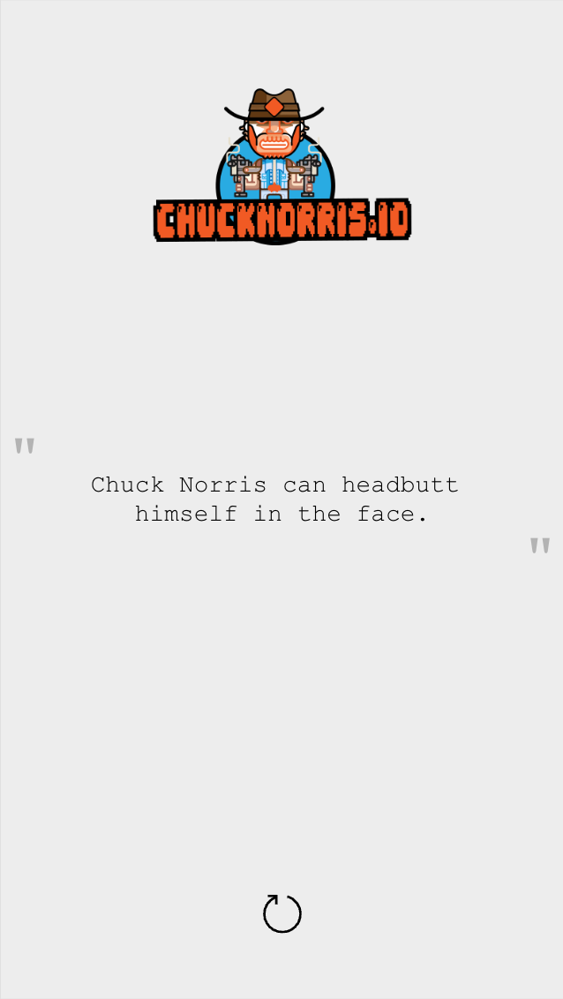

# ChuckNorrisIO

## Summary

This sample illustrates how to get a Chuck Norris joke via the **Chuck Norris IO (IndependentPublisher)** connector.



## Applies to

* [Microsoft Power Apps](https://docs.microsoft.com/powerapps/)

## Compatibility


## Authors

Solution|Author(s)
--------|---------
ChuckNorrisIO | [Daniel Laskewitz](https://github.com/laskewitz) ([@laskewitz](https://twitter.com/laskewitz)), Microsoft

## Version history

Version|Date|Comments
-------|----|--------
1.0|February 2, 2023|Initial release

## Features

This sample illustrates how to get a Chuck Norris joke via the **Chuck Norris IO (IndependentPublisher)** connector.

## Data Sources

* **Chuck Norris IO (IndependentPublisher)**

## Minimal Path to Awesome

* [Download](./solution/ChuckNorrisIO.zip) the `.zip` from the `solution` folder
* Within **Power Apps Studio**, import the solution `.zip` file using **Solutions** > **Import Solution** and select the `.zip` file you just packed.
* Open the app in edit mode and make sure the data source **Chuck Norris IO (IndependentPublisher)** is connected correctly.

## Using the Source Code

You can also use the [Power Apps CLI](https://docs.microsoft.com/powerapps/developer/data-platform/powerapps-cli) to pack the source code by following these steps::

* Clone the repository to a local drive
* Pack the source files back into a solution `.zip` file:
  ```bash
  pac solution pack --zipfile pathtodestinationfile --folder pathtosourcefolder --processCanvasApps
  ```
  Making sure to replace `pathtosourcefolder` to point to the path to this sample's `sourcecode` folder, and `pathtodestinationfile` to point to the path of this solution's `.zip` file (located under the `solution` folder)
* Within **Power Apps Studio**, import the solution `.zip` file using **Solutions** > **Import Solution** and select the `.zip` file you just packed.

## Disclaimer

**THIS CODE IS PROVIDED *AS IS* WITHOUT WARRANTY OF ANY KIND, EITHER EXPRESS OR IMPLIED, INCLUDING ANY IMPLIED WARRANTIES OF FITNESS FOR A PARTICULAR PURPOSE, MERCHANTABILITY, OR NON-INFRINGEMENT.**

## Help

We do not support samples, but we this community is always willing to help, and we want to improve these samples. We use GitHub to track issues, which makes it easy for  community members to volunteer their time and help resolve issues.

If you encounter any issues while using this sample, you can [create a new issue](https://github.com/pnp/powerapps-samples/issues/new?assignees=Laskewitz&labels=Needs%3A+Triage+%3Amag%3A%2Ctype%3Abug-suspected&template=bug-report.yml&sample=ChuckNorrisIO&authors=@Laskewitz&title=ChuckNorrisIO%20-%20).

For questions regarding this sample, [create a new question](https://github.com/pnp/powerapps-samples/issues/new?assignees=Laskewitz&labels=Needs%3A+Triage+%3Amag%3A%2Ctype%3Abug-suspected&template=question.yml&sample=ChuckNorrisIO&authors=@Laskewitz&title=ChuckNorrisIO%20-%20).

Finally, if you have an idea for improvement, [make a suggestion](https://github.com/pnp/powerapps-samples/issues/new?assignees=Laskewitz&labels=Needs%3A+Triage+%3Amag%3A%2Ctype%3Abug-suspected&template=suggestion.yml&sample=ChuckNorrisIO&authors=@Laskewitz&title=ChuckNorrisIO%20-%20).

## For more information

* [Overview of creating apps in Power Apps](https://docs.microsoft.com/powerapps/maker/)
* [Power Apps canvas apps documentation](https://docs.microsoft.com/powerapps/maker/canvas-apps/)


---