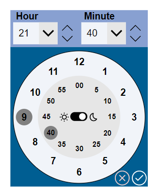
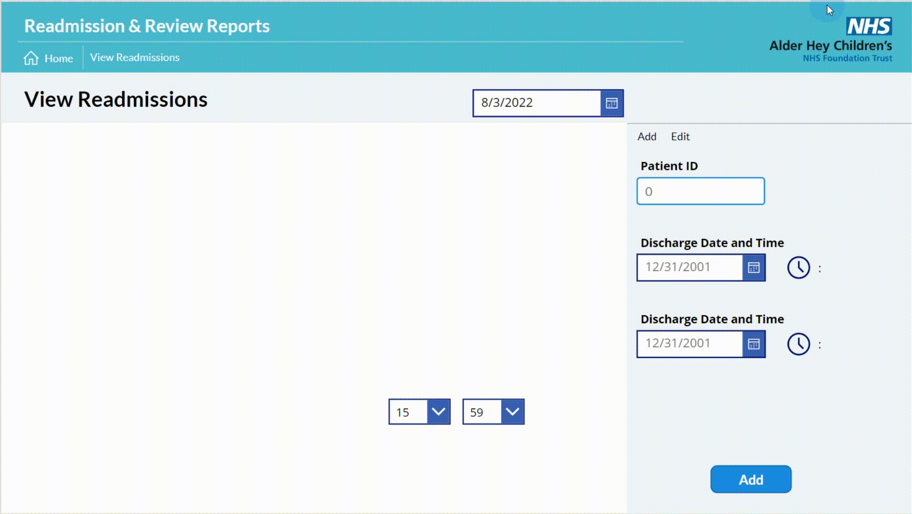

# Calendar Component

## Summary

A re-usable component that allows you to select times through a user friendly and convenient UI.

  
  


## Applies to

* [Microsoft Power Apps](https://docs.microsoft.com/powerapps/)

## Compatibility


## Authors

Solution|Author(s)
--------|---------
Clock Time Picker Component | [Nati Turtledove](https://github.com/NatiTurts) ([@NatiTurts](https://www.twitter.com/NatiTurts) )

## Version history

Version|Date|Comments
-------|----|--------
1.0|Dec 1, 2022|Initial release


## Features

This sample illustrates the following concepts:

* The ability for users to interact with a clock to select a preferred time
* Allowing for users to select a time by clicking on the clock numbers 
* Allowing for users to select a time from the dropdowns
* Allowing for users to select a time by increasing/deacreasing a selected hour and minute
* Allowing for users to select am or pm times
* Save the chosen time through an Output Property
* Reset the times after saved or cleared

## Prerequisites

### Using the component

To use the component in this sample, you'll need to pass the components Output Properties to a local or global variable within the Canvas App.

The component consists of the following Output Properties that can pass through data:
`Hour` - the selected hour in HH format.
`Minute` - the selected minute
`FullTime` - the full time selected in HH:mm format
`AMPM` - the selected Ante/Post Meridiem

The two Input Properties are:
`SaveTime`
`Close`

The pass the selected time from the clock component to a variable within the app, assign a `Set()` or `UpdateContext({})` function to the component Input Property `SaveTime`. When the `Save` button is pressed, the selected time will be passed through and the clock will reset.

When the `Close` button is pressed, the clock will reset.


## Data Sources
 
None

## Minimal Path to Awesome

* [Download](./solution/ClockTimePickerComponent.msapp) the `.msapp` from the `solution` folder
* Use the `.msapp` file using **File** > **Open** > **Browse** within Power Apps Studio.
* Save and Publish

## Using the Source Code

You can also use the [Power Apps CLI](https://docs.microsoft.com/powerapps/developer/data-platform/powerapps-cli) to pack the source code by following these steps::

* Clone the repository to a local drive
* Pack the source files back into `.msapp` file:
  ```bash
  pac canvas pack --sources pathtosourcefolder --msapp pathtomsapp
  ```
  Making sure to replace `pathtosourcefolder` to point to the path to this sample's `sourcecode` folder, and `pathtomsapp` to point to the path of this solution's `.msapp` file (located under the `solution` folder)
* Use the `.msapp` file using **File** > **Open** > **Browse** in Power Apps Studio.

## Disclaimer

**THIS CODE IS PROVIDED *AS IS* WITHOUT WARRANTY OF ANY KIND, EITHER EXPRESS OR IMPLIED, INCLUDING ANY IMPLIED WARRANTIES OF FITNESS FOR A PARTICULAR PURPOSE, MERCHANTABILITY, OR NON-INFRINGEMENT.**


## Support

While we don't support samples, if you encounter any issues while using this sample, you can [create a new issue](https://github.com/pnp/powerapps-samples/issues/new?assignees=&labels=Needs%3A+Triage+%3Amag%3A%2Ctype%3Abug-suspected&template=bug-report.yml&sample=ClockTimePickerComponent&authors=@NatiTurts&title=ClockTimePickerComponent%20-%20).

For questions regarding this sample, [create a new question](https://github.com/pnp/powerapps-samples/issues/new?assignees=&labels=Needs%3A+Triage+%3Amag%3A%2Ctype%3Abug-suspected&template=question.yml&sample=ClockTimePickerComponent&authors=@NatiTurts&title=ClockTimePickerComponent%20-%20).

Finally, if you have an idea for improvement, [make a suggestion](https://github.com/pnp/powerapps-samples/issues/new?assignees=&labels=Needs%3A+Triage+%3Amag%3A%2Ctype%3Abug-suspected&template=suggestion.yml&sample=ClockTimePickerComponent&authors=@NatiTurts&title=ClockTimePickerComponent%20-%20).

## For more information

- [Create a component for canvas apps](https://docs.microsoft.com/powerapps/maker/canvas-apps/create-component#components-in-canvas-apps)
- [Overview of creating apps in Power Apps](https://docs.microsoft.com/powerapps/maker/)
- [Power Apps canvas apps documentation](https://docs.microsoft.com/en-us/powerapps/maker/canvas-apps/)

