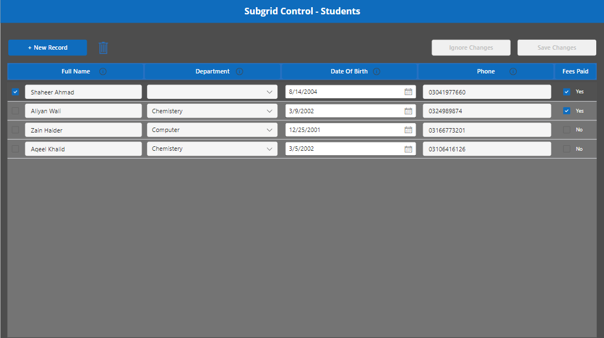

# Editable Subgrid Power App Sample

## Overview

The **Editable Subgrid Power App** sample is a contribution by Shaheer Ahmad (GitHub: shaheerahmadch) that demonstrates how to create a Power App with an editable subgrid, allowing users to efficiently manage and update data within a grid interface. This sample is designed to showcase best practices for building user-friendly and responsive Power Apps.

## Features

- **Editable Subgrid:** The core feature of this Power App sample is an editable subgrid that displays a list of items with editable fields. Users can easily update data directly within the grid, streamlining the data management process.

- **Efficient Data Manipulation:** Users can quickly edit individual fields, which are then updated in real-time without requiring page reloads or additional navigation.

## Usage

1. **Prerequisites:**
   - You need a valid Microsoft Power Apps account to import and use this sample app.
   - Make sure you have the necessary permissions to create and modify Power Apps within your environment.

2. **Import the App:**
   - Download the `.zip` solution file from the soluton folder of this repository.

   - In Power Apps, navigate to "Solutions" and click on "Import"

   - Select the downloaded `.zip` file and follow the on-screen instructions to import the app.

3. **Customize and Extend:**
   - The editable subgrid component can be further customized to match your organization's branding and requirements.
   - You can extend the functionality by adding additional features such as sorting, filtering, or incorporating additional fields.

4. **Deploy and Share:**
   - Once you've configured and customized the app to your satisfaction, you can deploy it to your intended users.
   - Share the app link or provide access to users within your Power Apps environment.

## Feedback and Contributions

Feedback and contributions are welcome! If you encounter issues or have suggestions for improvements, please open an issue on the [GitHub repository](https://github.com/shaheerahmadch/editable-subgrid-powerapp). If you'd like to contribute to the project, feel free to submit a pull request.

For any questions or inquiries, feel free to reach out to Shaheer Ahmad via email (shaheer.ashraf@live.com) or connect on [LinkedIn](https://www.linkedin.com/in/shaheer-ahmad-ch). Your feedback and engagement are highly appreciated!
