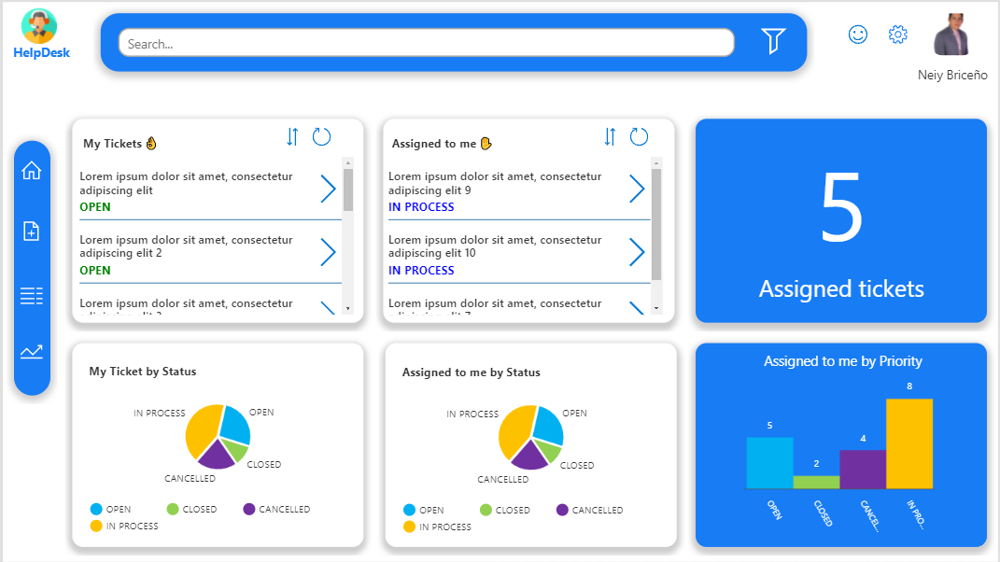
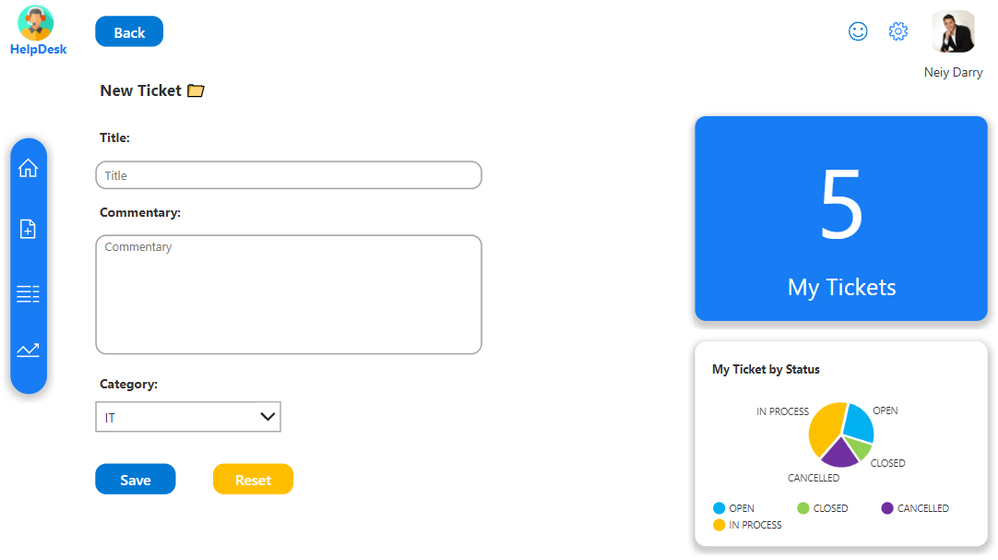
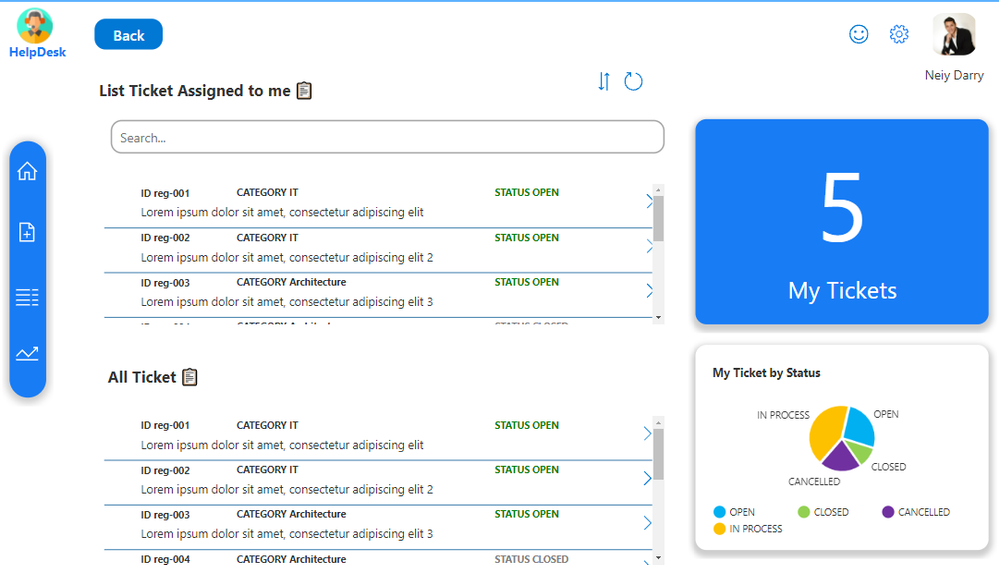
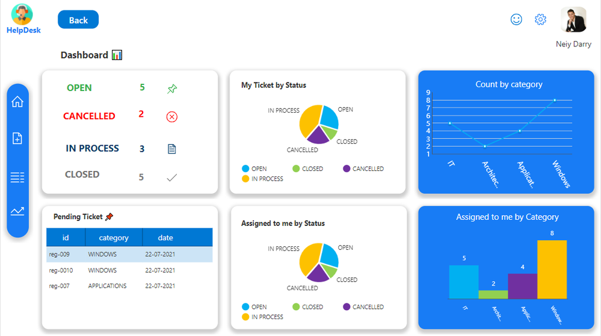

# Template HelpDesk 2021

Beautiful template for HelpDesk applications, inspiration for you.

Advantage:
<ul>
<li>Easy to install</li>
<li>Easy to customize</li>
<li>Interface design time reduction</li>
<li>Higher productivity at work</li>
</ul>

### Screen 1 - Smart panel for users and IT staff

  

### Screen 2 - Ticket creation form and Ticket view.

  

### Screen 3 - List of assigned Tickets and view of all tickets.

  

### Screen 4 - Allows you to see the status of all tickets and also includes smart graphics.

  

## Applies to

* [Microsoft Power Apps](https://docs.microsoft.com/powerapps/)

## Authors

Solution|Author(s)
--------|---------
Template HelpDesk 2021 | [Neiy Darry](https://github.com/neiydarry28) - Email: neiy15@hotmail.com / neiydarry28@gmail.com

## Version history

Version|Date|Comments
-------|----|--------
1.0|Sept 28, 2021|Initial release

## Features

This template includes the following functions:
<ul>
<li>Home - Smart panel for users and IT staff.</li>
<li>New - Ticket creation form and Ticket view.</li>
<li>List - List of assigned Tickets and view of all tickets.</li>
<li>Administrative Panel: Allows you to see the status of all tickets and also includes smart graphics.</li>
</ul>

## Prerequisites

None

## Data Sources

Different collections with sample data.
You can use different data sources and adapt the design to your needs.

## Minimal Path to Awesome

* [Download](./HelpDesk2021.msapp) the `.msapp` from the `solution` folder
* Within **Power Apps Studio**, use the `.msapp` file using **File** > **Open** > **Browse** and select the `.msapp` file you just downloaded.
* Select the **Data** tab
* ...

## Using the Source Code

  You can also use the [Power Apps Source Code tool](https://github.com/microsoft/PowerApps-Language-Tooling) to the code using these steps:

* Clone the repository to a local drive
* Pack the source files back into `.msapp` file:
  * [Power Apps Tooling Usage](https://github.com/microsoft/PowerApps-Language-Tooling)
* Within **Power Apps Studio**, use the `.msapp` file using **File** > **Open** > **Browse** and select the `.msapp` file you just packed.

## Disclaimer

**THIS CODE IS PROVIDED *AS IS* WITHOUT WARRANTY OF ANY KIND, EITHER EXPRESS OR IMPLIED, INCLUDING ANY IMPLIED WARRANTIES OF FITNESS FOR A PARTICULAR PURPOSE, MERCHANTABILITY, OR NON-INFRINGEMENT.**

## Help

We do not support samples, but we this community is always willing to help, and we want to improve these samples. We use GitHub to track issues, which makes it easy for  community members to volunteer their time and help resolve issues.

If you encounter any issues while using this sample, you can [create a new issue](https://github.com/pnp/powerapps-samples/issues/new?assignees=&labels=Needs%3A+Triage+%3Amag%3A%2Ctype%3Abug-suspected&template=bug-report.yml&sample=containers-example&authors=@YOURGITHUBUSERNAME&title=containers-example%20-%20).

For questions regarding this sample, [create a new question](https://github.com/pnp/powerapps-samples/issues/new?assignees=&labels=Needs%3A+Triage+%3Amag%3A%2Ctype%3Abug-suspected&template=question.yml&sample=containers-example&authors=@YOURGITHUBUSERNAME&title=containers-example%20-%20).

Finally, if you have an idea for improvement, [make a suggestion](https://github.com/pnp/powerapps-samples/issues/new?assignees=&labels=Needs%3A+Triage+%3Amag%3A%2Ctype%3Abug-suspected&template=suggestion.yml&sample=containers-example&authors=@YOURGITHUBUSERNAME&title=containers-example%20-%20).

## For more information

- [Overview of creating apps in Power Apps](https://docs.microsoft.com/powerapps/maker/)
- [Power Apps canvas apps documentation](https://docs.microsoft.com/en-us/powerapps/maker/canvas-apps/)

