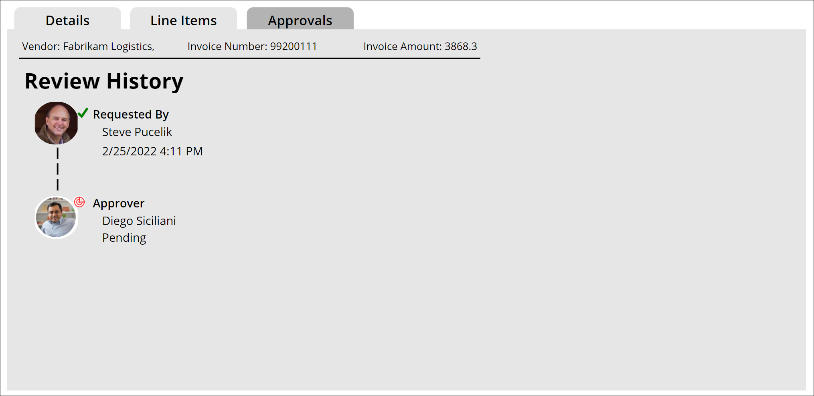
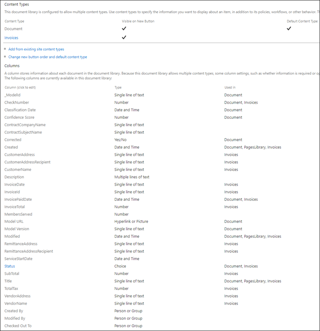
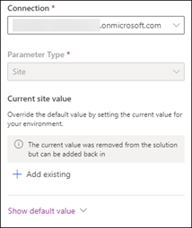
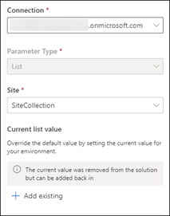
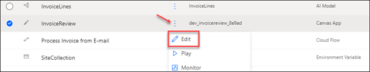
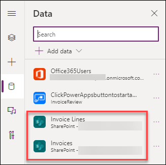

# Invoice Automation using the SharePoint Syntex 

Invoice processing is something that every company does, but many are still doing it manually and is very labor intensive.  Not anymore!  I'll show you how to use the new "Invoice processing template" in SharePoint Syntex to automatically capture invoice header information and save it to a SharePoint document library.  We’ll then use AI Builder to extract the invoice line-item information and save it to a SharePoint List.  Finally, Power Apps will allow you to review and complete the processing so it can be integrated with the accounting LOB application.

## Process Overview
Invoices come in several different ways.  Ideally, they would be electronic, if not most scanners/copiers have integration into SharePoint that makes the capture process easy to accomplish.  Here is a typical process overview for most organizations.

## Invoice Review
Once the metadata has been captured using SharePoint Syntex and AI Builder, PowerApps will display this information to the user in a clean, easy to use format.  Accounts Payable can use this to provide additional accounting information or assign approvers.  It can be easily modified to accommodate your business process.

### Invoice review details

### Invoice review line items

### Invoice approval history

## SharePoint Schema
To get things started, we need to configure out content types and SharePoint information architecture to accommodate capturing the invoice “header” information, typically located at the top that has non-repeating items such as vendor name, invoice number, date due etc.  
We also need a “line items” list to hold each itemized item that has been purchased.  A typical schema should resemble this:

Create the following library and list for this solution:

### Invoices Library

### Invoice Lines List

A few things to keep in mind:

-  There should be a content type created for each list, we’ll need this later when configuring the search experience.  It’s best to do this in the SharePoint Admin Center -> Content Services -> Content Type Gallery and then deploy it to the hub the library/list is in.
-  The relationship between Invoices and Line Items is a 1:many relationship where the InvoiceID column is the SharePoint ID in the Invoices list.

# Solution Assets
The assets for the solution are in the /assets folder.  The .zip file contains the Power Platform components while the Invoices.classifier contains the Invoices prebuilt model that can be deployed to your Content Center.

## Deploy the Power Platform solutions

The invoice automation solution has been packed in a Power Platform solution file (/assets .zip file) that has all the components necessary to properly deploy it in your environment.  This guide will help you configure it properly.
1.	Navigate to Power Automate in your tenant -> Solutions and select the Import button.
2.	Select the .zip file that represents the Invoices solution. Once imported you will see a success message.

## Configure the solution
 Once the solution has been successfully imported, you will see it in the list of Solutions in Power Automate.  Click into the solution and configure the following Environment Variables:
- SiteCollection – select the connection and add the site collection that will contain the Invoices Library and list.

    

- Invoice Library – Select a connection and the library that will contain the invoice documents.

    

- Invoice Lines – Select a connection and the list that will contain the invoice line items.

    

## Configure the Power App

The Power App in the solution has 2 data connections to the Invoices library and Invoice Lines list.  
- Within the solution, Edit the Canvas App

    

- Navigate to the Data Connections tab and delete and re-add the data connections to the Invoices and Invoice Lines objects in SharePoint.

    

- Save and test the app to ensure it’s retrieving the invoice and lines information. 

## Import the Invoices Syntex Model
The pre-built invoices model in Syntex is used to process the header information of the invoice.  The .classifier file should be uploaded to your Syntex content center and then deployed to the Invoices document library.

