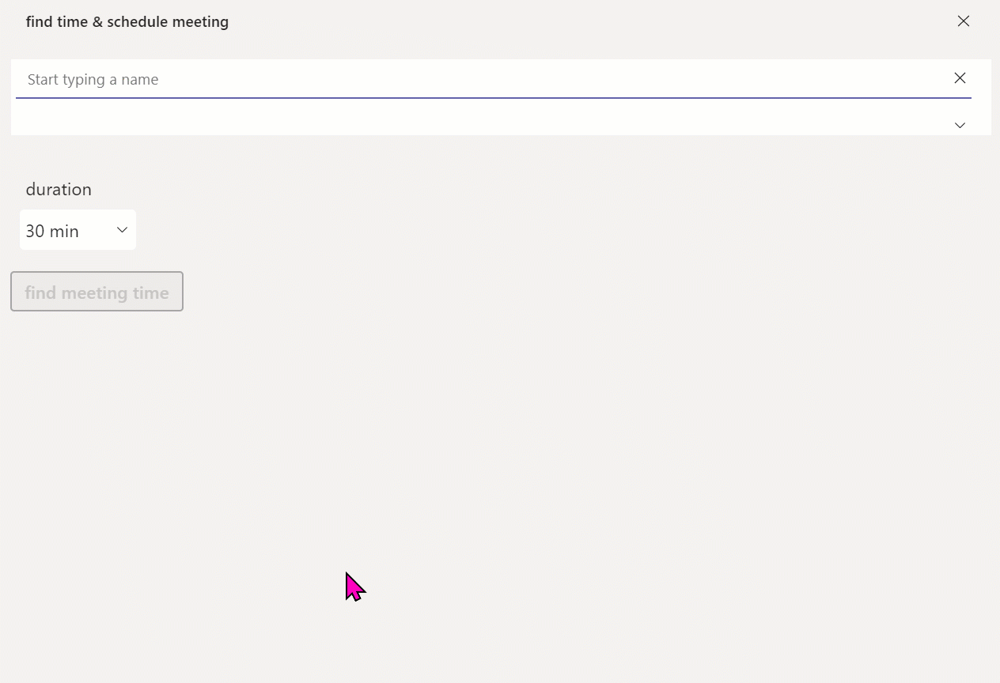

# Microsoft Graph toolkit People Picker

This sample

* provides you with a component library containing
  * a people-picker component
* reflects all styles in Microsoft Teams: default, dark, and high-contrast

## Demo



## Applies to

* [Microsoft Power Apps](https://docs.microsoft.com/powerapps/)

## Compatibility


<!--  -->


<!--  -->

## Authors

Solution|Author(s)
--------|---------
Fluent UI for Teams theme | [Luise Freese](https://github.com/luisefreese) ([@LuiseFreese](https://www.twitter.com/LuiseFreese) )

## Version history

Version|Date|Comments
-------|----|--------
1.0|December 06, 2022 |Initial release

## Minimal Path to Awesome

* [Download](https://github.com/pnp/powerapps-samples/raw/main/samples/fluentui-for-teams-theme/solution/MGT%20components.msapp) the `.msapp` from the [`solution`](https://github.com/pnp/powerapps-samples/tree/main/samples/fluentui-for-teams-theme/solution) folder
* Within **Power Apps Studio**, use the `.msapp` file using **File** > **Open** > **Browse** and select the `.msapp` file you just downloaded.
* Save and Publish

## Context

To be able to use the component in your app properly, you will need to follow the steps described in this blog post: [How to build a Microsoft Graph toolkit people picker in Power Apps](https://m365princess.com/microsoft-graph-people-picker-power-apps)

## Using the Source Code

You can also use the [Power Apps CLI](https://docs.microsoft.com/powerapps/developer/data-platform/powerapps-cli) to pack the source code by following these steps::

* Clone the repository to a local drive
* Pack the source files back into `.msapp` file

``` bash
pac canvas pack --sources pathtosourcefolder --msapp pathtomsapp
```

* Make sure to replace `pathtosourcefolder` to point to the path to this sample's `sourcecode` folder, and `pathtomsapp` to point to the path of this solution's `.msapp` file (located under the `solution` folder)
* Within **Power Apps Studio**, use the `.msapp` file using **File** > **Open** > **Browse** and select the `.msapp` file you just packed.

## Disclaimer

**THIS CODE IS PROVIDED *AS IS* WITHOUT WARRANTY OF ANY KIND, EITHER EXPRESS OR IMPLIED, INCLUDING ANY IMPLIED WARRANTIES OF FITNESS FOR A PARTICULAR PURPOSE, MERCHANTABILITY, OR NON-INFRINGEMENT.**

## Support

While we don't support samples, if you encounter any issues while using this sample, you can [create a new issue](https://github.com/pnp/powerapps-samples/issues/new?assignees=&labels=Needs%3A+Triage+%3Amag%3A%2Ctype%3Abug-suspected&template=bug-report.yml&sample=fluentui-custom-theme&authors=@fabiofranzini&title=fluentui-custom-theme%20-%20).

For questions regarding this sample, [create a new question](https://github.com/pnp/powerapps-samples/issues/new?assignees=&labels=Needs%3A+Triage+%3Amag%3A%2Ctype%3Abug-suspected&template=question.yml&sample=fluentui-custom-theme&authors=@fabiofranzini&title=fluentui-custom-theme%20-%20).

Finally, if you have an idea for improvement, [make a suggestion](https://github.com/pnp/powerapps-samples/issues/new?assignees=&labels=Needs%3A+Triage+%3Amag%3A%2Ctype%3Abug-suspected&template=suggestion.yml&sample=fluentui-custom-theme&authors=@fabiofranzini&title=fluentui-custom-theme%20-%20).

## For more information

* [Overview of creating apps in Power Apps](https://docs.microsoft.com/powerapps/maker/)
* [Power Apps canvas apps documentation](https://docs.microsoft.com//powerapps/maker/canvas-apps/)
