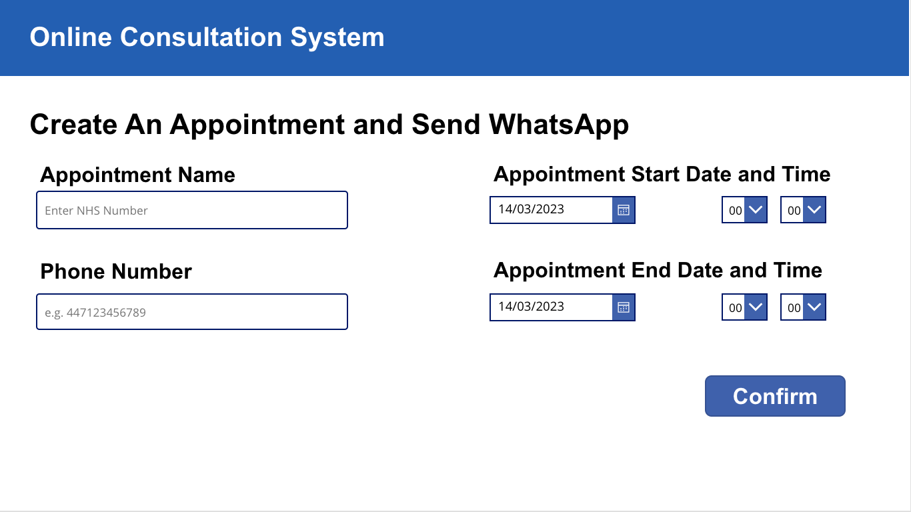

# Online Consultation System 

## Summary
This sample is a simple online consultation system. It is a canvas app that allows doctors to create and send Webex appointment links to patients via WhatsApp. This sample also showcases the two connectors that we have created - WhatsApp and Webex connectors. Webex connector would be used to create meeting in conjuction with WhatsApp connector to send the meeting link to the patient.



## Applies to

* [Microsoft Power Apps](https://docs.microsoft.com/powerapps/)
* [Power Plaform WhatsApp Connector](https://learn.microsoft.com/en-us/connectors/whatsappip/)
* [Power Plaform Webex Connector](https://learn.microsoft.com/en-us/connectors/webexip/)

## Compatibility


## Authors

Solution|Author(s)
--------|---------
Online_Consultation_System | [Oscar Hui](https://github.com/ocarhui), University College London
Online_Consultation_System | [Zakariya Fakira](https://github.com/zak0807), University College London

## Version history

Version|Date|Comments
-------|----|--------
1.0|March 14, 2023|Initial release

## Features

This sample illustrates the following features of WhatsApp and Webex connectors:

* Create a Webex meeting (Webex Connector)
* Send a templated WhatsApp message (WhatsApp Connector)

## Prerequisites

Following developer accounts are required to use this sample:
* [WhatsApp Business Account](https://business.whatsapp.com/developers/developer-hub) for Whatsapp Bearer Token
* [Webex Developer Account](https://developer.webex.com/) for Webex Access Token
* [Webex Account](https://www.webex.com/) for Webex OAuth purposes

## Solution Components
The following solution components are used in this sample:

* Webex_Create_and_Send_Messages (Cloud flow)
* Webex API Connection via Webex Connector (Connection reference)
* WhatsApp API Connection via WhatsApp Connector (Connection reference)

## Data Sources

### Create meeting and send message

|Type|Internal Name|Required|
|---|---|:---:|
|Text|Appointment Name|Yes|
|Dropbox|Appointment Start Date|Yes|
|Dropbox|Appointment Start Time|Yes|
|Dropbox|Appointment End Date|Yes|
|Dropbox|Appointment End Time|Yes|
|Text|Phone Number|Yes|

## Minimal Path to Awesome

* [Download](./solution/YOURSAMPLENAME.zip) the solution `.zip` from the `solution` folder
* Within **https://make.powerapps.com**, import the `.zip` file via **Solutions** > **Import solution** > **Browse** and select the `.zip` file you just downloaded.
* Click next.
* ...

## Using the Source Code

You can also use the [Power Apps CLI](https://aka.ms/pac/docs) to pack the source code by following these steps::

* Clone the repository to a local drive
* Pack the source files back into `.zip` file:
  ```bash
  pac solution pack --folder pathtosourcefolder --zipfile pathtosolution  --processCanvasApps
  ```
  Making sure to replace `pathtosourcefolder` to point to the path to this sample's `sourcecode` folder, and `pathtosolution` to point to the path of this solution's `.zip` file (located under the `solution` folder)
* Within **https://make.powerapps.com**, import the `.zip` file via **Solutions** > **Import solution** > **Browse** and select the `.zip` file you just downloaded.
* Click next.
* ...

## Disclaimer

**THIS CODE IS PROVIDED *AS IS* WITHOUT WARRANTY OF ANY KIND, EITHER EXPRESS OR IMPLIED, INCLUDING ANY IMPLIED WARRANTIES OF FITNESS FOR A PARTICULAR PURPOSE, MERCHANTABILITY, OR NON-INFRINGEMENT.**

## Help

We do not support samples, but we this community is always willing to help, and we want to improve these samples. We use GitHub to track issues, which makes it easy for  community members to volunteer their time and help resolve issues.

If you encounter any issues while using this sample, you can [create a new issue](https://github.com/pnp/powerapps-samples/issues/new?assignees=&labels=Needs%3A+Triage+%3Amag%3A%2Ctype%3Abug-suspected&template=bug-report.yml&sample=YOURSAMPLENAME&authors=@YOURGITHUBUSERNAME&title=YOURSAMPLENAME%20-%20).

For questions regarding this sample, [create a new question](https://github.com/pnp/powerapps-samples/issues/new?assignees=&labels=Needs%3A+Triage+%3Amag%3A%2Ctype%3Abug-suspected&template=question.yml&sample=YOURSAMPLENAME&authors=@YOURGITHUBUSERNAME&title=YOURSAMPLENAME%20-%20).

Finally, if you have an idea for improvement, [make a suggestion](https://github.com/pnp/powerapps-samples/issues/new?assignees=&labels=Needs%3A+Triage+%3Amag%3A%2Ctype%3Abug-suspected&template=suggestion.yml&sample=YOURSAMPLENAME&authors=@YOURGITHUBUSERNAME&title=YOURSAMPLENAME%20-%20).

## For more information

- [Webex API Documentation for Creating Meeting](https://developer.webex.com/docs/api/v1/meetings/create-a-meeting)
- [WhatsApp API Documentation for Sending Messages](https://developers.facebook.com/docs/whatsapp/on-premises/reference/messages/)
