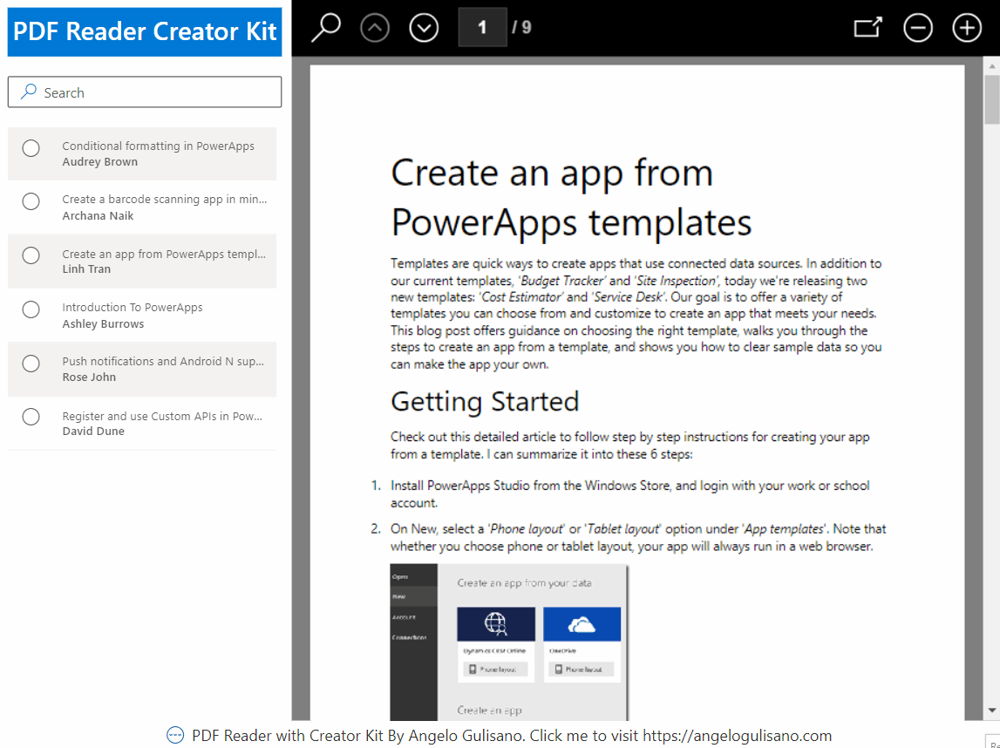

# PDF Reader - Creator Kit

## Summary

This is a an App like "PDF Reader" app's sample by Microsoft (you can create it by "Start from template" section when you creating new Power App) but this one using Creator Kit controls.
If you don't kwow what Creator Kit is, you can start here [Creators Kit - Introduction](https://angelogulisano.com/creator-kit-introduction/)



## Features

This sample illustrates the following concepts:

* Containers: All control are inside containers.
* Filter: Formula is used inside "Items" property of Fluent Detail List control.
* Controls from **Creator Kit**:
  - Auto Width Label - used to show Title
  - Fluent Details List - used to show list of PDF files
  - Fluent SearchBox - used to show texbox to filter PDF Files
  - Fluent Icon - used to show credits in botton of app and link my blog :-)
* Use ForAll

## Applies to

* [Microsoft Power Apps](https://docs.microsoft.com/powerapps/)

## Compatibility


## Authors

Solution|Author(s)
--------|---------
PDF Reader - Creator Kit | [Angelo Gulisano](https://github.com/angelogulisano) ([@angelog1908](https://twitter.com/angelog1908))

## Version history

Version|Date|Comments
-------|----|--------
1.0|September 05, 2022|Initial release

## Prerequisites

* **Creator Kit**: Official Microsoft reference [Creator Kit](https://learn.microsoft.com/power-platform/guidance/creator-kit/overview)
* **Introduction to Creator Kit** from my blog [Creators Kit - Introduction](https://angelogulisano.com/creator-kit-introduction/)

### Using the sample

No configuration is needed to use this sample.  All data is stored locally in the app.

## Data Sources

No datasources needed. List of PDF Files are stored in Table created on OnStart Event of the App. All PDF links are from original PDF Reader - Office Example App.

## Minimal Path to Awesome

* [Download](./solution/PDF Reader - Creator Kit.msapp) the `.msapp` from the `solution` folder
* Within **Power Apps Studio**, use the `.msapp` file using **File** > **Open** > **Browse** and select the `.msapp` file you just downloaded.
* Save and Publish

## Using the Source Code

You can also use the [Power Apps CLI](https://docs.microsoft.com/powerapps/developer/data-platform/powerapps-cli) to pack the source code by following these steps::

* Clone the repository to a local drive
* Pack the source files back into `.msapp` file:
  
```bash
pac canvas pack --sources pathtosourcefolder --msapp pathtomsapp
```

Making sure to replace `pathtosourcefolder` to point to the path to this sample's `sourcecode` folder, and `pathtomsapp` to point to the path of this solution's `.msapp` file (located under the `solution` folder)

* Within **Power Apps Studio**, use the `.msapp` file using **File** > **Open** > **Browse** and select the `.msapp` file you just packed.

## Disclaimer

**THIS CODE IS PROVIDED *AS IS* WITHOUT WARRANTY OF ANY KIND, EITHER EXPRESS OR IMPLIED, INCLUDING ANY IMPLIED WARRANTIES OF FITNESS FOR A PARTICULAR PURPOSE, MERCHANTABILITY, OR NON-INFRINGEMENT.**

## Help

We do not support samples, but we this community is always willing to help, and we want to improve these samples. We use GitHub to track issues, which makes it easy for  community members to volunteer their time and help resolve issues.

If you encounter any issues while using this sample, you can [create a new issue](https://github.com/pnp/powerapps-samples/issues/new?assignees=&labels=Needs%3A+Triage+%3Amag%3A%2Ctype%3Abug-suspected&template=bug-report.yml&sample=PDF Reader - Creator Kit&authors=@angelogulisano&title=PDF Reader - Creator Kit%20-%20).

For questions regarding this sample, [create a new question](https://github.com/pnp/powerapps-samples/issues/new?assignees=&labels=Needs%3A+Triage+%3Amag%3A%2Ctype%3Abug-suspected&template=question.yml&sample=PDF Reader - Creator Kit&authors=@angelogulisano&title=PDF Reader - Creator Kit%20-%20).

Finally, if you have an idea for improvement, [make a suggestion](https://github.com/pnp/powerapps-samples/issues/new?assignees=&labels=Needs%3A+Triage+%3Amag%3A%2Ctype%3Abug-suspected&template=suggestion.yml&sample=PDF Reader - Creator Kit&authors=@angelogulisano&title=PDF Reader - Creator Kit%20-%20).

## For more information

* [Overview of creating apps in Power Apps](https://docs.microsoft.com/powerapps/maker/)
* [Power Apps canvas apps documentation](https://docs.microsoft.com/powerapps/maker/canvas-apps/)
* [Creator Kit](https://learn.microsoft.com/power-platform/guidance/creator-kit/overview)
* [Read my blog - https://angelogulisano.com](https://angelogulisano.com/)
