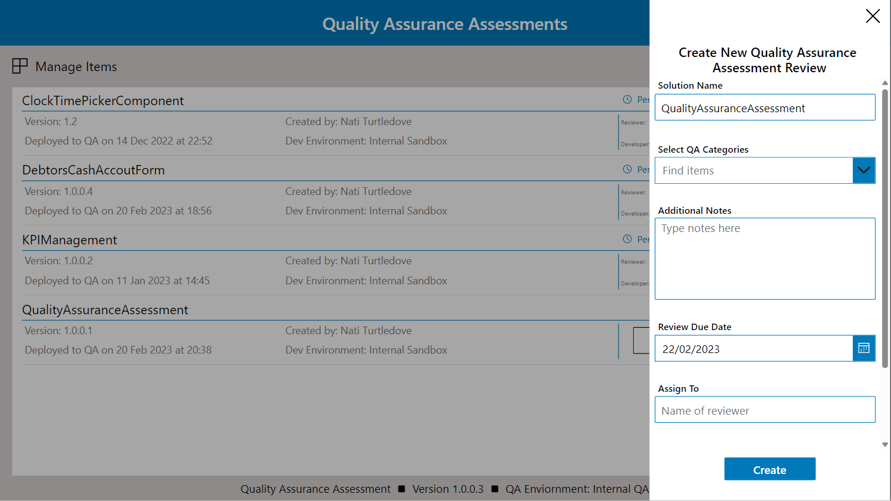
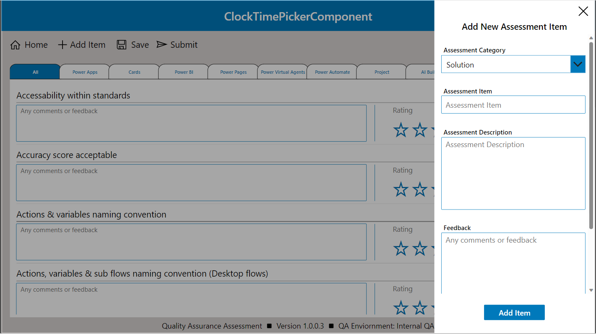

# PowerApps Quality Assurance Assessment Solution

## Summary

Inspired by the ALM Accelerator by PowerCAT, This solution is built alongside Power Platform Pipelines accessing all deployed solutions within your designated QA Environment. When a solution is in QA, the user can create a QA Assessment for the project, assign it to other users, manage checklist items, and submit a final QA grade for the solution.
  
  


## Applies to

* [Microsoft Power Apps](https://docs.microsoft.com/powerapps/)

## Compatibility


## Authors

Solution|Author(s)
--------|---------
PowerApps Quality Assurance Assessment Solution | [Nati Turtledove](https://github.com/NatiTurts) ([@NatiTurts](https://www.twitter.com/NatiTurts) )

## Version history

Version|Date|Comments
-------|----|--------
1.0.0.3|Jan 23, 2023|Initial release


## Features

This sample solution offers the following capabilities:

* For users to view solutions deployed to their specified QA Environment when deployed using Power Platform Pipelines.
* Enabling users to manage and create QA Assessment checklist items.
* Allowing for users to create a QA Assessment for a solution deployed to the QA environment.
* Assign QA Assessment to a specific user with a deadline.
* Conduct a review, score and pass/fail checklist items and an entire QA Assessment.
* Submit final QA Assessment grading.
* View historical QA Assessments for various solution versions.

## Prerequisites

In order to successfully import and use this solution, the solution should be installed in your host environment where the Power Platform Pipelines solution has already been installed.

## Importing the solution

Before importing this solution, you need to ensure that it is being imported into the same environment where you host your Power Platform Pipelines solution.

Upon import, you will need to specify your QA Environment used within your Power Platform Pipeline and enter the environment ID into the `Quality Assurance Environment ID` variable. Should the variable not import successfully, simply open the imported solution and open the `Update QA Environment ID` flow. When you trigger the flow, enter the ID into the input field and the flow will update the flow accordingly.
 
---
 

## Using the solution
### Importing QA Items
Although you can create your own Assessment Categories and Items, included in this repository are two Excel files you can import into the following tables:
* `QA Choices` - Import into the natiturt_QAAssessmentChoices table. Map the Excel `Choices` column to the tables `Choices` column.
* `QA Items` - Import into natiturt_QAAssessmentItems table. Map the Excel `Category` column to the tables `Category` column and the Excel `Item` column to the tables `Item` column.
  

### Landing Page
Once you have completed the import, you can open the `Quality Assurance Assessment` Canvas application. If you have no solutions in QA, a message will appear advising so. You can also confirm your QA Environment details by referring the footer text.

The `Manage Items` button above the solution gallery will navigate you to the `Manage Items` page where you can add, create, edit and delete both checklist items and categories.

If you do have solutions in your QA Environment, they will appear in the gallery displaying the current version and last deployed date. You will also be able to create a new QA Assessment by clicking the `New Review` button. This will open up a side bar allowing you to add notes, a due date and assign the assessment to another user. When you click `Create`, the assessment will generate and you will be navigated to the assessment page.

Additionally, should an assessment for a solution be in progress, you can select the arrow to the far right of the solution in the gallery, and you will be navigated to the solutions active assessment.

Lastly, to view previous assessments for a solution, you can click the `History` icon for a solution and you will be redirected to view historical assessments and results.


---
 

### Manage Items Page
Within this page, if you imported the forementioned templates, you should have a variety of checklist categories and items already loaded. The top gallery will display available categories and toggling between them will filter the corresponding checklist items below. Clicking on the `Add Item` button will open a side bar allowing you to create new Categories and Items. The default Categories will default to a dropdown, but by clicking the `+` icon it will change to free text allowing you to add new categories. The `Open` icon above the category will open up another slider displaying all current categories. You can delete categories accordingly. This will also delete associated items.

When adding a new item, simply complete the required fields and click `Add Item`. This will add the new item to the gallery and create a new category if required.

By clicking the `Trash` icon within a specific item will again open the side bar allowing you to edit the item and delete it. 


---
 
---
 


### Assessment Page
When an assessment has been created, you will be able to view all available checklist items within a gallery on the Assessment Page. Within this page, you can update items accordingly by adding comments, scoring and passing/failing an item.
Additionally, should an item not be require, you can remove it from the list. Be sure to click the `Save` button to save the assessment and apply item removals.

When you are ready to complete the QA Assessment, press the `Submit` button to open the side bar. In the side bar, you will be requested to score the overall solution and either pass or fail it. You can add feedback as well. The scoring matrix works on the following principle:
* `1` - Item/Solution Failed to meet quality standards and requirements.
* `2` - Item/Solution borderline met quality standards and requirements.
* `3` - Item/Solution exceeded quality standards and requirements.

The scoring matrix is determined by each individual item score against the overall number of items in the assessment. For example:
There are 100 items in a QA Assessment. If each item is graded out of 3, the total QA Assessment score should have a max score of 300.
If all the items were scored and the sum of the 100 scores are 289, the solution will be scored as 289/300 (96%).

Once you have scored the overall solution and confirmed whether it passed or failed the assessment, you can submit and the assessment will be marked accordingly. 
Should an assessment fail, the user can create another QA assessment when ready, alternatively, if a solution has passed, the user can proceed with a newer QA if a later version is deployed.


---
 
---
 
### Previous Assessments Page
To view active or completed assessments, clicking the `Open` icon above the solution on the Landing Page will direct you to the Previous Assessments Page for that solution. On this page, users will be able to view active and passed assessments, who the developer was and who completed the assessment, what version the solution was and the overall score, feedback and result of that assessment. 

The user can also open the assessment items and view individual item scores if required. 


---
 

## Data Sources
 
Dataverse

## Minimal Path to Awesome

* [Download](./solution/QualityAssuranceAssessment_1_0_0_3_managed.zip) the `.zip` from the `solution` folder.
* Within **Power Apps Studio**, import the solution `.zip` file using **Solutions** > **Import Solution** and select the `.zip` file you just packed.
* Update the environment variables or run the `Update QA Environment Variable` flow.

## Using the Source Code

You can also use the [Power Apps CLI](https://docs.microsoft.com/powerapps/developer/data-platform/powerapps-cli) to pack the source code by following these steps::

* Clone the repository to a local drive
* Pack the source files back into a solution `.zip` file:
  ```bash
  pac solution pack --zipfile pathtodestinationfile --folder pathtosourcefolder --processCanvasApps
  ```
  Making sure to replace `pathtosourcefolder` to point to the path to this sample's `sourcecode` folder, and `pathtodestinationfile` to point to the path of this solution's `.zip` file (located under the `solution` folder)
* Within **Power Apps Studio**, import the solution `.zip` file using **Solutions** > **Import Solution** and select the `.zip` file you just packed.

## Disclaimer

**THIS CODE IS PROVIDED *AS IS* WITHOUT WARRANTY OF ANY KIND, EITHER EXPRESS OR IMPLIED, INCLUDING ANY IMPLIED WARRANTIES OF FITNESS FOR A PARTICULAR PURPOSE, MERCHANTABILITY, OR NON-INFRINGEMENT.**


## Support

While we don't support samples, if you encounter any issues while using this sample, you can [create a new issue](https://github.com/pnp/powerapps-samples/issues/new?assignees=&labels=Needs%3A+Triage+%3Amag%3A%2Ctype%3Abug-suspected&template=bug-report.yml&sample=PowerApps_Quality_Assurance_Assessment&authors=@NatiTurts&title=PowerApps_Quality_Assurance_Assessment%20-%20).

For questions regarding this sample, [create a new question](https://github.com/pnp/powerapps-samples/issues/new?assignees=&labels=Needs%3A+Triage+%3Amag%3A%2Ctype%3Abug-suspected&template=question.yml&sample=PowerApps_Quality_Assurance_Assessment&authors=@NatiTurts&title=PowerApps_Quality_Assurance_Assessment%20-%20).

Finally, if you have an idea for improvement, [make a suggestion](https://github.com/pnp/powerapps-samples/issues/new?assignees=&labels=Needs%3A+Triage+%3Amag%3A%2Ctype%3Abug-suspected&template=suggestion.yml&sample=PowerApps_Quality_Assurance_Assessment&authors=@NatiTurts&title=PowerApps_Quality_Assurance_Assessment%20-%20).

## For more information

- [Create a component for canvas apps](https://docs.microsoft.com/powerapps/maker/canvas-apps/create-component#components-in-canvas-apps)
- [Overview of creating apps in Power Apps](https://docs.microsoft.com/powerapps/maker/)
- [Power Apps canvas apps documentation](https://docs.microsoft.com/en-us/powerapps/maker/canvas-apps/)

