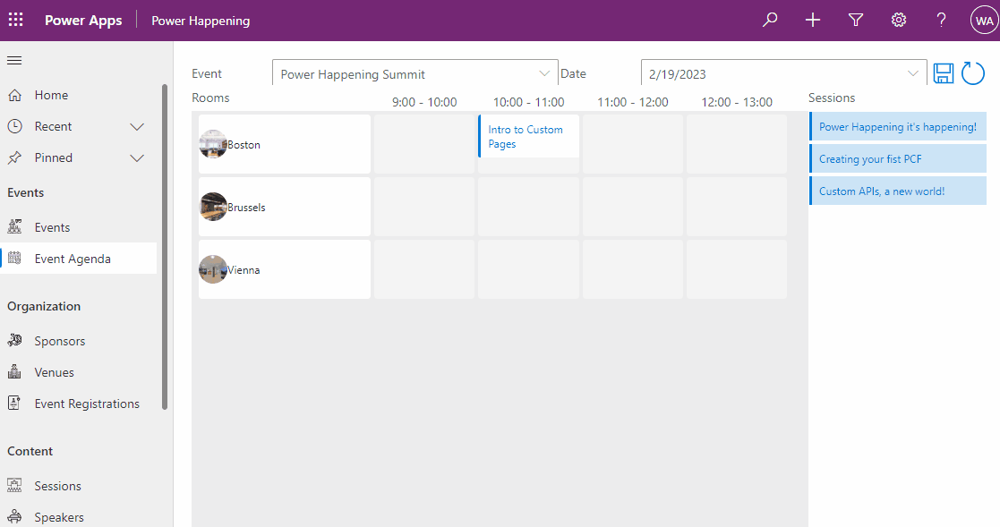

# Power Happening

## Summary

Power Happening! It's Happening! An event organizer Model-Driven Power App.

This is a community sample to inspire you how you can use Model-Driven Power Apps and Custom Pages for your business processes.

Use this solution to manage your next Power Platform event. Add and manage speakers, sessions, attendees and venues.
After you add Rooms to your Venue and Slots on Event Days you can use our Custom Page Agenda Scheduler:

## Applies to

* [Microsoft Power Apps](https://learn.microsoft.com/en-us/power-apps/)
* [Model-Driven Power Apps](https://learn.microsoft.com/en-us/power-apps/maker/model-driven-apps/)
* [Custom Pages](https://learn.microsoft.com/en-us/power-apps/maker/model-driven-apps/model-app-page-overview)
* [Creator Kit](https://learn.microsoft.com/en-us/power-platform/guidance/creator-kit/overview)
* [Power Drag and Drop](https://docs.microsoft.com/powerapps/)

## Compatibility

> Don't worry about this section, we'll take care of it. Unless you really want to...

## Authors

Solution|Author(s)
--------|---------
Power Happening | [Wilmer Alcivar](https://github.com/walcivar) - [LinkedIn](https://www.linkedin.com/in/wilmeralcivar/)
Power Happening | [Ben den Blanken](https://github.com/BendenBlanken) - [LinkedIn](https://www.linkedin.com/in/bendenblanken/) - [Twitter](https://twitter.com/BenDenBlanken)

## Version history

Version|Date|Comments
-------|----|--------
1.0|March 3, 2023|Initial release

## Features

This sample illustrates the following concepts:

* Model-Driven App with Forms, Views and Relations
* Custom Page with Creator Kit and Power Drag and Drop

## Prerequisites

To install this solution to your Dataverse enabled environment you also need the following:
* Creator Kit
* Power Drag and Drop

## Solution Components
The following solution components are used in this sample:

* Power Happening (Model-Driven App)
* Agenda (Custom Page)

## Data Sources

* Dataverse

### MySample List

This solutions uses the following Dataverse tables:

* Account
* Agenda
* Contact
* Event
* Event Registration
* Event Schedule
* Event Sponsors
* Organizing Teammember
* Room
* Session
* Slots
* User

## Minimal Path to Awesome

* [Install the Creator Kit](https://learn.microsoft.com/en-us/power-platform/guidance/creator-kit/overview)
* [Install Power Drag and Drop](https://github.com/scottdurow/power-drag-drop)
* [Download Power Happening](./solution/PowerHappingBase.zip)
* Import the solution to your dataverse enabled environment

For more info visit the [installation guide on the project wiki](https://github.com/BendenBlanken/PowerHappening/wiki/1.-Installation-Manual)

## Disclaimer

**THIS CODE IS PROVIDED *AS IS* WITHOUT WARRANTY OF ANY KIND, EITHER EXPRESS OR IMPLIED, INCLUDING ANY IMPLIED WARRANTIES OF FITNESS FOR A PARTICULAR PURPOSE, MERCHANTABILITY, OR NON-INFRINGEMENT.**

## Help

> Note: don't worry about this section, we'll update the links.

We do not support samples, but we this community is always willing to help, and we want to improve these samples. We use GitHub to track issues, which makes it easy for  community members to volunteer their time and help resolve issues.

If you encounter any issues while using this sample, you can [create a new issue](https://github.com/pnp/powerapps-samples/issues/new?assignees=&labels=Needs%3A+Triage+%3Amag%3A%2Ctype%3Abug-suspected&template=bug-report.yml&sample=YOURSAMPLENAME&authors=@YOURGITHUBUSERNAME&title=YOURSAMPLENAME%20-%20).

For questions regarding this sample, [create a new question](https://github.com/pnp/powerapps-samples/issues/new?assignees=&labels=Needs%3A+Triage+%3Amag%3A%2Ctype%3Abug-suspected&template=question.yml&sample=YOURSAMPLENAME&authors=@YOURGITHUBUSERNAME&title=YOURSAMPLENAME%20-%20).

Finally, if you have an idea for improvement, [make a suggestion](https://github.com/pnp/powerapps-samples/issues/new?assignees=&labels=Needs%3A+Triage+%3Amag%3A%2Ctype%3Abug-suspected&template=suggestion.yml&sample=YOURSAMPLENAME&authors=@YOURGITHUBUSERNAME&title=YOURSAMPLENAME%20-%20).

## For more information

- [User Manual](https://github.com/BendenBlanken/PowerHappening/wiki/2.-User-manual)

