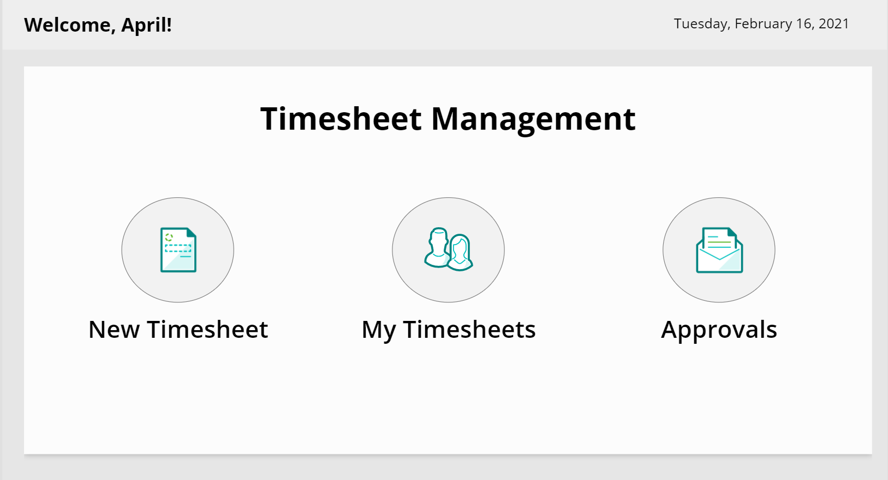
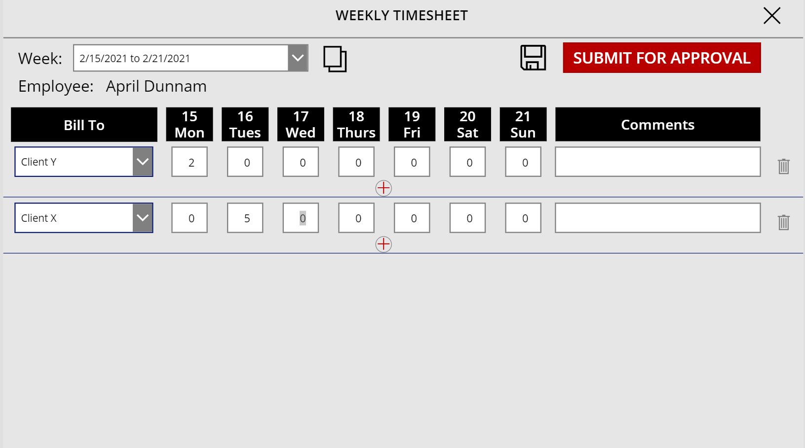

# Timesheet Power App Template

## Summary
This timesheet application is a tablet-based canvas app that gives you a way to create and manage weekly timesheets.

Home Screen

  

Timesheet Entry Screen

  

## Data Sources 
This app uses SharePoint as a data source and requires two SharePoint Lists with the following fields:

### BillTo List
This list contains the lookup data to associate a timesheet entry with a job or client to bill to.  Set the list up as follows:

|Type|Internal Name|Required|
|---|---|:---:|
|Single line of text|Title|Yes|

### TimeEntries List
This list contains the timesheet entries.  Set the list up as follows:

|Type|Internal Name|Required|
|---|---|:---:|
|Single line of text|Title|Yes|
|Number|Mon|No|
|Number|Tues|No|
|Number|Weds|No|
|Number|Thurs|No|
|Number|Fri|No|
|Number|Sat|No|
|Number|Sun|No|
|Multi line of text|Comments|No|
|Choice|Status|No|
|Person or Group|Employee|No|
|Person or Group|Manager|No|
|Lookup|BillTo|No|
|Date|WeekStart|No|
|Number|Total|No|

## Installing the Template
This sample utilizes the new Power Apps Canvas app Source Code tooling [Power Apps Source Code Tooling](https://github.com/microsoft/PowerApps-Language-Tooling). Set up and install the source code tool to use this sample.  

Clone this repo and run the Power Apps Source Code tool to pack the solution.  This will create an .msapp file for you.

Perform the following steps to import the .msapp file into your environment:
1. Go to make.powerapps.com 
2. Select "New App" and "Canvas App" from the dropdown
3. Click "Open" from the left hand side 
4. Choose the "Browse" option and navigate to the msapp file location
5. Select the data tab in the left hand side
6. Remove the "BillTo" and "TimesheetEntries" data sources from the app
7. Add new data sources for the "BillTo" and "TimesheetEntries" SharePoint Lists you created in your environment
8. Save and Publish

## Sample

Solution|Author(s)
--------|---------
Timesheet Power App | [April Dunnam](https://www.twitter.com/aprildunnam)

## Version history

Version|Date|Comments
-------|----|--------
1.0|February 16, 2021|Initial release

## Disclaimer
**THIS CODE IS PROVIDED *AS IS* WITHOUT WARRANTY OF ANY KIND, EITHER EXPRESS OR IMPLIED, INCLUDING ANY IMPLIED WARRANTIES OF FITNESS FOR A PARTICULAR PURPOSE, MERCHANTABILITY, OR NON-INFRINGEMENT.**

---

## Additional notes

None

