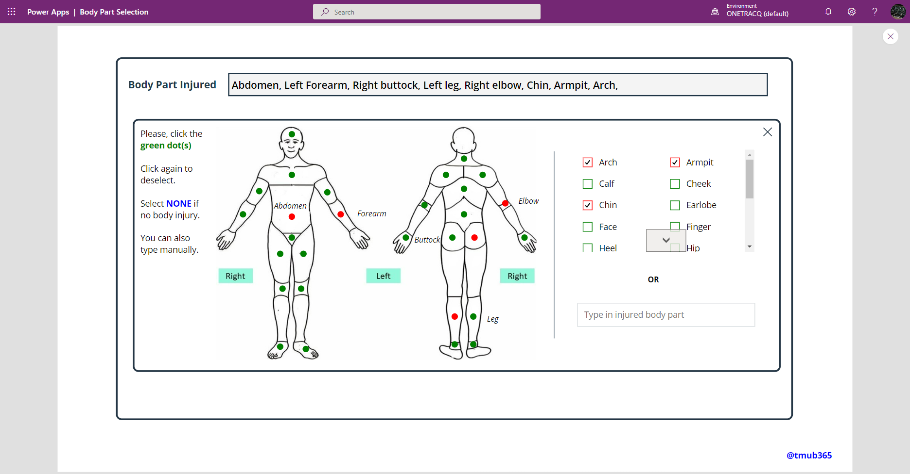

# Gallery Component

## Summary

Happy to share some of my PowerApps projects that I think might be interesting with the community. I tend to spend too much time on UI/UX and I hope someone else finds them useful for their project . . . Just load the .msapp file and customise it to your heart's content.

An app with a Body Part Selection A gallery that can be applied to a canvas app to select various parts of the body. Use case - A reporting app that requires that the injured body part be submitted as a multi-choice option to a DB

  


## Applies to

* [Microsoft Power Apps](https://docs.microsoft.com/powerapps/)

## Compatibility


## Authors

Solution|Author(s)
--------|---------
Body-Part Selection Canvas App | [Mubarak Adeyemo](https://github.com/tMub365) ([@tMub365](https://www.twitter.com/tMub365) )

## Version history

Version|Date|Comments
-------|----|--------
1.0|Nov 30, 2022|Initial release


## Features

This sample illustrates the following concepts:

* Manipulating UI


## Prerequisites

### Using the component

Selecting each of the dots insert the name of the corresponding body part into a collection. The color of the selected dot also changes, with a correspodning title. Selecting the dot again deselects it and remove the body part form the collection.

If you have a form with a datacard driven by multichoice field, you can just copy the container into the datacard. A collection named `col_BodyPart` captures all the selection. 

You can also use `TextInput_ManualInput` to capture free text, in case users need the option to enter such.

Update for the datacard can look like this

```If(
    !(IsBlank(TextInput_ManualInput)),
    TextInput_ManualInput.Text,
    Concat(
        col_BodyPart,
        Value & ", "
    )
)
```

To change the colours of any of the controls, |Navigate to the Screen_Style You can do this by connecting to a data source which provides a `Date`, a `Title` and a `Time` field, or you can manually create entries and pass them as a `Table`, as follows:


## Data Sources
 
Static table with body part title

## Minimal Path to Awesome

* [Download](./solution/BodyPartSelection.msapp) the `.msapp` from the `solution` folder
* Use the `.msapp` file using **File** > **Open** > **Browse** within Power Apps Studio.
* Save and Publish


## Disclaimer

**THIS CODE IS PROVIDED *AS IS* WITHOUT WARRANTY OF ANY KIND, EITHER EXPRESS OR IMPLIED, INCLUDING ANY IMPLIED WARRANTIES OF FITNESS FOR A PARTICULAR PURPOSE, MERCHANTABILITY, OR NON-INFRINGEMENT.**


## Support

While we don't support samples, if you encounter any issues while using this sample, you can [create a new issue](https://github.com/pnp/powerapps-samples/issues/new?assignees=&labels=Needs%3A+Triage+%3Amag%3A%2Ctype%3Abug-suspected&template=bug-report.yml&sample=calendar-component&authors=@aprildunnam&title=calendar-component%20-%20).

For questions regarding this sample, [create a new question](https://github.com/pnp/powerapps-samples/issues/new?assignees=&labels=Needs%3A+Triage+%3Amag%3A%2Ctype%3Abug-suspected&template=question.yml&sample=calendar-component&authors=@aprildunnam&title=calendar-component%20-%20).

Finally, if you have an idea for improvement, [make a suggestion](https://github.com/pnp/powerapps-samples/issues/new?assignees=&labels=Needs%3A+Triage+%3Amag%3A%2Ctype%3Abug-suspected&template=suggestion.yml&sample=calendar-component&authors=@aprildunnam&title=calendar-component%20-%20).

## For more information

- [Create a component for canvas apps](https://docs.microsoft.com/powerapps/maker/canvas-apps/create-component#components-in-canvas-apps)
- [Overview of creating apps in Power Apps](https://docs.microsoft.com/powerapps/maker/)
- [Power Apps canvas apps documentation](https://docs.microsoft.com/en-us/powerapps/maker/canvas-apps/)


## PS

* Credit to aprildunnam for the content of this ReadMe. Without this, I wont even know where to start
* Thanks to David Warner and Hugo Bernier for the Nov 22 SharingIsCaring session. Lets just say that was my first official Github training
* First time contributing, please be gentle


