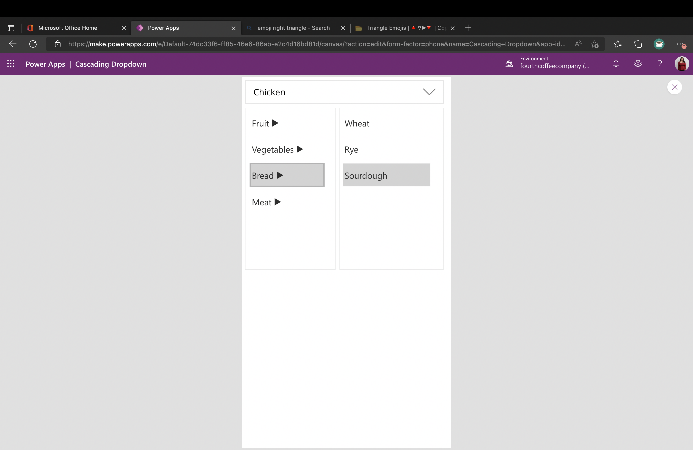

# Cascading Dropdown Component

## Summary

This is a Power Apps Canvas component that demonstrates how to implement a custom cascading dropdown control. This control handles a two-level cascading dropdown and can even be customized to handle a single selection or multiple selection of items. 

  

## Features

This sample app is a great way to learn some fundamental Power Apps concepts like:

* How to build a component and use component input and output properties
* How to show/hide elements
* How to leverage collections and split out collection items into a string

## Applies to

* [Microsoft Power Apps](https://docs.microsoft.com/powerapps/)
* [Microsoft Power Automate](https://docs.microsoft.com/en-us/power-automate/)

## Compatibility


## Authors

Solution|Author(s)
--------|---------
Cascading Dropdown Component | [April Dunnam](https://github.com/aprildunnam) ([@aprildunnam](https://www.twitter.com/aprildunnam) )

## Version history

Version|Date|Comments
-------|----|--------
1.0|Oct 29, 2022|Initial release
## Prerequisites

### Using the component

To use the component in this sample, you'll need to either hard code in the items you want to display in the 1st level and 2nd level menus or pull them in from your data source. The cascading effect is dependent on having a property in your 1st level items called "Name" and a property inyour 2nd level items called "ParentItem" which can be matched back to the name field of the 1st level items.  Look at the default 1stLevelItems and 2ndLevelItems properties to see the format that the component is expecting.

## Data Sources
 
None

## Minimal Path to Awesome

* [Download](./solution/CascadingDropdown.msapp) the `.msapp` from the `solution` folder
* Use the `.msapp` file using **File** > **Open** > **Browse** within Power Apps Studio.
* Save and Publish

## Using the Source Code

You can also use the [Power Apps CLI](https://docs.microsoft.com/powerapps/developer/data-platform/powerapps-cli) to pack the source code by following these steps::

* Clone the repository to a local drive
* Pack the source files back into `.msapp` file:
  ```bash
  pac canvas pack --sources pathtosourcefolder --msapp pathtomsapp
  ```
  Making sure to replace `pathtosourcefolder` to point to the path to this sample's `sourcecode` folder, and `pathtomsapp` to point to the path of this solution's `.msapp` file (located under the `solution` folder)
* Use the `.msapp` file using **File** > **Open** > **Browse** in Power Apps Studio.

## Disclaimer

**THIS CODE IS PROVIDED *AS IS* WITHOUT WARRANTY OF ANY KIND, EITHER EXPRESS OR IMPLIED, INCLUDING ANY IMPLIED WARRANTIES OF FITNESS FOR A PARTICULAR PURPOSE, MERCHANTABILITY, OR NON-INFRINGEMENT.**


## Support

While we don't support samples, if you encounter any issues while using this sample, you can [create a new issue](https://github.com/pnp/powerapps-samples/issues/new?assignees=&labels=Needs%3A+Triage+%3Amag%3A%2Ctype%3Abug-suspected&template=bug-report.yml&sample=calendar-component&authors=@aprildunnam&title=calendar-component%20-%20).

For questions regarding this sample, [create a new question](https://github.com/pnp/powerapps-samples/issues/new?assignees=&labels=Needs%3A+Triage+%3Amag%3A%2Ctype%3Abug-suspected&template=question.yml&sample=calendar-component&authors=@aprildunnam&title=calendar-component%20-%20).

Finally, if you have an idea for improvement, [make a suggestion](https://github.com/pnp/powerapps-samples/issues/new?assignees=&labels=Needs%3A+Triage+%3Amag%3A%2Ctype%3Abug-suspected&template=suggestion.yml&sample=calendar-component&authors=@aprildunnam&title=calendar-component%20-%20).

## For more information

- [Create a component for canvas apps](https://docs.microsoft.com/powerapps/maker/canvas-apps/create-component#components-in-canvas-apps)
- [Overview of creating apps in Power Apps](https://docs.microsoft.com/powerapps/maker/)
- [Power Apps canvas apps documentation](https://docs.microsoft.com/en-us/powerapps/maker/canvas-apps/)

