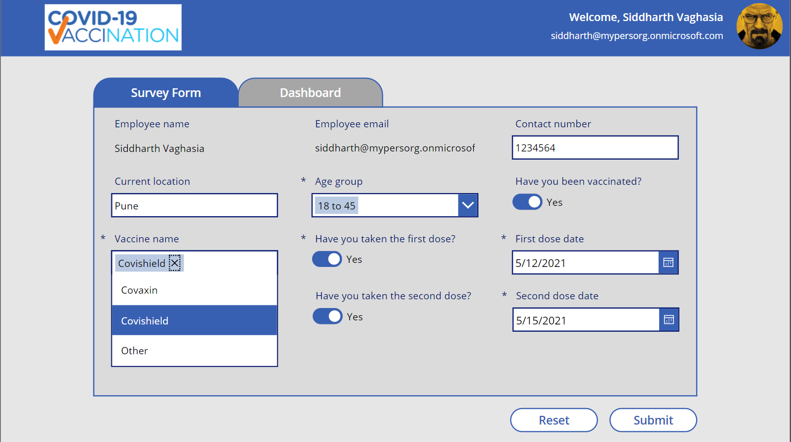
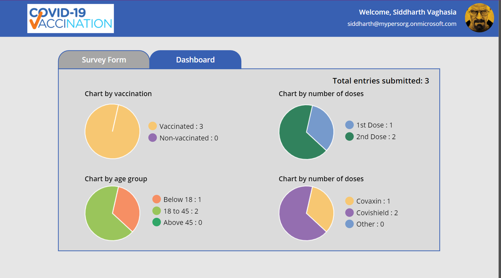

# Covid Vaccination Survey

## Summary

A PowerApps and SharePoint-based solution for organizations to collect vaccination surveys (data) from their employee about thier vaccination status. 

Please use the [guide](assets/Covid19VaccinationSurvey%20Setup%20Guide.docx) in this repo to follow step by step instructions on how to setup in your tenant.

### User Survey Form(for employees)




### Dashboard for Admin/HR Users(configurable in list who can see this)



## Applies to

* [Microsoft Power Apps](https://docs.microsoft.com/powerapps/)


## Compatibility

> Don't worry about this section, we'll take care of it. Unless you really want to...


## Authors

Solution|Author(s)
--------|---------
covid-vaccine-survey | [Siddharth Vaghasia](https://github.com/siddharth-vaghasia) ([@yourtwitterhandle](https://twitter.com/siddh_me))
covid-vaccine-survey | [Mayuresh Joshi](https://www.linkedin.com/in/mayure5h/) , 

## Version history

Version|Date|Comments
-------|----|--------
1.0|Oct 27, 2021|Initial release

## Features/Brief

•	As with current situation on Covid, it is important to get ourselves vaccinated. All the countries governments are running vaccination drive. 

•	As an organization, it become important to get survey of employees about this vaccination status. 

•	This PowerApps and SharePoint based application can be used to get the vaccination status of all the employees in organization. 

•	Using the app, employee of the organization can provide information about their current vaccination status like if they have been vaccinated, have they taken both doses and which vaccine drive. 

•	This survey data will give organization to how many employees have been vaccinated and other information related to vaccination.

•	Employee (normal user) can come to this app and update the data anytime until they fill out their information till dose 2. 

•	HR/Admins(configurable) can view dashboard to see different charts based on total survey filled by employees, total vaccinated, employees taken first dose or second and which vaccine brand.

## Prerequisites

SharePoint Site Collection

## Data Sources

### Covid19Survey List

This SharePoint list contains data captured as part of survey.  Set the list up as follows:

|Type|Internal Name|Required|
|---|---|:---:|
|Single line of text|EmployeeName|No|
|Single line of text|EmployeeEmail|No|
|Boolean|AreYouVaccinated|No|
|DateTime|FirstDoseDate|No|
|DateTime|SecondDoseDate|No|
|Choice|VaccineName|Yes| 
|Choice|AgeGroup|No|
|Single line of text|ContactNumber|No|
|Single line of text|Location|No|
|Boolean|Dose1|No|
|Boolean|Dose2|No|

You can also use below powershell script to import the list using list template

* [PowerShell Path](assets/Importlist.ps1)
* [List Template XML](assets/CovidVaccineSurveyList.xml)


## Minimal Path to Awesome

* [Download](solution/Covid-19VaccinationSurvey.msapp) the `.msapp` from the `solution` folder
* Within **Power Apps Studio**, use the `.msapp` file using **File** > **Open** > **Browse** and select the `.msapp` file you just downloaded.
* Select the **Data** tab
* ...

## Using the Source Code

You can also use the [Power Apps CLI](https://docs.microsoft.com/powerapps/developer/data-platform/powerapps-cli) to pack the source code by following these steps::

* Clone the repository to a local drive
* Pack the source files back into `.msapp` file:
  ```bash
  pac canvas pack --sources pathtosourcefolder --msapp pathtomsapp
  ```
  Making sure to replace `pathtosourcefolder` to point to the path to this sample's `sourcecode` folder, and `pathtomsapp` to point to the path of this solution's `.msapp` file (located under the `solution` folder)
* Within **Power Apps Studio**, use the `.msapp` file using **File** > **Open** > **Browse** and select the `.msapp` file you just packed.

## Disclaimer

**THIS CODE IS PROVIDED *AS IS* WITHOUT WARRANTY OF ANY KIND, EITHER EXPRESS OR IMPLIED, INCLUDING ANY IMPLIED WARRANTIES OF FITNESS FOR A PARTICULAR PURPOSE, MERCHANTABILITY, OR NON-INFRINGEMENT.**

## Help

> Note: don't worry about this section, we'll update the links.

We do not support samples, but we this community is always willing to help, and we want to improve these samples. We use GitHub to track issues, which makes it easy for  community members to volunteer their time and help resolve issues.

If you encounter any issues while using this sample, you can [create a new issue](https://github.com/pnp/powerapps-samples/issues/new?assignees=&labels=Needs%3A+Triage+%3Amag%3A%2Ctype%3Abug-suspected&template=bug-report.yml&sample=YOURSAMPLENAME&authors=@YOURGITHUBUSERNAME&title=YOURSAMPLENAME%20-%20).

For questions regarding this sample, [create a new question](https://github.com/pnp/powerapps-samples/issues/new?assignees=&labels=Needs%3A+Triage+%3Amag%3A%2Ctype%3Abug-suspected&template=question.yml&sample=YOURSAMPLENAME&authors=@YOURGITHUBUSERNAME&title=YOURSAMPLENAME%20-%20).

Finally, if you have an idea for improvement, [make a suggestion](https://github.com/pnp/powerapps-samples/issues/new?assignees=&labels=Needs%3A+Triage+%3Amag%3A%2Ctype%3Abug-suspected&template=suggestion.yml&sample=YOURSAMPLENAME&authors=@YOURGITHUBUSERNAME&title=YOURSAMPLENAME%20-%20).

## For more information

- [Overview of creating apps in Power Apps](https://docs.microsoft.com/powerapps/maker/)
- [Power Apps canvas apps documentation](https://docs.microsoft.com/en-us/powerapps/maker/canvas-apps/)


---
> Note that better pictures and documentation will increase the sample usage and the value you are providing for others. Thanks for your submissions in advance! You rock ❤.
> DELETE THIS PARAGRAPH BEFORE SUBMITTING
