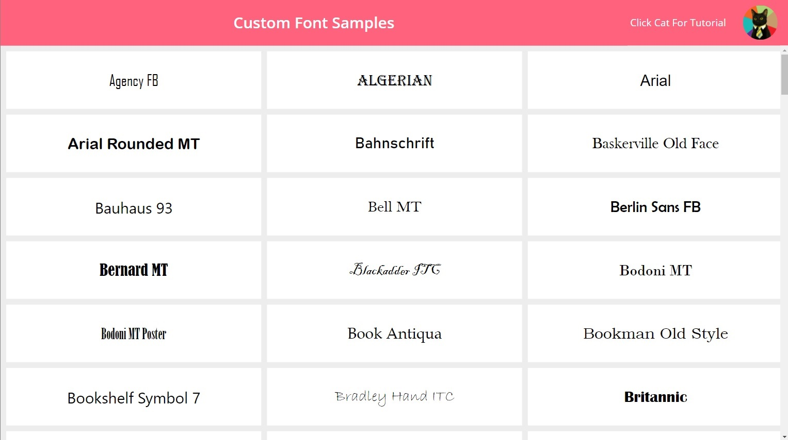

# Custom Font Samples

177 custom font samples for Power Apps.

### Home Screen

  

## Applies to

* [Microsoft Power Apps](https://docs.microsoft.com/powerapps/)

## Compatibility

## Authors

Solution|Author(s)
--------|---------
Custom Font Samples | [Matthew Devaney](https://matthewdevaney.com) ([@mattbdevaney](https://www.twitter.com/mattbdevaney) )

## Version history

Version|Date|Comments
-------|----|--------
1.0|May 13, 2021|Initial release

## Features

This sample includes the following fonts

* Agency FB
* Algerian
* Arial
* Arial Rounded MT
* Bahnschrift
* Baskerville Old Face
* Bauhaus 93
* Bell MT
* Berlin Sans FB
* Bernard MT
* Blackadder ITC
* Bodoni MT
* Bodoni MT Poster
* Book Antiqua
* Bookman Old Style
* Bookshelf Symbol 7
* Bradley Hand ITC
* Britannic
* Broadway
* Brush Script MT
* Calibri
* Californian FB
* Calisto MT
* Cambria
* Cambria Math
* Candara
* Castellar
* Centaur
* Century
* Century Gothic
* Century Schoolbook
* Chiller
* Colonna MT
* Comic Sans MS
* Consolas
* Constantia
* Cooper
* Copperplate Gothic
* Corbel
* Courier New
* Curlz MT
* Dubai
* Ebrima
* Edwardian Script ITC
* Elephant
* Engravers MT
* Eras ITC
* Felix Titling
* Footlight MT
* Forte
* Franklin Gothic
* Franklin Gothic Book
* Freestyle Script
* French Script MT
* Gabriola
* Gadugi
* Garamond
* Georgia
* Gigi
* Gill Sans
* Gill Sans MT
* Gloucester MT
* Goudy Old Style
* Goudy Stout
* Haettenschweiler
* Harlow Solid
* Harrington
* Helvetica
* High Tower Text
* HoloLens MDL2 Assets
* Impact
* Imprint MT Shadow
* Informal Roman
* Ink Free
* Javanese Text
* Jokerman
* Juice ITC
* Kristen ITC
* Kunstler Script
* Leelawadee
* Leelawadee UI
* Lucida Bright
* Lucida Calligraphy
* Lucida Console
* Lucida Fax
* Lucida Handwriting
* Lucida Sans
* Lucida Sans Typewriter
* Lucida Sans Unicode
* Magneto
* Maiandra GD
* Malgun Gothic
* Marlett
* Matura MT Script Capitals
* Microsoft Himalaya
* Microsoft JhengHei
* Microsoft JhengHei UI
* Microsoft New Tai Lue
* Microsoft PhagsPa
* Microsoft Sans Serif
* Microsoft Tai Le
* Microsoft Uighur
* Microsoft YaHei
* Microsoft YaHei UI
* Microsoft Yi Baiti
* MingLiU-ExtB
* MingLiU_HKSCS-ExtB
* Mistral
* Modern No. 20
* Mongolian Baiti
* Monotype Corsiva
* MS Gothic
* MS Outlook
* MS PGothic
* MS Reference Sans Serif
* MS Reference Specialty
* MS UI Gothic
* MT Extra
* MV Boli
* Myanmar Text
* Niagara Engraved
* Niagara Solid
* Nirmala UI
* NSimSun
* OCR A
* Old English Text MT
* Onyx
* Palace Script MT
* Palatino Linotype
* Papyrus
* Parchment
* Perpetua
* Perpetua Titling MT
* Playbill
* PMingLiU-ExtB
* Poor Richard
* Pristina
* Rage
* Ravie
* Rockwell
* Script MT
* Segoe MDL2 Assets
* Segoe Print
* Segoe Script
* Segoe UI
* Segoe UI Emoji
* Segoe UI Historic
* Segoe UI Symbol
* Showcard Gothic
* SimSun
* SimSun-ExtB
* Sitka Banner
* Sitka Display
* Sitka Heading
* Sitka Small
* Sitka Subheading
* Sitka Text
* Snap ITC
* Stencil
* Sylfaen
* Symbol
* Tahoma
* Tempus Sans ITC
* Times New Roman
* Trebuchet MS
* Tw Cen MT
* Verdana
* Viner Hand ITC
* Vivaldi
* Vladimir Script
* Webdings
* Wide Latin
* Wingdings
* Wingdings 2
* Wingdings 3
* Yu Gothic
* Yu Gothic UI

## Minimal Path to Awesome

* [Download](https://github.com/pnp/powerapps-samples/raw/main/samples/custom-font-samples/solution/customfontsamples.msapp) the `.msapp` from the `solution` folder
* Use the `.msapp` file using **File** > **Open** > **Browse** within Power Apps Studio.
* Save and Publish

## Using the Source Code

  You can also use the [Power Apps Source Code tool](https://github.com/microsoft/PowerApps-Language-Tooling) to the code using these steps:

* Clone the repository to a local drive
* Pack the source files back into `.msapp` file:
  * [Power Apps Tooling Usage](https://github.com/microsoft/PowerApps-Language-Tooling)
* Use the `.msapp` file using **File** > **Open** > **Browse** in Power Apps Studio.

## Disclaimer

**THIS CODE IS PROVIDED *AS IS* WITHOUT WARRANTY OF ANY KIND, EITHER EXPRESS OR IMPLIED, INCLUDING ANY IMPLIED WARRANTIES OF FITNESS FOR A PARTICULAR PURPOSE, MERCHANTABILITY, OR NON-INFRINGEMENT.**

## Support

While we don't support samples, if you encounter any issues while using this sample, you can [create a new issue](https://github.com/pnp/powerapps-samples/issues/new?assignees=&labels=Needs%3A+Triage+%3Amag%3A%2Ctype%3Abug-suspected&template=bug-report.yml&sample=custom-font-samples&authors=@mattbdevaney&title=custom-font-samples%20-%20).

For questions regarding this sample, [create a new question](https://github.com/pnp/powerapps-samples/issues/new?assignees=&labels=Needs%3A+Triage+%3Amag%3A%2Ctype%3Abug-suspected&template=question.yml&sample=custom-font-samples&authors=@mattbdevaney&title=custom-font-samples%20-%20).

Finally, if you have an idea for improvement, [make a suggestion](https://github.com/pnp/powerapps-samples/issues/new?assignees=&labels=Needs%3A+Triage+%3Amag%3A%2Ctype%3Abug-suspected&template=suggestion.yml&sample=custom-font-samples&authors=@mattbdevaney&title=custom-font-samples%20-%20).

## For more information

- [Overview of creating apps in Power Apps](https://docs.microsoft.com/powerapps/maker/)
- [Power Apps canvas apps documentation](https://docs.microsoft.com/en-us/powerapps/maker/canvas-apps/)

