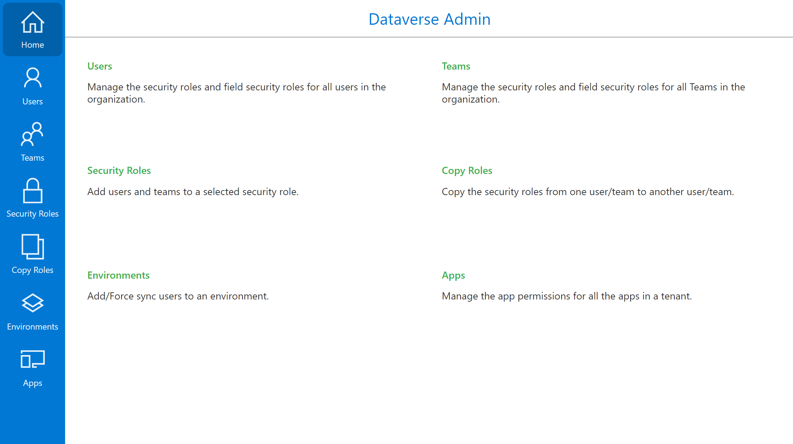
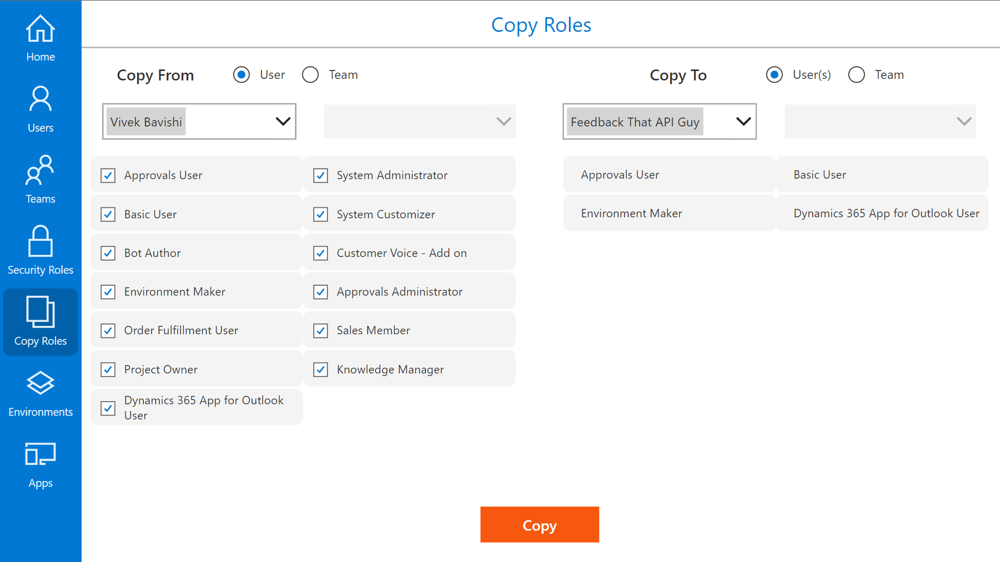

# Dataverse Admin

## Summary

The Dataverse admin app enables admins to easily manage users/teams/security roles/apps and perform some repetitive tasks more efficiently.







## Applies to

* [Microsoft Power Apps](https://docs.microsoft.com/powerapps/)


## Compatibility


## Version history

Version|Date|Comments
-------|----|--------
1.0.1| Apr 6, 2022|Added an option to search for user in the Apps screen and added a new manage environment variables screen
1.0|Feb 17, 2022|Initial release

## Features

All the following operations can be performed using this app:
* Manage Security roles of Users and Teams.
* Add / remove amultiple users from a Security Role.
* Copy Security roles from one user/team to another.
* Add users to an environment.
* Manage app permissions for all the apps in a tenant.
* Manage all environment variables from a single place.

## Prerequisites

You need to be a system admin in order to perform all the operations listed above. Though the app will work partly for makers, the intended audience for this app is system admins.

## Data Sources

* Dataverse

## Minimal Path to Awesome

* [Download](./solution/DataverseAdmin.msapp) the `.msapp` from the `solution` folder
* Use the `.msapp` file using **File** > **Open** > **Browse** within Power Apps Studio.
* Save and Publish

## Using the Source Code

You can also use the [Power Apps CLI](https://docs.microsoft.com/powerapps/developer/data-platform/powerapps-cli) to pack the source code by following these steps::

* Clone the repository to a local drive
* Pack the source files back into `.msapp` file:
  ```bash
  pac canvas pack --sources pathtosourcefolder --msapp pathtomsapp
  ```
  Making sure to replace `pathtosourcefolder` to point to the path to this sample's `sourcecode` folder, and `pathtomsapp` to point to the path of this solution's `.msapp` file (located under the `solution` folder)
* Within **Power Apps Studio**, use the `.msapp` file using **File** > **Open** > **Browse** and select the `.msapp` file you just packed.

## Disclaimer

**THIS CODE IS PROVIDED *AS IS* WITHOUT WARRANTY OF ANY KIND, EITHER EXPRESS OR IMPLIED, INCLUDING ANY IMPLIED WARRANTIES OF FITNESS FOR A PARTICULAR PURPOSE, MERCHANTABILITY, OR NON-INFRINGEMENT.**

## Help

We do not support samples, but we this community is always willing to help, and we want to improve these samples. We use GitHub to track issues, which makes it easy for  community members to volunteer their time and help resolve issues.

If you encounter any issues while using this sample, you can [create a new issue](https://github.com/pnp/powerapps-samples/issues/new?assignees=&labels=Needs%3A+Triage+%3Amag%3A%2Ctype%3Abug-suspected&template=bug-report.yml&sample=YOURSAMPLENAME&authors=@YOURGITHUBUSERNAME&title=YOURSAMPLENAME%20-%20).

For questions regarding this sample, [create a new question](https://github.com/pnp/powerapps-samples/issues/new?assignees=&labels=Needs%3A+Triage+%3Amag%3A%2Ctype%3Abug-suspected&template=question.yml&sample=YOURSAMPLENAME&authors=@YOURGITHUBUSERNAME&title=YOURSAMPLENAME%20-%20).

Finally, if you have an idea for improvement, [make a suggestion](https://github.com/pnp/powerapps-samples/issues/new?assignees=&labels=Needs%3A+Triage+%3Amag%3A%2Ctype%3Abug-suspected&template=suggestion.yml&sample=YOURSAMPLENAME&authors=@YOURGITHUBUSERNAME&title=YOURSAMPLENAME%20-%20).

## For more information

- [Overview of creating apps in Power Apps](https://docs.microsoft.com/powerapps/maker/)
- [Power Apps canvas apps documentation](https://docs.microsoft.com/en-us/powerapps/maker/canvas-apps/)


---
