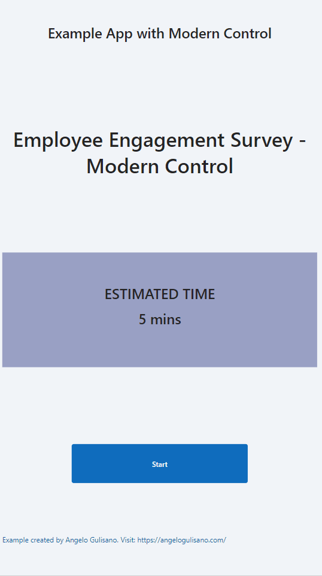

# Employee Engagement Survey - Modern Controls

## Summary

This is a an App like "Employee Engagement Survey" app's sample by Microsoft (you can create it by "Start from template" section when you creating new Power App) but this one using (when possible) modern controls.
These new controls (In Preview) are based on Fluent UI and you can use it to build application with professional UI.
If you don't kwow what modern controls are, you can start here [Canvas App - Modern Controls](https://powerapps.microsoft.com/en-us/blog/modern-controls-coming-to-canvas-apps/)



## Applies to

* [Microsoft Power Apps](https://docs.microsoft.com/powerapps/)

## Compatibility


## Authors

Solution|Author(s)
--------|---------
Employee Engagement Survey - Modern Controls | [Angelo Gulisano](https://angelogulisano.com/) ([@angelog1908](https://twitter.com/angelog1908))

## Version history

Version|Date|Comments
-------|----|--------
1.0|April 02, 2023|Initial release

## Features

This sample illustrates the following concepts:

* Containers: All control are inside containers.
* Controls from **Modern Controls**:
  - Button
  - Checkbox
  - Link (used to show credits in botton of app and link my blog :-) )
  - Text
  - Text Input

## Prerequisites

* **Modern Control Experimental Feature**: Official reference [Modern Control](https://powerapps.microsoft.com/en-us/blog/modern-controls-coming-to-canvas-apps/)
* **Modern Control** from my blog [Modern Control] (https://angelogulisano.com/power-apps-modern-controls/)

## Solution Components

The following solution components are used in this sample:

* Employee Survey - Modern Control (Canvas app)

## Data Sources

No datasources needed.

### Using the sample

No configuration is needed to use this sample.  All data is stored locally in the app.

## Minimal Path to Awesome

* [Download](./solution/EmployeeSurveyModernControls.zip) the solution `.zip` from the `solution` folder
* Within **https://make.powerapps.com**, import the `.zip` file via **Solutions** > **Import solution** > **Browse** and select the `.zip` file you just downloaded.
* Click next.
* ...

## Using the Source Code

You can also use the [Power Apps CLI](https://aka.ms/pac/docs) to pack the source code by following these steps::

* Clone the repository to a local drive
* Pack the source files back into `.zip` file:
  ```bash
  pac solution pack --folder pathtosourcefolder --zipfile pathtosolution  --processCanvasApps
  ```
  Making sure to replace `pathtosourcefolder` to point to the path to this sample's `sourcecode` folder, and `pathtosolution` to point to the path of this solution's `.zip` file (located under the `solution` folder)
* Within **https://make.powerapps.com**, import the `.zip` file via **Solutions** > **Import solution** > **Browse** and select the `.zip` file you just downloaded.
* Click next.
* ...

## Disclaimer

**THIS CODE IS PROVIDED *AS IS* WITHOUT WARRANTY OF ANY KIND, EITHER EXPRESS OR IMPLIED, INCLUDING ANY IMPLIED WARRANTIES OF FITNESS FOR A PARTICULAR PURPOSE, MERCHANTABILITY, OR NON-INFRINGEMENT.**

## Help

We do not support samples, but we this community is always willing to help, and we want to improve these samples. We use GitHub to track issues, which makes it easy for  community members to volunteer their time and help resolve issues.

If you encounter any issues while using this sample, you can [create a new issue](https://github.com/pnp/powerapps-samples/issues/new?assignees=&labels=Needs%3A+Triage+%3Amag%3A%2Ctype%3Abug-suspected&template=bug-report.yml&sample=employee-engagement-survey-modern-controls&authors=@angelogulisano&title=employee-engagement-survey-modern-controls).

For questions regarding this sample, [create a new question](https://github.com/pnp/powerapps-samples/issues/new?assignees=&labels=Needs%3A+Triage+%3Amag%3A%2Ctype%3Abug-suspected&template=question.yml&sample=employee-engagement-survey-modern-controls&authors=@angelogulisano&title=employee-engagement-survey-modern-controls).

Finally, if you have an idea for improvement, [make a suggestion](https://github.com/pnp/powerapps-samples/issues/new?assignees=&labels=Needs%3A+Triage+%3Amag%3A%2Ctype%3Abug-suspected&template=suggestion.yml&sample=employee-engagement-survey-modern-controls&authors=@angelogulisano&title=employee-engagement-survey-modern-controls).

## For more information

- [Read my blog - https://angelogulisano.com](https://angelogulisano.com/)
- [Overview of creating apps in Power Apps](https://docs.microsoft.com/powerapps/maker/)
- [Power Apps canvas apps documentation](https://docs.microsoft.com/en-us/powerapps/maker/canvas-apps/)
