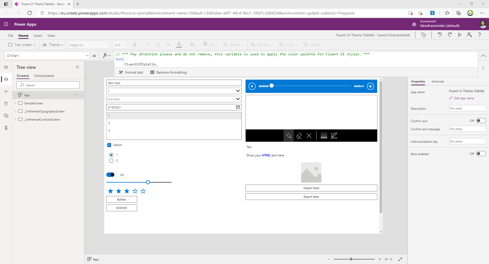
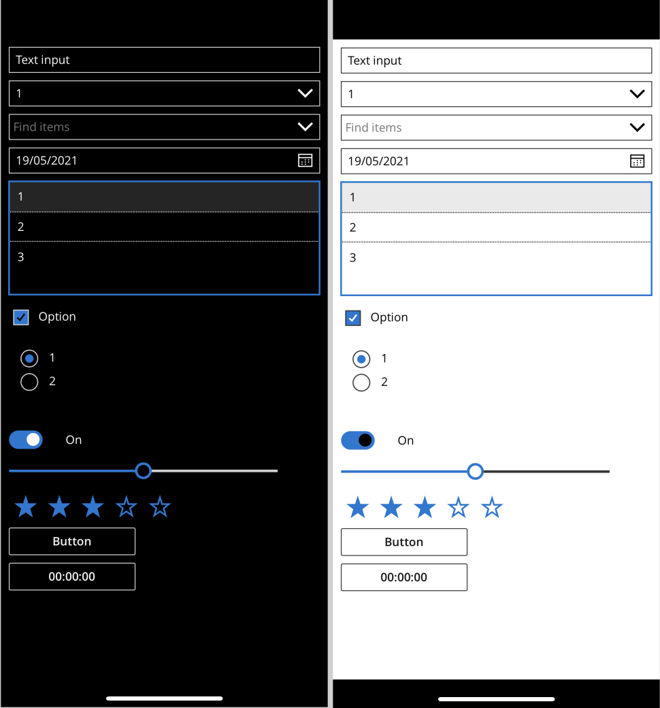
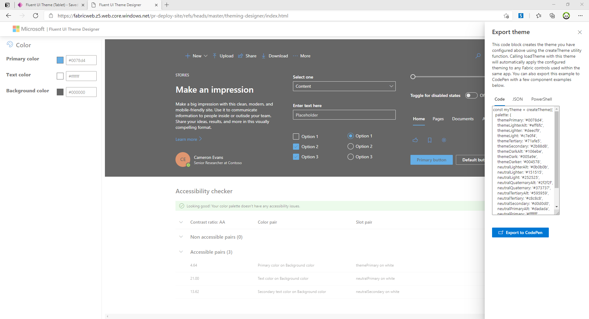
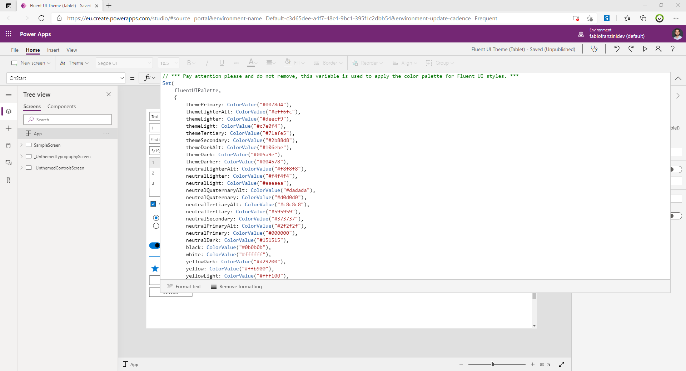

# Fluent UI Custom Theme (Tablet)

Implementing a custom theme (for tablet layout) to apply the style of the Fluent UI controls to the canvas controls with extensive modification of the "Default Theme" inside the `theme.json` file.

### Some sample Screens

This is the 'Sample Screen' present which contains only a few controls that have been stylized:

  

Using the screen level settings contained in this template, the application can also be opened with a smartphone showing an adaptive layout (always use responsive controls for this purpose).

This work was made necessary to remedy the problem that afflicts the current controls of the Canvas App, that is a non "Modern" graphics.

The work that has been done, with all the limitations of the case, is just re-styling the controls, not changing the controls.

Canvas Apps created in Dataverse for Teams use an updated version of controls that rely on Fluent UI React, which is currently not true for Canvas Apps created outside of Dataverse for Teams.

## Applies to

* [Microsoft Power Apps](https://docs.microsoft.com/powerapps/)

## Compatibility

## Authors

Solution|Author(s)
--------|---------
Fluentui-custom-theme | [Fabio Franzini](https://github.com/fabiofranzini), ([https://fabiofranzini.com](https://fabiofranzini.com) [@franzinifabio](https://www.twitter.com/franzinifabio) )

## Version history

Version|Date|Comments
-------|----|--------
1.0|May 19, 2021|Initial release

## Features

This sample includes the default style for the following controls:

* Button
* Text Input
* Pen Input
* Dropdown
* Combobox
* Date Picker
* Listbox
* Checkbox
* Radio
* Toggle
* Slider
* Rating
* Timer
* Forms (Edit/View)
* Rich Text Editor
* Label
* HTML Text
* Forms Pro survey
* Data Table
* Gallery
* Image
* Camera
* Barcode Scanner
* Video
* Microsoft Stream
* Audio
* Microphone
* Add Picture
* Import
* Export
* PDF Viewer
* All Shapes
* All Charts

And include 2 screens with some "Unthemed" (not possible to theme them into the theme.json) controls like:

* Some Fluent UI Typography
* Some Fluent UI Button Styles

The color palette is based on that of Fluent UI React (as the name of the colors present) and is completely customizable by acting on the variable called fluentUIPalette which is initialized in the OnStart event of the App object, as you can see here: 

In this way it is possible to generate your own palette and set the values in the variable fluentUIPalette:

All controls theme in the theme.json file are based on the fluentUIPalette variable defined in the app. Removing or modifying (not maintaining the same structure) of this variable will generate function level errors.

## Minimal Path to Awesome

* [Download](https://github.com/pnp/powerapps-samples/raw/main/samples/fluentui-custom-theme/solution/fluentui-custom-theme.msapp) the `.msapp` from the [`solution`](https://github.com/pnp/powerapps-samples/tree/main/samples/fluentui-custom-theme/solution) folder
* Within **Power Apps Studio**, use the `.msapp` file using **File** > **Open** > **Browse** and select the `.msapp` file you just downloaded.
* Save and Publish

## Using the Source Code

  You can also use the [Power Apps Source Code tool](https://github.com/microsoft/PowerApps-Language-Tooling) to the code using these steps:

* Clone the repository to a local drive
* Pack the source files back into `.msapp` file:
  * [Power Apps Tooling Usage](https://github.com/microsoft/PowerApps-Language-Tooling)
* Within **Power Apps Studio**, use the `.msapp` file using **File** > **Open** > **Browse** and select the `.msapp` file you just packed.

## Disclaimer

**THIS CODE IS PROVIDED *AS IS* WITHOUT WARRANTY OF ANY KIND, EITHER EXPRESS OR IMPLIED, INCLUDING ANY IMPLIED WARRANTIES OF FITNESS FOR A PARTICULAR PURPOSE, MERCHANTABILITY, OR NON-INFRINGEMENT.**

## Support

While we don't support samples, if you encounter any issues while using this sample, you can [create a new issue](https://github.com/pnp/powerapps-samples/issues/new?assignees=&labels=Needs%3A+Triage+%3Amag%3A%2Ctype%3Abug-suspected&template=bug-report.yml&sample=fluentui-custom-theme&authors=@fabiofranzini&title=fluentui-custom-theme%20-%20).

For questions regarding this sample, [create a new question](https://github.com/pnp/powerapps-samples/issues/new?assignees=&labels=Needs%3A+Triage+%3Amag%3A%2Ctype%3Abug-suspected&template=question.yml&sample=fluentui-custom-theme&authors=@fabiofranzini&title=fluentui-custom-theme%20-%20).

Finally, if you have an idea for improvement, [make a suggestion](https://github.com/pnp/powerapps-samples/issues/new?assignees=&labels=Needs%3A+Triage+%3Amag%3A%2Ctype%3Abug-suspected&template=suggestion.yml&sample=fluentui-custom-theme&authors=@fabiofranzini&title=fluentui-custom-theme%20-%20).

## For more information

- [Overview of creating apps in Power Apps](https://docs.microsoft.com/powerapps/maker/)
- [Power Apps canvas apps documentation](https://docs.microsoft.com/en-us/powerapps/maker/canvas-apps/)

