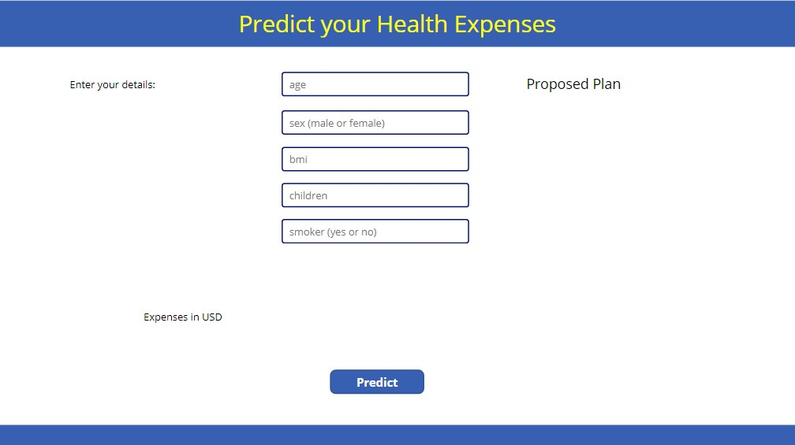
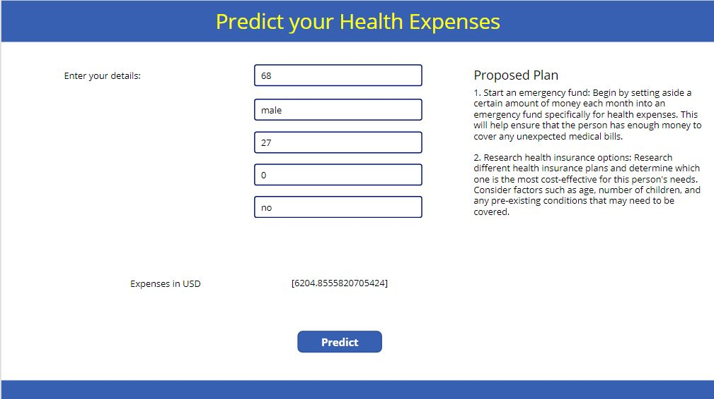
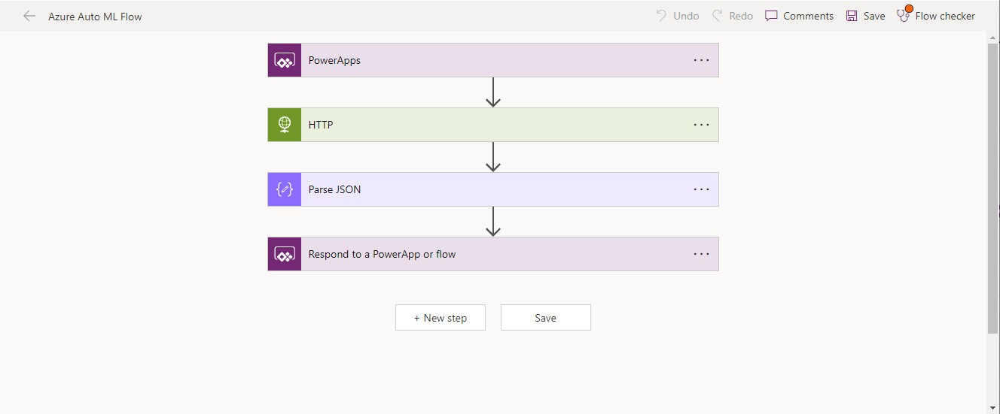

# Health Expense

## Summary

This sample allows the user to predict their Health Expense using a Machine Learning Model and then get a detailed personalized plan to save for it.

|Starting Screen|Output 1 |Output 2 |
:-------------------------:|:-------------------------:|:-------------------------:
 |  | 

## Applies to

* [Microsoft Power Apps](https://docs.microsoft.com/powerapps/)

## Compatibility

> Don't worry about this section, we'll take care of it. Unless you really want to...


## Authors

Solution|Author(s)
--------|---------
HealthExpense | [Aaryan Arora](https://github.com/aaryan2134), Delhi Technological University

## Version history

Version|Date|Comments
-------|----|--------
1.0|March 25, 2023|Initial release

## Features

This sample allows the user to:

* Predict Health expenses based on various parameters like age, sex, bmi, number of children and whether they are a smoker or not
* Uses a custom built Azure Auto ML model integrated to Power Apps using Power Automate Flow
* Provides a customized plan to save for health expenses based on inputs and the result of the model using Open AI's API

## Prerequisites

You need to get an API key from [OpenAI](https://platform.openai.com/)

## Solution Components

The following solution components are used in this sample:

* HealthExpense (Canvas app)
* Azure Auto ML Flow (Power Automate flow)
* Azure Auto ML Model for predictions

## Data Sources

### Open AI Connector
This connector connects to the Open AI API and uses the information to create a health expense plan. You can add it to the app as follows:

* In the Data tab, click Add data->connectors->OpenAI.
* Next, click on Add a new connection.
* Enter the API key and click Connect.

### Power Automate Flow
Use a Power Automate Flow to pass the input to the model and get the results back.

* The flow uses HTTP to POST the inputs to the Model Endpoint
* It then uses Parse JSON to parse the output
* Finally sends it back to the Power App

A screenshot for the flow:


## Instructions to Deploy your own Azure AutoML Model
* Go to Azure Machine Learning Studio and create a new Workspace
* Select Automated ML and Select +New automated ML job
* Follow the instructions on the screen to add dataset
* After that, configure the job and forecast settings
* Run the experiment
* Once training is completed, select the best model from the results
* Select Deploy
* This process might take a while
* Once deploying is completed, go to the deployed model and copy the end point URL
* This end point URL can be used directly in the Power Automate Flow to connect the model with Power Apps

Check out [this](https://learn.microsoft.com/azure/machine-learning/tutorial-automated-ml-forecast?view=azureml-api-2&wt.mc_id=studentamb_133327) for more detailed instructions.

## Minimal Path to Awesome

* [Download](./solution/HealthExpense.zip) the solution `.zip` from the `solution` folder
* Within **https://make.powerapps.com**, import the `.zip` file via **Solutions** > **Import solution** > **Browse** and select the `.zip` file you just downloaded.
* Select the Data tab
* Connect the app with OpenAI Connector as stated above.
* Add the ML Model flow as stated above.

## Using the Source Code

You can also use the [Power Apps CLI](https://aka.ms/pac/docs) to pack the source code by following these steps::

* Clone the repository to a local drive
* Pack the source files back into `.zip` file:
  ```bash
  pac solution pack --folder pathtosourcefolder --zipfile pathtosolution  --processCanvasApps
  ```
  Making sure to replace `pathtosourcefolder` to point to the path to this sample's `sourcecode` folder, and `pathtosolution` to point to the path of this solution's `.zip` file (located under the `solution` folder)
* Within **https://make.powerapps.com**, import the `.zip` file via **Solutions** > **Import solution** > **Browse** and select the `.zip` file you just downloaded.
* Click next.

## Disclaimer

**THIS CODE IS PROVIDED *AS IS* WITHOUT WARRANTY OF ANY KIND, EITHER EXPRESS OR IMPLIED, INCLUDING ANY IMPLIED WARRANTIES OF FITNESS FOR A PARTICULAR PURPOSE, MERCHANTABILITY, OR NON-INFRINGEMENT.**

## Help

> Note: don't worry about this section, we'll update the links.

We do not support samples, but we this community is always willing to help, and we want to improve these samples. We use GitHub to track issues, which makes it easy for  community members to volunteer their time and help resolve issues.

If you encounter any issues while using this sample, you can [create a new issue](https://github.com/pnp/powerapps-samples/issues/new?assignees=&labels=Needs%3A+Triage+%3Amag%3A%2Ctype%3Abug-suspected&template=bug-report.yml&sample=YOURSAMPLENAME&authors=@YOURGITHUBUSERNAME&title=YOURSAMPLENAME%20-%20).

For questions regarding this sample, [create a new question](https://github.com/pnp/powerapps-samples/issues/new?assignees=&labels=Needs%3A+Triage+%3Amag%3A%2Ctype%3Abug-suspected&template=question.yml&sample=YOURSAMPLENAME&authors=@YOURGITHUBUSERNAME&title=YOURSAMPLENAME%20-%20).

Finally, if you have an idea for improvement, [make a suggestion](https://github.com/pnp/powerapps-samples/issues/new?assignees=&labels=Needs%3A+Triage+%3Amag%3A%2Ctype%3Abug-suspected&template=suggestion.yml&sample=YOURSAMPLENAME&authors=@YOURGITHUBUSERNAME&title=YOURSAMPLENAME%20-%20).

## For more information

- [Overview of creating apps in Power Apps](https://docs.microsoft.com/powerapps/maker/)
- [Power Apps canvas apps documentation](https://docs.microsoft.com/en-us/powerapps/maker/canvas-apps/)


---
