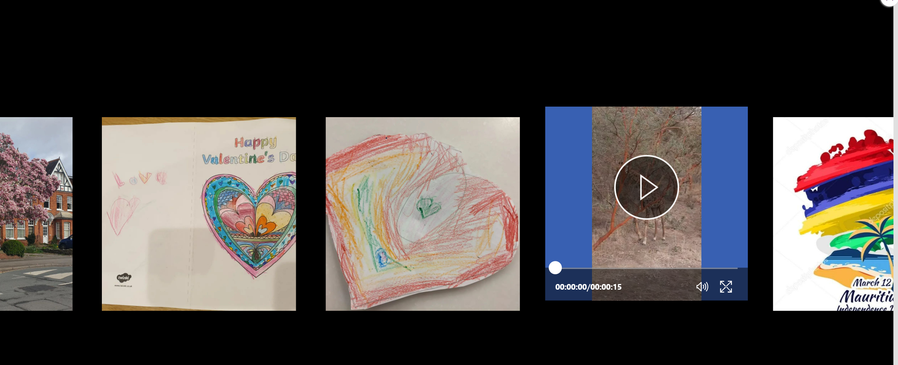
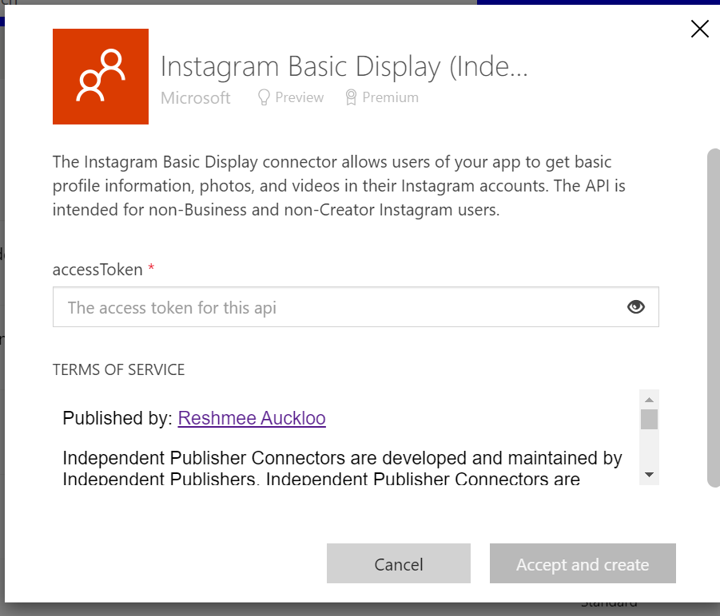

# Instagram Basic Display canvas app

## Summary

This uses the **Instagram Basic Display (IndependentPublisher)** connector to retrieve media images and videos in a gallery.

  

## Applies to

* [Microsoft Power Apps](https://docs.microsoft.com/powerapps/)

## Compatibility


## Authors

Solution|Author(s)
--------|---------
Instagram Basic Display | [Reshmee Auckloo](https://github.com/reshmee011)

## Version history

Version|Date|Comments
-------|----|--------
1.0|April 18, 2023|Initial release

## Features

This uses **Instagram Basic Display (IndependentPublisher)** connector to display a combination of media images and videos in a gallery from Instagram.

The UI consists of a gallery with swiping effect achieved using the slider trick mentioned in [How to build a curved gallery in Power Apps](https://www.m365princess.com/blogs/build-curved-gallery-power-apps/) by Luise Freese.

## Prerequisites

An Instagram developer account is required to generate an access token, and using that token to fetch the feed data from [Instagram's Basic Display API](https://developers.facebook.com/docs/instagram-basic-display-api/overview#instagram-user-access-tokens) environment.

Follow the steps to generate your user access token.

### Step 1

Go to developers.facebook.com and sign in to your Facebook account. Click on the "My Apps" button on the top right.

### Step 2

Click on the "Create App" button.

### Step 3

Select either "Consumer" or "None" as your application type.

### Step 4

Give your application a name, enter your contact email, and create your app.

### Step 5

Re-enter your Facebook account password

### Step 6

Click on the "Set Up" button in the "Instagram Basic Display" box.

### Step 7

Click on "Create New App" and click on "Create App" from the pop up to create a new instagram app id.

### Step 8

Save your changes. In the "User Token Generator" section, click on the "Add or Remove Instagram Testers" button, and follow the instructions.

### Step 9

Click on the link "apps and websites" link to manage instagram tester invitations and click on accept.

### Step 11

Click on "Basic Display", click on "Generate Token" under "User Token Generator" and from the pop up click on "continue as <testername>".

### Step 12

Click on "Allow" from the pop up to authorise the app to retrieve profile and media information about the instagram user.

### Step 13

Copy the user token to be used on the connection reference.

You must then enter this access token in the connector to get the instagram feeds from the authenticated user.



## Known Limitations

Instagram Basic API only allows access to basic data such as user profiles and photos. It does not provide access to more advanced features such as direct messaging, insights, and analytics.
There is also a limit on the number of calls done daily.

## Data Sources

* **Instagram Basic Display (IndependentPublisher)**

## Minimal Path to Awesome

* [Download](./solution/solution.zip) the `.zip` from the `solution` folder
* Within **Power Apps Studio**, import the solution `.zip` file using **Solutions** > **Import Solution** and select the `.zip` file you just packed.
* Open the app in edit mode and make sure the data source **InstagramBasicDisplay** is connected correctly.

## Using the Source Code

You can also use the [Power Apps CLI](https://docs.microsoft.com/powerapps/developer/data-platform/powerapps-cli) to pack the source code by following these steps::

* Clone the repository to a local drive
* Pack the source files back into a solution `.zip` file:

  ```bash
  pac solution pack --zipfile pathtodestinationfile --folder pathtosourcefolder --processCanvasApps
  ```

  Making sure to replace `pathtosourcefolder` to point to the path to this sample's `sourcecode` folder, and `pathtodestinationfile` to point to the path of this solution's `.zip` file (located under the `solution` folder)
* Within **Power Apps Studio**, import the solution `.zip` file using **Solutions** > **Import Solution** and select the `.zip` file you just packed.

## Disclaimer

**THIS CODE IS PROVIDED *AS IS* WITHOUT WARRANTY OF ANY KIND, EITHER EXPRESS OR IMPLIED, INCLUDING ANY IMPLIED WARRANTIES OF FITNESS FOR A PARTICULAR PURPOSE, MERCHANTABILITY, OR NON-INFRINGEMENT.**

## Support

While we don't support samples, if you encounter any issues while using this sample, you can [create a new issue](https://github.com/pnp/powerapps-samples/issues/new?assignees=&labels=Needs%3A+Triage+%3Amag%3A%2Ctype%3Abug-suspected&template=bug-report.yml&sample=instagram-basic-display&authors=@reshmee011&title=instagram-basic-display%20-%20).

For questions regarding this sample, [create a new question](https://github.com/pnp/powerapps-samples/issues/new?assignees=&labels=Needs%3A+Triage+%3Amag%3A%2Ctype%3Abug-suspected&template=question.yml&sample=instagram-basic-display&authors=@reshmee011&title=instagram-basic-display%20-%20).

Finally, if you have an idea for improvement, [make a suggestion](https://github.com/pnp/powerapps-samples/issues/new?assignees=&labels=Needs%3A+Triage+%3Amag%3A%2Ctype%3Abug-suspected&template=suggestion.yml&sample=instagram-basic-display&authors=@reshmee011&title=instagram-basic-display%20-%20).

## For more information

* [Companion blog post about this sample](https://www.m365princess.com/blogs/build-powerapps-progressbar-component/)
* [Overview of creating apps in Power Apps](https://docs.microsoft.com/powerapps/maker/)
* [Power Apps canvas apps documentation](https://docs.microsoft.com/powerapps/maker/canvas-apps/)
