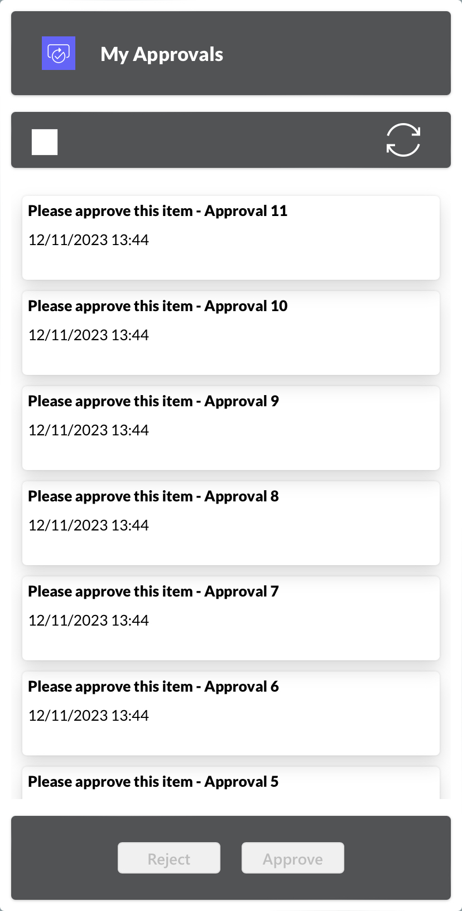
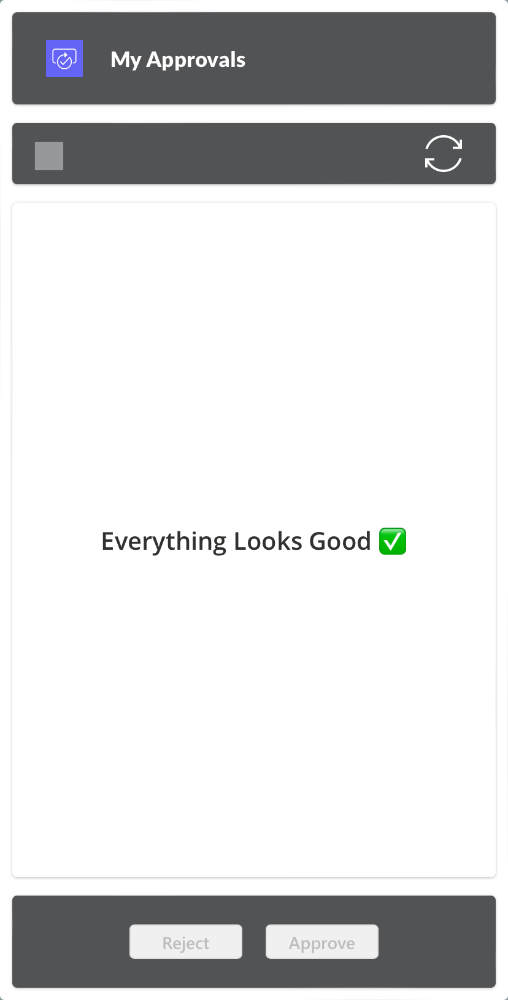

# Manage your Power Platform Approvals inside Power Apps

## Summary

This sample solution demonstrates how to manage your Approvals in a Power App by updating the relevant Approvals tables in Dataverse. 

## Canvas Power App
* Manage Approvals App

#### Manage Approvals App
* This Canvas app displays all pending approvals (***Approve/Reject - First to Respond Only***) for the current user. 
* Users have the ability to select items and approve or reject them individually or in bulk.

#### Pending approvals


#### No pending approvals


## Flow
* Set Approval Result

#### Set Approval Result
* This flow updates the relevant Dataverse tables and also initiates a POST request to ensure the "Waiting for Approval" action in Power Automate proceeds rather than remaining in a waiting state.
* Once this flow is executed, it will no longer be possible to Approve or Reject the item through the adaptive card sent in an email or via Microsoft Teams.


## Applies to

* [Microsoft Power Automate](https://docs.microsoft.com/power-automate/)
* [Microsoft Power Apps](https://docs.microsoft.com/power-apps)

## Compatibility


## Authors

Solution|Author(s)
--------|---------
manage-approvals | [Gabriel Koolman](https://www.linkedin.com/in/gabrielkoolman/)

## Version history

Version|Date|Comments
-------|----|--------
1.0|November 12, 2023|Initial release

## Minimal Path to Awesome

* [Download](solution/manage-approvals.zip) the `.zip` file from the `solution` folder
* Import the solution by going to the [Power Apps Portal](https://make.powerapps.com) and clicking on **"Import Solution"**
* Make sure you have the **Approval User** and **Approval Administrator** security role

## Using the Source Code

You can also use the [Power Platform CLI](https://docs.microsoft.com/powerapps/developer/data-platform/powerapps-cli) to pack the source code by following these steps::

* Clone the repository to a local drive
* Pack the source files back into a solution `.zip` file:
  ```bash
  pac solution pack --zipfile pathtodestinationfile --folder pathtosourcefolder
  ```
  Making sure to replace `pathtosourcefolder` to point to the path to this sample's `sourcecode` folder, and `pathtodestinationfile` to point to the path of this solution's `.zip` file (located under the `solution` folder)
* Within **Power Apps Studio**, import the solution `.zip` file using **Solutions** > **Import Solution** and select the `.zip` file you just packed.

## Disclaimer

**THIS CODE IS PROVIDED *AS IS* WITHOUT WARRANTY OF ANY KIND, EITHER EXPRESS OR IMPLIED, INCLUDING ANY IMPLIED WARRANTIES OF FITNESS FOR A PARTICULAR PURPOSE, MERCHANTABILITY, OR NON-INFRINGEMENT.**

## For more information

- [Overview of creating apps in Power Apps](https://docs.microsoft.com/powerapps/maker/)
- [Power Apps canvas apps documentation](https://docs.microsoft.com/en-us/powerapps/maker/canvas-apps/)


