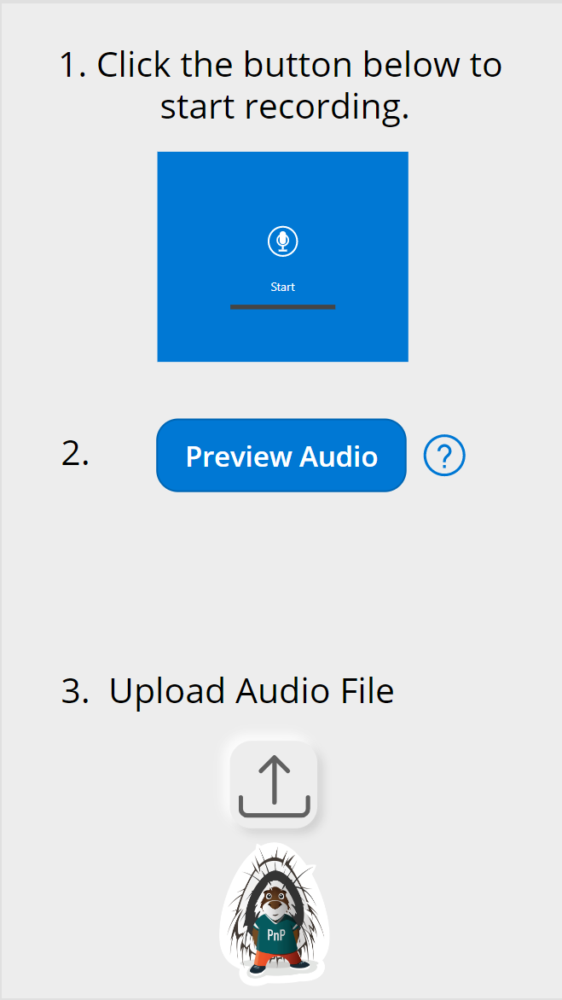
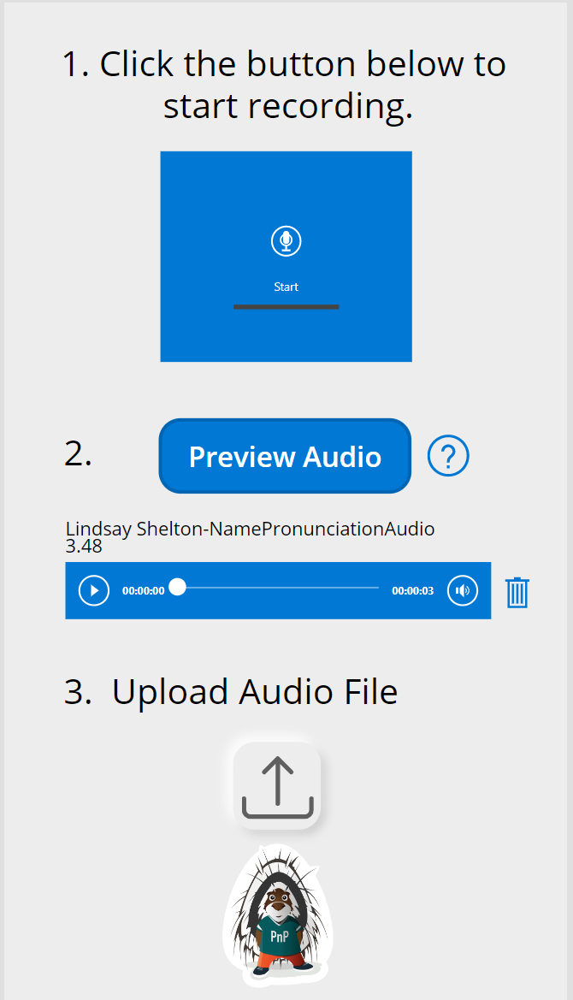
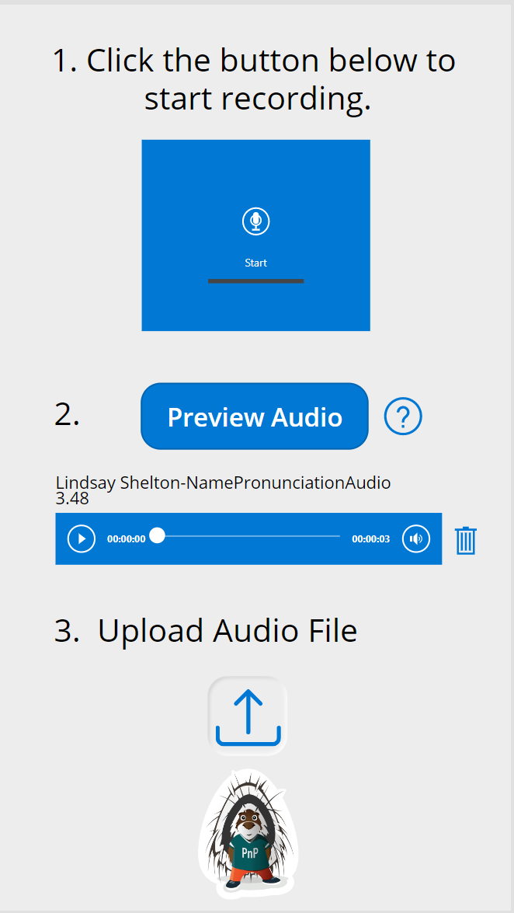
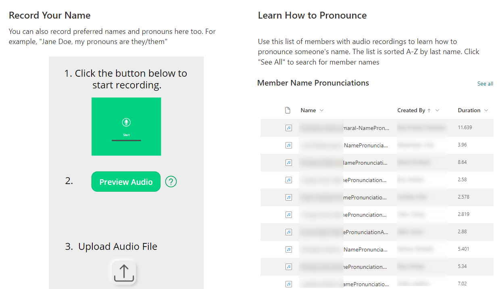

# Name Pronunciation Recorder

## Summary

We live in an incredibly diverse society, but one of the challenges that can come with that is working with people who have names from different cultures and languages that might not be immediately clear how to pronounce.  This is meant to serve as a solution to that problem.  Paired with the "Send Name Pronunciation Recording to Library" Power Automate sample and a document library, you can utilize this Power App to allow your users to record their name pronunciations and upload them to SharePoint, where others in your organization can then listen to them and practice on their own, leading to increasingly satisfying interactions and reducing confusion over a common problem.

One possible extension of this solution is having your users also share their pronouns as a part of their recording.  Our organization's example prompt for recordings is "My name is Jane Doe, and my pronouns are they/them".  Feel free to adapt to your organization's needs, but we felt this was more inclusive.






You can go to this blog post for more details about the implementations of this solution https://lindsaytshelton.com/2022/09/30/how-to-create-a-name-pronunciation-database-using-the-power-platform/

## Applies to

* [Microsoft Power Apps](https://docs.microsoft.com/powerapps/)
* [Microsoft Power Automate](https://docs.microsoft.com/power-automate/)
* [Microsoft SharePoint](https://learn.microsoft.com/en-us/sharepoint/)

## Compatibility

> Don't worry about this section, we'll take care of it. Unless you really want to...


## Authors

Solution|Author(s)
--------|---------
name-pronunciation-recorder | [Lindsay Shelton](https://github.com/lsheltonSTO) ([@lshelton_tech](https://twitter.com/lshelton_tech)), Stowers Institute for Medical Research

## Version history

Version|Date|Comments
-------|----|--------
1.0|October 11, 2022|Initial release

## Features

This Power App could be modified for anything you'd like users to record using the audio functionality in Power Apps - it isn't limited to just a name pronunciation database.  Feel free to modify the accompanying Power Automate sample to use a different data source as well.

This sample illustrates the following concepts:

* Using the Audio and Microphone functionality in Power Apps
* Transforming that audio data into a format that SharePoint can read
* Uploading that transformed audio data into a SharePoint document library

## Prerequisites

It is important, unless you want to create one from scratch, to ALSO download the Power Automate sample "Send Name Pronunciation Recording to Library" and IMPORT THAT FILE FIRST.  Errors may occur if you try to import the .msapp file without the Power Automate flow already in place.

## Data Sources

There is not technically a data source, as you are creating the data in this app.  The data flows into the SharePoint Document Library, but that can be changed in Power Automate.

### SharePoint Document Library

This SharePoint Document Library contains all of the uploaded audio files.  Set the list up as follows:

|Type|Internal Name|Required|
|---|---|:---:|
|Single line of text|Name (renaming default Title column)|Yes|
|Number|Duration|No|

## Minimal Path to Awesome

* [Download](./solution/NamePronunciationRecorder.msapp) the `.msapp` from the `solution` folder
* Within **Power Apps Studio**, use the `.msapp` file using **File** > **Open** > **Browse** and select the `.msapp` file you just downloaded.
* Select the **Data** tab
* ...

## Using the Source Code

You can also use the [Power Apps CLI](https://docs.microsoft.com/powerapps/developer/data-platform/powerapps-cli) to pack the source code by following these steps::

* Clone the repository to a local drive
* Pack the source files back into `.msapp` file:
  ```bash
  pac canvas pack --sources pathtosourcefolder --msapp pathtomsapp
  ```
  Making sure to replace `pathtosourcefolder` to point to the path to this sample's `sourcecode` folder, and `pathtomsapp` to point to the path of this solution's `.msapp` file (located under the `solution` folder)
* Within **Power Apps Studio**, use the `.msapp` file using **File** > **Open** > **Browse** and select the `.msapp` file you just packed.

## Disclaimer

**THIS CODE IS PROVIDED *AS IS* WITHOUT WARRANTY OF ANY KIND, EITHER EXPRESS OR IMPLIED, INCLUDING ANY IMPLIED WARRANTIES OF FITNESS FOR A PARTICULAR PURPOSE, MERCHANTABILITY, OR NON-INFRINGEMENT.**

## Help

> Note: don't worry about this section, we'll update the links.

We do not support samples, but we this community is always willing to help, and we want to improve these samples. We use GitHub to track issues, which makes it easy for  community members to volunteer their time and help resolve issues.

If you encounter any issues while using this sample, you can [create a new issue](https://github.com/pnp/powerapps-samples/issues/new?assignees=&labels=Needs%3A+Triage+%3Amag%3A%2Ctype%3Abug-suspected&template=bug-report.yml&sample=YOURSAMPLENAME&authors=@YOURGITHUBUSERNAME&title=YOURSAMPLENAME%20-%20).

For questions regarding this sample, [create a new question](https://github.com/pnp/powerapps-samples/issues/new?assignees=&labels=Needs%3A+Triage+%3Amag%3A%2Ctype%3Abug-suspected&template=question.yml&sample=YOURSAMPLENAME&authors=@YOURGITHUBUSERNAME&title=YOURSAMPLENAME%20-%20).

Finally, if you have an idea for improvement, [make a suggestion](https://github.com/pnp/powerapps-samples/issues/new?assignees=&labels=Needs%3A+Triage+%3Amag%3A%2Ctype%3Abug-suspected&template=suggestion.yml&sample=YOURSAMPLENAME&authors=@YOURGITHUBUSERNAME&title=YOURSAMPLENAME%20-%20).

## For more information

- [Overview of creating apps in Power Apps](https://docs.microsoft.com/powerapps/maker/)
- [Power Apps canvas apps documentation](https://docs.microsoft.com/en-us/powerapps/maker/canvas-apps/)


---
