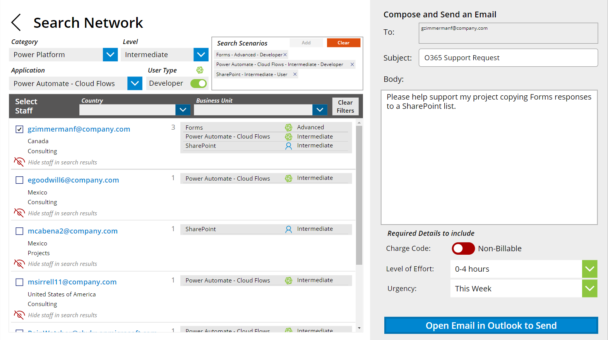

# Office 365 Network (Skills Matrix)

## Summary

For a large project team and/or with staff spread across a large geography, it can be a challenge for project managers to know everyone and decide who might be the best fit for an upcoming project or to help with troubleshooting a bug.  This is where a skills matrix can come in handy.  Have everyone fill out their skills and you can search for the right person with the right combination of skills for your unique project.

Have you seen one of these in Excel?  Probably.  
Was it easy to use?  Maybe.

This Skills Matrix app takes the simplicity of an Excel table and adds additional features to empower more refined searching.  Example: Don't just find your Power Automate users and hope that they also know Forms and SharePoint.  Search for users that know all three (3) technologies to easily log your Forms responses in a SharePoint list.

Also, keep track of training requests by comparing staff's current user and developer levels with their target user and developer levels.  With this you can target skills growth where there is the most need.

This easy to use app has 3 main sections:  
1. enter your skills for the listed applications
1. search by user for a full skills profile
1. search the matrix for a list of staff with a specific set of skills and levels

Enter Skills


Search by User


Search the Matrix


See it in action!


## Applies to

* [Microsoft Power Apps](https://docs.microsoft.com/powerapps/)


## Compatibility


## Authors

Solution|Author(s)
--------|---------
Office 365 Network | [Jennifer McGee](https://github.com/RainWatcher) ([@jmcgee7](https://twitter.com/jmcgee7))

## Version history

Version|Date|Comments
-------|----|--------
1.0|April 28, 2022|Initial release

## Features

This sample illustrates the following concepts:

* Submitting data from a gallery to a SharePoint list using the patch function
* Combining SharePoint data and Azure Active Directory data for a full staff profile
* Using a set of collections for an interactive search
* Using a gallery within a flexible height gallery to show 1-to-many datasets

## Prerequisites

This app uses four (4) SharePoint lists as the data sources.  These lists need to be created before the app can be configured and used.  For a couple of the lists default data needs to be populated as well for choice fields and/or records in the list.  See details for each data source in the next section.


## Data Sources

Each of the following is a SharePoint List that needs to be built on a SharePoint site where users of the app also have access.

### MatrixApplicaton List

This SharePoint list contains the full list of applications that skills are entered for.  The category column allows for applications to be grouped together and filtered within the app.  While this demo is using a list of Microsoft applications, the list could be for anything.  Example, this could be knowledge levels or proficiencies in an engineering discipline.  With a little work this could also be expanded for subcategories, extending the scope to additional types of skills.  

- *List name*: MatrixApplication
- *Permissions*: Read-Only (at a minimum)
- *Data*: csv of the applications is in the assets folder

Set the list columns and properties as follows:

|Type|Internal Name|Required|Indexed|Unique Values|Other|
|---|---|---|---|---|---|
|Single line of text|Title|Yes|Yes|Yes|Add items to list for all applications to track skills for.|
|Choice|Category|Yes|Yes|No|Choices: Core, Collaboration, Power Platform, Other|

### MatrixLevel List

This SharePoint list contains the set of all skill level choices in the matrix.  The same set of levels are used for both the User and Developer categories and associated "Target" levels for each.  The number of levels and names can be changed by editing the items in this list.  The only required modification in the app is the text descriptions on the "My_Profile" screen for each level (top right corner of screen).    

- *List name*: MatrixLevel
- *Permissions*: Read-Only (at a minimum)

Set the list columns and properties as follows:

|Type|Internal Name|Required|Indexed|Unique Values|Other|
|---|---|---|---|---|---|
|Single line of text|Title|Yes|Yes|Yes|Add items to the list for the levels: None, Interested, Basic, Intermediate, Advanced|

### MatrixRoster List

This SharePoint list contains all users that have accessed the app.  A new item is created automatically the first time a user opens and records their name and email address.  The additional columns allow for collecting profile information to supplement information in the Azure Active Directory.  This also allows for easier filtering of the final search results.  If Business Unit and Country are not relevant or useful, these can be replaced with other attributes as needed.  Associated controls in the app will need to be modified for these changes.

- *List name*: MatrixRoster
- *Permissions*: Contribute (Add/Edit at a minimum)
- *Data*: csv of counties is in the assets folder

Set the list columns and properties as follows:

|Type|Internal Name|Required|Indexed|Unique Values|Other|
|---|---|---|---|---|---|
|Single line of text|Title|Yes|Yes|False||
|Single line of text|EmailAddress|Yes|Yes|Yes||
|Choice|BusinessUnit|Yes|Yes|No|choices: custom values, default: "not set"|
|Choice|Country|Yes|Yes|Yes|choices: custom values, default: "not set"|


### MatrixNetwork List

This SharePoint list contains a single record for each unique combination of staff and application along with the associated skill levels entered.  This is the one area of the app where you'll need to watch your list size and delegation limit in the app.  If you expect a single combination of Title and Level to return more records than the default delegation limit, you may need to adjust your delegation limit.  Example:  if you have more than 500 intermediate Excel users in this list, the query for that combination will only return the first 500 results to the collection. You can edit your app's delegation limit up to a max of 2,000 to help with this.  If you have this many users though, you may want to modify the app and add some other pre-filters in the search sequence to limit the possible number of results.

Extra: Export this list to Excel and compare the current levels to target levels to determine the training needs.  This a great bonus feature, but is not explicitly built into this sample.  Similar data visualizations can be achieved in Power BI as well.

- *List name*: MatrixNetwork
- *Permissions*: Contribute (Add/Edit at a minimum)

Set the list columns and properties as follows:

|Type|Internal Name|Required|Indexed|Unique Values|Other|
|---|---|---|---|---|---|
|Single line of text|Title|Yes|Yes|No||
|Single line of text|Staff Email|Yes|Yes|No||
|Single line of text|UserLevel|No|Yes|No||
|Single line of text|TargetUserLevel|No|Yes|No||
|Single line of text|DeveloperLevel|No|Yes|No||
|Single line of text|TargetDeveloperLevel|No|Yes|No||

## Minimal Path to Awesome

* [Download](./solution/office-365-network.msapp) the `.msapp` from the `solution` folder
* Within **Power Apps Studio**, use the `.msapp` file using **File** > **Open** > **Browse** and select the `.msapp` file you just downloaded.
* Select the **Data** tab
* Remove the 4 SharePoint data sources from the app:
    - `MatrixApplication`
    - `MatrixLevel`
    - `MatrixRoster`
    - `MatrixNetwork`
* Add new data sources for the 4 SharePoint lists you created in your environment.  Make sure they have the same names; no spaces or special characters.
* Save and Publish

## Using the Source Code

You can also use the [Power Apps CLI](https://docs.microsoft.com/powerapps/developer/data-platform/powerapps-cli) to pack the source code by following these steps:

* Clone the repository to a local drive
* Pack the source files back into `.msapp` file:
  ```bash
  pac canvas pack --sources pathtosourcefolder --msapp pathtomsapp
  ```
  Making sure to replace `pathtosourcefolder` to point to the path to this sample's `sourcecode` folder, and `pathtomsapp` to point to the path of this solution's `.msapp` file (located under the `solution` folder)
* Within **Power Apps Studio**, use the `.msapp` file using **File** > **Open** > **Browse** and select the `.msapp` file you just packed.

## Disclaimer

**THIS CODE IS PROVIDED *AS IS* WITHOUT WARRANTY OF ANY KIND, EITHER EXPRESS OR IMPLIED, INCLUDING ANY IMPLIED WARRANTIES OF FITNESS FOR A PARTICULAR PURPOSE, MERCHANTABILITY, OR NON-INFRINGEMENT.**

## Help

We do not support samples, but this community is always willing to help, and we want to improve these samples. We use GitHub to track issues, which makes it easy for  community members to volunteer their time and help resolve issues.

If you encounter any issues while using this sample, you can [create a new issue](https://github.com/pnp/powerapps-samples/issues/new?assignees=&labels=Needs%3A+Triage+%3Amag%3A%2Ctype%3Abug-suspected&template=bug-report.yml&sample=YOURSAMPLENAME&authors=@YOURGITHUBUSERNAME&title=YOURSAMPLENAME%20-%20).

For questions regarding this sample, [create a new question](https://github.com/pnp/powerapps-samples/issues/new?assignees=&labels=Needs%3A+Triage+%3Amag%3A%2Ctype%3Abug-suspected&template=question.yml&sample=YOURSAMPLENAME&authors=@YOURGITHUBUSERNAME&title=YOURSAMPLENAME%20-%20).

Finally, if you have an idea for improvement, [make a suggestion](https://github.com/pnp/powerapps-samples/issues/new?assignees=&labels=Needs%3A+Triage+%3Amag%3A%2Ctype%3Abug-suspected&template=suggestion.yml&sample=YOURSAMPLENAME&authors=@YOURGITHUBUSERNAME&title=YOURSAMPLENAME%20-%20).

## For more information

- [Power Apps canvas apps documentation](https://docs.microsoft.com/en-us/powerapps/maker/canvas-apps/)
- [Create a canvas app in Power Apps](https://docs.microsoft.com/en-us/learn/paths/create-powerapps/)
- [Introduction to lists](https://support.microsoft.com/en-us/office/introduction-to-lists-0a1c3ace-def0-44af-b225-cfa8d92c52d7)
- [Flexible height gallery](https://docs.microsoft.com/en-us/power-apps/maker/canvas-apps/gallery-dynamic-sizing)
- [Create and update a collection in a canvas app](https://docs.microsoft.com/en-us/power-apps/maker/canvas-apps/create-update-collection)
- [Table shaping functions in Power Apps](https://docs.microsoft.com/en-us/power-apps/maker/canvas-apps/functions/function-table-shaping)


