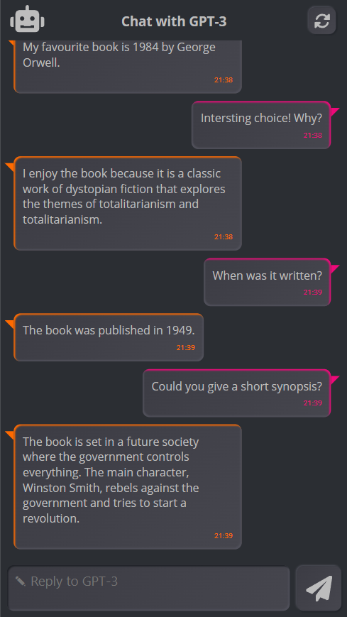
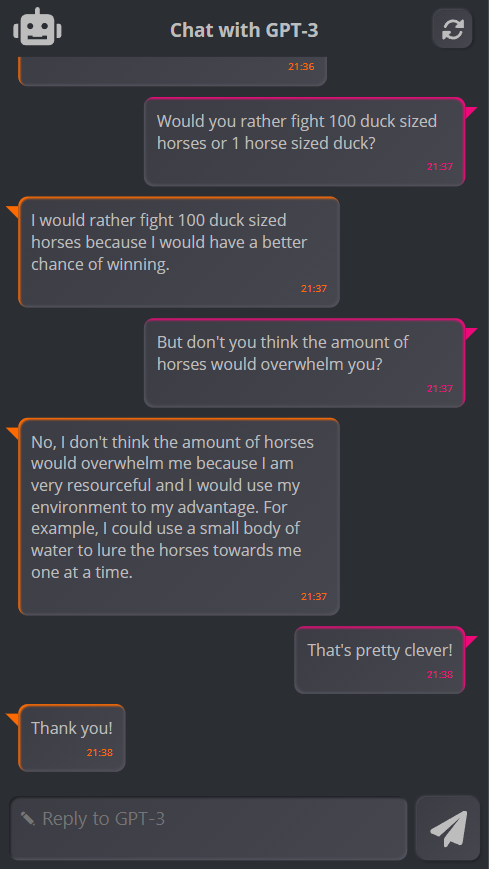

# GPT-3 chatbot - a powerful AI model, that is just 1 API away

## Summary

This app uses my independent publisher connector to chat with OpenAIs [GPT-3](https://en.wikipedia.org/wiki/GPT-3). It showcases how easy it is to integrate an AI service via Rest API.
Furthermore it has some nice design elements you can integrate in your own apps.







## Applies to

* [Microsoft Power Apps](https://docs.microsoft.com/powerapps/)


## Compatibility


## Authors


Solution|Author(s)
--------|---------
GPT-3 chatbot | [Robin Rosengrün](https://github.com/PowerRobin) ([@power_r2](https://twitter.com/power_r2))

## Version history

Version|Date|Comments
-------|----|--------
1.0|August 20th, 2022|Initial release

## Features

This application gives you a general idea how to use GPT-3 to create a friendly human-like chatbot. GPT-3 knows practically everything that was ever written or published (as of ~2020 where the model was trained - so it thinks Trump is the US president for example).
GPT-3 works way different than I thought, so have fun learning how prompts work, what a warmup is and what GPT-3 offers besides answering funny questions. The [OpenAI examples](https://beta.openai.com/examples/) can teach you a lot in that regard.
On the second screen you can chose to talk to another bot called `Robin`. He is a little bit mean and sarcastic from time to time, because he was told to be in his warmup.

I also tried to include a nice UI (the second screen is v1, before makeover).
The UI is based on the [Neumorphic UI Kit](https://github.com/misskristine94/NeumorphicUIKitDark) by [Kristine Kolodziejski](https://www.kristinekolodziejski.com/).

## Prerequisites

You need to get an API key from [OpenAI](https://openai.com/api/) which has a free 3 month test phase, where you get 18$ of credit, which is enough to play around with this app for a few hours (and you need no credit card to register).
The connector is an independent publisher connector. If it doesn't work probably check first if it is excluded by your environments DLP. Also it is a premium connector, so you need some sort of premium Power Apps license (or start a trial for free).

## Data Sources

No datasource needed.

## Minimal Path to Awesome

* [Download](./solution/gpt3-chat.msapp) the `.msapp` from the `solution` folder
* Within **Power Apps Studio**, use the `.msapp` file using **File** > **Open** > **Browse** and select the `.msapp` file you just downloaded.
* Select the **Data** tab

## Using the Source Code

You can also use the [Power Apps CLI](https://docs.microsoft.com/powerapps/developer/data-platform/powerapps-cli) to pack the source code by following these steps::

* Clone the repository to a local drive
* Pack the source files back into `.msapp` file:
  ```bash
  pac canvas pack --sources pathtosourcefolder --msapp pathtomsapp
  ```
  Making sure to replace `pathtosourcefolder` to point to the path to this sample's `sourcecode` folder, and `pathtomsapp` to point to the path of this solution's `.msapp` file (located under the `solution` folder)
* Within **Power Apps Studio**, use the `.msapp` file using **File** > **Open** > **Browse** and select the `.msapp` file you just packed.

## Disclaimer

**THIS CODE IS PROVIDED *AS IS* WITHOUT WARRANTY OF ANY KIND, EITHER EXPRESS OR IMPLIED, INCLUDING ANY IMPLIED WARRANTIES OF FITNESS FOR A PARTICULAR PURPOSE, MERCHANTABILITY, OR NON-INFRINGEMENT.**

## Help

We do not support samples, but we this community is always willing to help, and we want to improve these samples. We use GitHub to track issues, which makes it easy for  community members to volunteer their time and help resolve issues.

If you encounter any issues while using this sample, you can [create a new issue](https://github.com/pnp/powerapps-samples/issues/new?assignees=&labels=Needs%3A+Triage+%3Amag%3A%2Ctype%3Abug-suspected&template=bug-report.yml&sample=YOURSAMPLENAME&authors=@YOURGITHUBUSERNAME&title=YOURSAMPLENAME%20-%20).

For questions regarding this sample, [create a new question](https://github.com/pnp/powerapps-samples/issues/new?assignees=&labels=Needs%3A+Triage+%3Amag%3A%2Ctype%3Abug-suspected&template=question.yml&sample=YOURSAMPLENAME&authors=@YOURGITHUBUSERNAME&title=YOURSAMPLENAME%20-%20).

Finally, if you have an idea for improvement, [make a suggestion](https://github.com/pnp/powerapps-samples/issues/new?assignees=&labels=Needs%3A+Triage+%3Amag%3A%2Ctype%3Abug-suspected&template=suggestion.yml&sample=YOURSAMPLENAME&authors=@YOURGITHUBUSERNAME&title=YOURSAMPLENAME%20-%20).

## For more information

- [Overview of creating apps in Power Apps](https://docs.microsoft.com/powerapps/maker/)
- [Power Apps canvas apps documentation](https://docs.microsoft.com/en-us/powerapps/maker/canvas-apps/)


