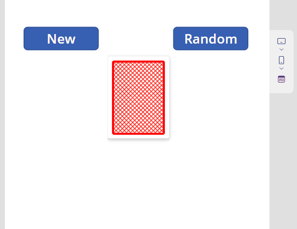

---
page_type: sample
languages:
- powerapps-comma
products:
- powerapps
- canvas
name: Play Card Component
description: A re-usable component that allows you to display play cards or generated random play cards based on template.
urlFragment: powerapps-play-card-component
ms.date: 27/6/2023
author: aaclage
ms.author: pnp
level: beginner
ms.prod: power-apps
---

# Play Card Component

## Summary

A re-usable component that allows you to display play cards or generated random play cards based on template.

  


## Applies to

* [Microsoft Power Apps](https://docs.microsoft.com/powerapps/)

## Compatibility


## Authors

Solution|Author(s)
--------|---------
Play Card Component | [André Lage](https://github.com/aaclage)

## Version history

Version|Date|Comments
-------|----|--------
1.0|June 27, 2023|Initial release


## Features

This sample illustrates the following concepts:

* Creating a Power Apps component
* Using a Power Apps component

## Prerequisites

### Using the component

To use the component in this sample, you'll need to define the Template for play card and Card information and generate random play card when click on component.

You can do this using a data source in property `Input_CardInfo` and `Input_TypeTemplate` or you can manually create entries and pass, as follows:

### Input_CardInfo

Input property `record` for Card information and display in component.

```excel

{
    Value: 1,
    Type: "♥",
    Color: "red"
}
```

### Input_TypeTemplate

Input property `Table` for Card Template definition used to display look and feel.

```excel
[
    {
        CardType: "♠️",
        Color: "black"
    },
    {
        CardType: "♣",
        Color: "black"
    },
    {
        CardType: "♦",
        Color: "red"
    },
    {
        CardType: "♥",
        Color: "red"
    }
]
```

## Data Sources
 
None

## Minimal Path to Awesome

* [Download](./solution/play-card-component.msapp) the `.msapp` from the `solution` folder
* Use the `.msapp` file using **File** > **Open** > **Browse** within Power Apps Studio.
* Save and Publish

## Using the Source Code

You can also use the [Power Apps CLI](https://docs.microsoft.com/powerapps/developer/data-platform/powerapps-cli) to pack the source code by following these steps::

* Clone the repository to a local drive
* Pack the source files back into `.msapp` file:
  ```bash
  pac canvas pack --sources pathtosourcefolder --msapp pathtomsapp
  ```
  Making sure to replace `pathtosourcefolder` to point to the path to this sample's `sourcecode` folder, and `pathtomsapp` to point to the path of this solution's `.msapp` file (located under the `solution` folder)
* Use the `.msapp` file using **File** > **Open** > **Browse** in Power Apps Studio.

## Disclaimer

**THIS CODE IS PROVIDED *AS IS* WITHOUT WARRANTY OF ANY KIND, EITHER EXPRESS OR IMPLIED, INCLUDING ANY IMPLIED WARRANTIES OF FITNESS FOR A PARTICULAR PURPOSE, MERCHANTABILITY, OR NON-INFRINGEMENT.**


## Support

While we don't support samples, if you encounter any issues while using this sample, you can [create a new issue](https://github.com/pnp/powerapps-samples/issues/new?assignees=&labels=Needs%3A+Triage+%3Amag%3A%2Ctype%3Abug-suspected&template=bug-report.yml&sample=calendar-component&authors=@aprildunnam&title=calendar-component%20-%20).

For questions regarding this sample, [create a new question](https://github.com/pnp/powerapps-samples/issues/new?assignees=&labels=Needs%3A+Triage+%3Amag%3A%2Ctype%3Abug-suspected&template=question.yml&sample=calendar-component&authors=@aprildunnam&title=calendar-component%20-%20).

Finally, if you have an idea for improvement, [make a suggestion](https://github.com/pnp/powerapps-samples/issues/new?assignees=&labels=Needs%3A+Triage+%3Amag%3A%2Ctype%3Abug-suspected&template=suggestion.yml&sample=calendar-component&authors=@aprildunnam&title=calendar-component%20-%20).

## For more information

- [Create a component for canvas apps](https://docs.microsoft.com/powerapps/maker/canvas-apps/create-component#components-in-canvas-apps)
- [Overview of creating apps in Power Apps](https://docs.microsoft.com/powerapps/maker/)
- [Power Apps canvas apps documentation](https://docs.microsoft.com/en-us/powerapps/maker/canvas-apps/)

