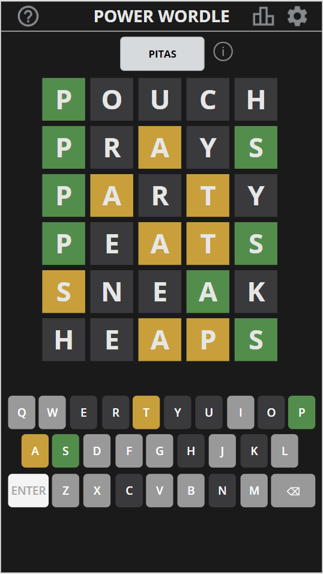

# Power Apps Wordle Game

## Summary

Power Wordle is a re-imagining of the popular word puzzle game Wordle inside of Power Apps. 

You get 6 tries to guess the 5 letter word. This app keeps track of your score and let's you tweet your score out to your friends.


  

## Features

This sample app is a great way to learn some fundamental Power Apps concepts like:

* Branding out-of-the-box controls
* Using and creating dialog boxes
* Adding configurable light and dark themes
* Adding a special color blind mode
* Working with local collections
* Power Fx Formulas
## Applies to

* [Microsoft Power Apps](https://docs.microsoft.com/powerapps/)

## Compatibility


## Authors

Solution|Author(s)
--------|---------
Calendar Component | [April Dunnam](https://github.com/aprildunnam) ([@aprildunnam](https://www.twitter.com/aprildunnam) )

## Version history

Version|Date|Comments
-------|----|--------
1.0|Jan 10, 2022|Initial release


## Prerequisites
None
### Using the sample

No configuration is needed to use this sample.  All data is stored locally in the app.  The only connector is the Twitter connector which is used to tweet out your score if you choose to share it.


## Data Sources
 
* Excel (loaded in app)
* Twitter (for tweeting your score)


## Minimal Path to Awesome

* [Download](./solution/PowerWordle.msapp) the `.msapp` from the `solution` folder
* Use the `.msapp` file using **File** > **Open** > **Browse** within Power Apps Studio.
* Save and Publish

## Using the Source Code

You can also use the [Power Apps CLI](https://docs.microsoft.com/powerapps/developer/data-platform/powerapps-cli) to pack the source code by following these steps::

* Clone the repository to a local drive
* Pack the source files back into `.msapp` file:
  ```bash
  pac canvas pack --sources pathtosourcefolder --msapp pathtomsapp
  ```
  Making sure to replace `pathtosourcefolder` to point to the path to this sample's `sourcecode` folder, and `pathtomsapp` to point to the path of this solution's `.msapp` file (located under the `solution` folder)
* Use the `.msapp` file using **File** > **Open** > **Browse** in Power Apps Studio.

## Disclaimer

**THIS CODE IS PROVIDED *AS IS* WITHOUT WARRANTY OF ANY KIND, EITHER EXPRESS OR IMPLIED, INCLUDING ANY IMPLIED WARRANTIES OF FITNESS FOR A PARTICULAR PURPOSE, MERCHANTABILITY, OR NON-INFRINGEMENT.**


## Support

While we don't support samples, if you encounter any issues while using this sample, you can [create a new issue](https://github.com/pnp/powerapps-samples/issues/new?assignees=&labels=Needs%3A+Triage+%3Amag%3A%2Ctype%3Abug-suspected&template=bug-report.yml&sample=calendar-component&authors=@aprildunnam&title=calendar-component%20-%20).

For questions regarding this sample, [create a new question](https://github.com/pnp/powerapps-samples/issues/new?assignees=&labels=Needs%3A+Triage+%3Amag%3A%2Ctype%3Abug-suspected&template=question.yml&sample=calendar-component&authors=@aprildunnam&title=calendar-component%20-%20).

Finally, if you have an idea for improvement, [make a suggestion](https://github.com/pnp/powerapps-samples/issues/new?assignees=&labels=Needs%3A+Triage+%3Amag%3A%2Ctype%3Abug-suspected&template=suggestion.yml&sample=calendar-component&authors=@aprildunnam&title=calendar-component%20-%20).

## For more information

- [Power Wordle Design Video](https://youtu.be/I-kJJ7YCD3o/)
- [Create a dialog box in Power Apps Video](https://youtu.be/FLHVJdoDSNE)
- [Overview of creating apps in Power Apps](https://docs.microsoft.com/powerapps/maker/)


