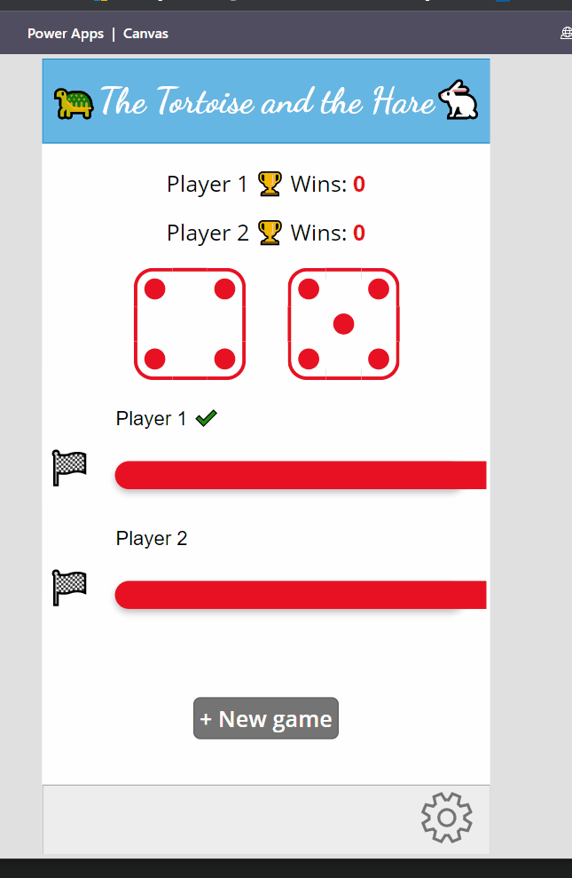

# Random roll dice

Random number generation based on timer. Progress bar with html customization. Visuals based on html components.

[Sample on how to migrate List formatting "roll dice"](https://github.com/pnp/List-Formatting/tree/master/view-samples/roll-dice).

### Screen 1 - random rool dice

  

## Applies to

* [Microsoft Power Apps](https://docs.microsoft.com/powerapps/)

## Authors

Solution|Author(s)
--------|---------
Roll Dice| [André Lage](https://github.com/aaclage) 

## Version history

Version|Date|Comments
-------|----|--------
1.0|Aug 10, 2022|Initial release

## Features

This template includes the following functions:
<ul>
<li>Home - Random number generation with associated progressbar evolution based on timer.</li>
<li>Administrative Panel: Allows you to manage player information and customization of graphics.</li>
</ul>

## Prerequisites

None

## Data Sources

Different collections with sample data.
You can use different data sources and adapt the design to your needs.

## Minimal Path to Awesome

* [Download](./solution/Roll%20Dice.msapp) the `.msapp` from the `solution` folder
* Within **Power Apps Studio**, use the `.msapp` file using **File** > **Open** > **Browse** and select the `.msapp` file you just downloaded.
* Select the **Data** tab
* ...

## Using the Source Code

  You can also use the [Power Apps Source Code tool](https://github.com/microsoft/PowerApps-Language-Tooling) to the code using these steps:

* Clone the repository to a local drive
* Pack the source files back into `.msapp` file:
  * [Power Apps Tooling Usage](https://github.com/microsoft/PowerApps-Language-Tooling)
* Within **Power Apps Studio**, use the `.msapp` file using **File** > **Open** > **Browse** and select the `.msapp` file you just packed.

## Disclaimer

**THIS CODE IS PROVIDED *AS IS* WITHOUT WARRANTY OF ANY KIND, EITHER EXPRESS OR IMPLIED, INCLUDING ANY IMPLIED WARRANTIES OF FITNESS FOR A PARTICULAR PURPOSE, MERCHANTABILITY, OR NON-INFRINGEMENT.**

## Help

We do not support samples, but we this community is always willing to help, and we want to improve these samples. We use GitHub to track issues, which makes it easy for  community members to volunteer their time and help resolve issues.

If you encounter any issues while using this sample, you can [create a new issue](https://github.com/pnp/powerapps-samples/issues/new?assignees=&labels=Needs%3A+Triage+%3Amag%3A%2Ctype%3Abug-suspected&template=bug-report.yml&sample=random-rolldice&authors=@aaclage&title=random-rolldice).

For questions regarding this sample, [create a new question](https://github.com/pnp/powerapps-samples/issues/new?assignees=&labels=Needs%3A+Triage+%3Amag%3A%2Ctype%3Abug-suspected&template=question.yml&sample=random-rolldice&authors=@aaclage&title=random-rolldice).

Finally, if you have an idea for improvement, [make a suggestion](https://github.com/pnp/powerapps-samples/issues/new?assignees=&labels=Needs%3A+Triage+%3Amag%3A%2Ctype%3Abug-suspected&template=suggestion.yml&sample=random-rolldice&authors=@aaclage&title=random-rolldice).

## For more information

- [Overview of creating apps in Power Apps](https://docs.microsoft.com/powerapps/maker/)
- [Power Apps canvas apps documentation](https://docs.microsoft.com/en-us/powerapps/maker/canvas-apps/)

