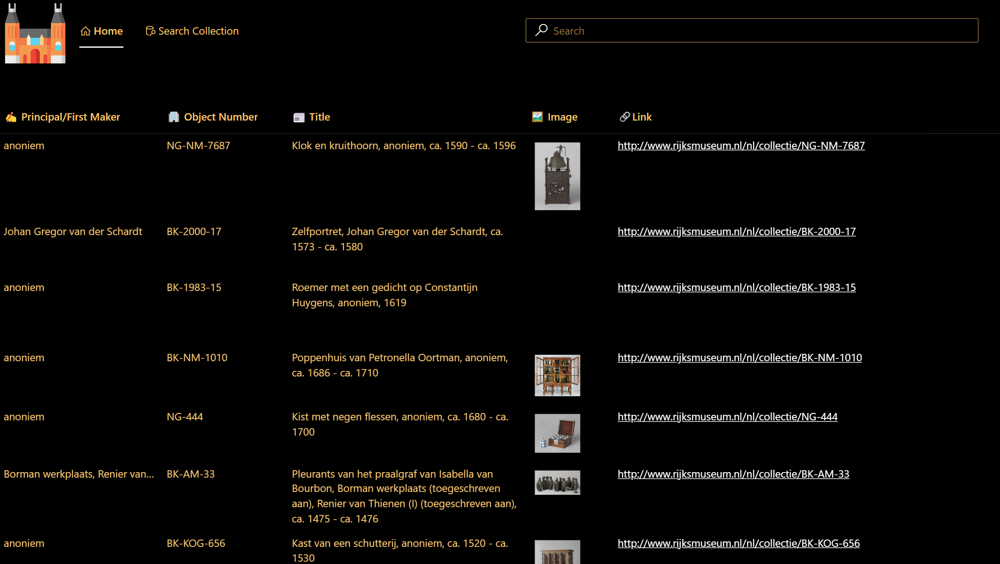

# Rijksmuseum Sample App

## Summary

This sample illustrates how to use the **Rijksmuseum (Independent Publisher)** connector.



## Applies to

* [Microsoft Power Apps](https://docs.microsoft.com/powerapps/)

## Compatibility


## Authors

Solution|Author(s)
--------|---------
Rijksmuseum | [Ashwin Ganesh Kumar](https://github.com/ashes2076) ([@ashwin_ku1](https://twitter.com/ashwin_ku1)), Sogeti

## Version history

Version|Date|Comments
-------|----|--------
1.0|June 7, 2023|Initial release

## Features

> This sample illustrates how to use the **Rijksmuseum (Independent Publisher)** connector in Power Apps and Power Automate.

This sample illustrates the following concepts:

* Shows the first 100 collection in a canvas app.
* Advanced search allows the user to query out a specific collection.
* Triggering a Power Automate flow to use the advanced search.

## Prerequisites

> Use of this connector requires the user to have an API Key issued by Rijksmuseum. For more information on how to get an API key, please click [here](https://data.rijksmuseum.nl/).

## Solution Components

The following solution components are used in this sample:

* Rijksmuseum Sample App (Canvas app)
* Rijksmuseum Search Collection (Cloud flow)

## Data Sources

> **Rijksmuseum (Independent Publisher)**

## Minimal Path to Awesome

* [Download](./solution/rijksmuseum.zip) the solution `.zip` from the `solution` folder
* Within **<https://make.powerapps.com>**, import the `.zip` file via **Solutions** > **Import solution** > **Browse** and select the `.zip` file you just downloaded.
* Play the app and make sure that you fill in your own API Key ([How to get one?](https://data.rijksmuseum.nl/)).

## Using the Source Code

You can also use the [Power Apps CLI](https://aka.ms/pac/docs) to pack the source code by following these steps::

* Clone the repository to a local drive
* Pack the source files back into `.zip` file:

  ```bash
  pac solution pack --folder pathtosourcefolder --zipfile pathtosolution  --processCanvasApps
  ```

  Making sure to replace `pathtosourcefolder` to point to the path to this sample's `sourcecode` folder, and `pathtosolution` to point to the path of this solution's `.zip` file (located under the `solution` folder)
* Within **<https://make.powerapps.com>**, import the `.zip` file via **Solutions** > **Import solution** > **Browse** and select the `.zip` file you just downloaded.
* Click next.
* ...

## Disclaimer

**THIS CODE IS PROVIDED *AS IS* WITHOUT WARRANTY OF ANY KIND, EITHER EXPRESS OR IMPLIED, INCLUDING ANY IMPLIED WARRANTIES OF FITNESS FOR A PARTICULAR PURPOSE, MERCHANTABILITY, OR NON-INFRINGEMENT.**

## Help

> Note: don't worry about this section, we'll update the links.

We do not support samples, but we this community is always willing to help, and we want to improve these samples. We use GitHub to track issues, which makes it easy for  community members to volunteer their time and help resolve issues.

If you encounter any issues while using this sample, you can [create a new issue](https://github.com/pnp/powerapps-samples/issues/new?assignees=&labels=Needs%3A+Triage+%3Amag%3A%2Ctype%3Abug-suspected&template=bug-report.yml&sample=rijksmuseum&authors=@ashes2076&title=rijksmuseum%20-%20).

For questions regarding this sample, [create a new question](https://github.com/pnp/powerapps-samples/issues/new?assignees=&labels=Needs%3A+Triage+%3Amag%3A%2Ctype%3Abug-suspected&template=question.yml&sample=rijksmuseum&authors=@ashes2076&title=rijksmuseum%20-%20).

Finally, if you have an idea for improvement, [make a suggestion](https://github.com/pnp/powerapps-samples/issues/new?assignees=&labels=Needs%3A+Triage+%3Amag%3A%2Ctype%3Abug-suspected&template=suggestion.yml&sample=rijksmuseum&authors=@ashes2076&title=rijksmuseum%20-%20).

## For more information

* [Overview of creating apps in Power Apps](https://docs.microsoft.com/powerapps/maker/)
* [Power Apps canvas apps documentation](https://docs.microsoft.com/en-us/powerapps/maker/canvas-apps/)


---
> Note that better pictures and documentation will increase the sample usage and the value you are providing for others. Thanks for your submissions in advance! You rock ❤.
> DELETE THIS PARAGRAPH BEFORE SUBMITTING
