# Instructions

This guide will help you to import the SelfService PowerApp into your own environment. It contains a description on the set-up and configuration  required to make the App work for you. Once installed the application will look as follows:

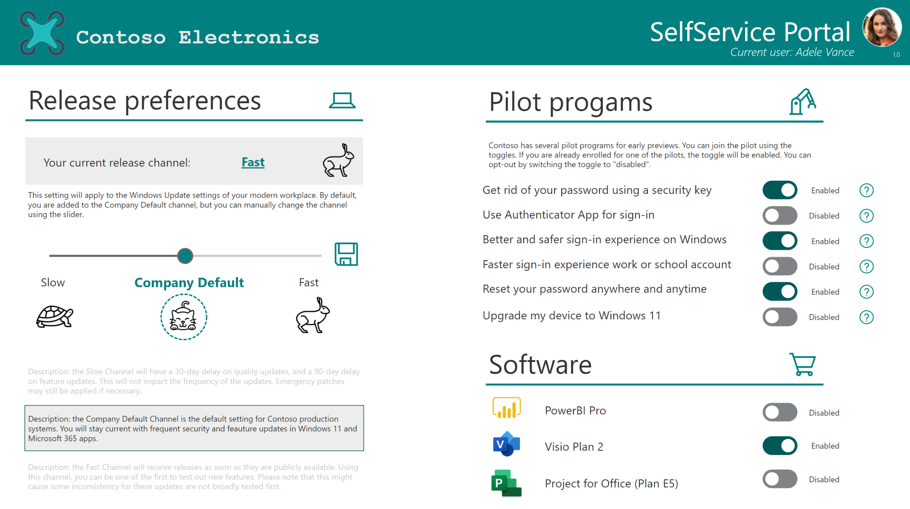

> 💡 This app is based on Azure AD users and groups.

## YouTube video with instructions

For those who rather watch video there is also a step-by-step video tutorial available on YouTube:

[](https://www.youtube.com/watch?v=MzH1Ps6gG7A)

## Requirements overview

- Azure AD groups (one for each feature)
- Power Automate -> [License FAQ](https://docs.microsoft.com/power-platform/admin/pricing-billing-skus)
- Power Apps -> [License FAQ](https://docs.microsoft.com/power-platform/admin/pricing-billing-skus)
- Azure AD App registration with Graph API permissions

## Architecture

The concept of this app is straightforward. It puts users into groups. Those groups live in Azure AD, and can be used within all supported and integrated services, like Azure AD security features, Microsoft Endpoint Manager, or Conditional Access, for example.

The front-end is this very PowerApp, where the users can add themselves to groups using toggles or sliders. This action will trigger Power Automate to start a flow. This flow will use an [HTTP connector](https://docs.microsoft.com/learn/modules/http-connectors/) to interact with the Graph API, and add or remove the user to and from the group. It uses an Azure AD App registration to authenticate and authorize these API requests.

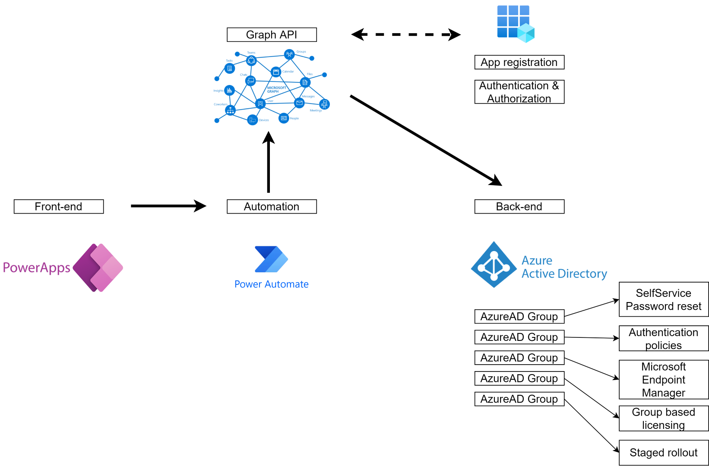

> 💡 You can use any existing group, or create new ones to serve a specific use-case Basically, any feature that can be managed with a group, is potentially a feature in your Power App. The app contains a couple of examples to get you started.

## Installation

Below are all steps required to install the Power App into your environment.

### Step 1 - Create an app registration and assign permissions

Before we start, we need an app registration in Azure AD. To create a new application you can [use the portal to create an Azure AD application and service principal that can access resources](https://docs.microsoft.com/azure/active-directory/develop/howto-create-service-principal-portal). Once created Assign the following permission for the Graph API: `https://graph.microsoft.com/Directory.Read.All (application)` and `https://graph.microsoft.com/GroupMember.ReadWrite.All (application)`

> 💡 Do not forget to grant admin consent for the permissions!


Next [add a new secret](https://docs.microsoft.com/azure/active-directory/develop/howto-create-service-principal-portal#option-2-create-a-new-application-secret), and capture the value.


Navigate back to the overview and capture the following information for later use:

- Application(client) ID
- Directory(tenant) ID
- Secret value


### Step 2 - Azure AD Groups

The next step is to define the Azure AD Groups. It's very likely that you already have groups for specific cases like Windows Update for Business, SelfService Password Reset, or FIDO2 pilot groups. In that case, you can simply capture the ID of the group. If you don't have a group, create one for each "feature". The demo app contains 12 groups, so if you want to align with that, you should have 12 group ID's. You can also have less or more groups, that's totally up to you.

> ❗ I **strongly** suggest to start off with (empty) test groups, to make sure that all the features of the app work correctly. After testing, you can replace the test groups with your "production" groups.


Groups can be either Security or Microsoft 365 groups but have to be **static**, not dynamic.


> 💡 If you just want to explore the app, just create **1** group, and capture the ID. All the features in the app will point to that single group, but for testing and exploring, that's fine. The concept of the app will be the same.

### Step 3 - Import the app

Now that we have created an app registration and the groups, it's time to import the app. Download the [ZIP file](https://github.com/BakkerJan/M365Portal/blob/main/SelfServicePortal_20220110193622.zip) from this repository, and go to [The Power App portal](https://make.powerapps.com).

In the app section, select **Import canvas app**

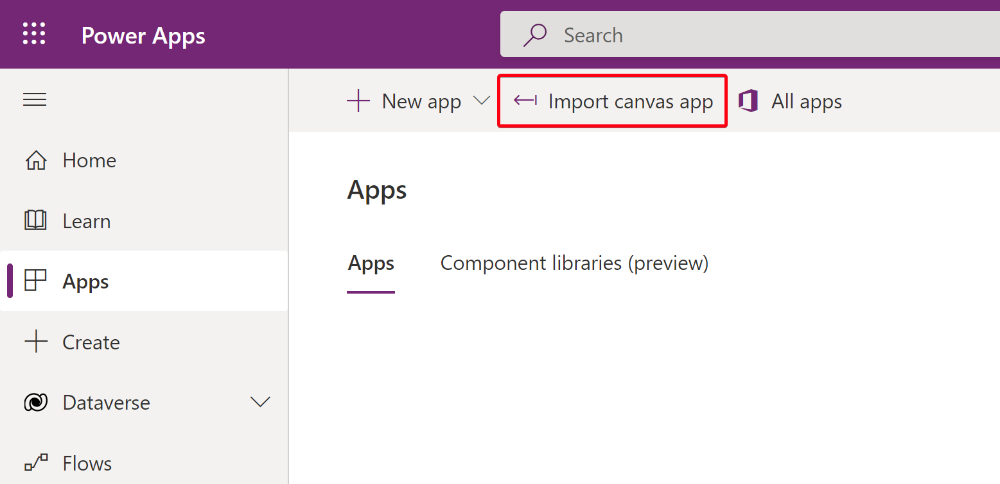

Point to the ZIP file that you just downloaded, and click **Upload**. Check the import setup screen. It should stage both the PowerApp and the related Flow. Click **Import** if all looks good.


Verify that the app is imported, but leave it for now; do not start or edit the app. First, we'll have to do some additional groundwork.

### Step 4 - Update the flow

Head over to [the Power Automate portal](https://flow.microsoft.com), and you should see the imported flow in a disabled state. Click **edit**.


In this flow, there are **4** variables that we need to change. The rest of the flow can be left untouched (for now).


#### **Variable - groupIDs**

Change this variable with your Azure AD groups ID's. Depending on the count of your groups, this can be 1 or more groups. Make sure that you keep correct formatting in place. Each line should end with a `,` (comma), except for the last one.


#### **Variable - Tenant ID, Client ID and Secret**

These variables should be aligned with the information you captured earlier from the app registration in Azure AD.


The information can be found here:

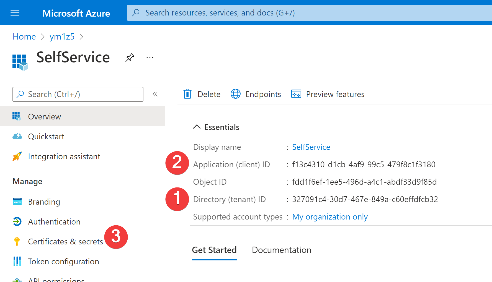

> Now, I'm fully aware of the fact that I probably should **not** use the secret as plain text in the flow for security reasons, but I wanted to keep things as easy as possible. I strongly suggest, to take a look at a blog to [use Azure Key Vault to secure your Graph API connection in Power Automate](https://www.inthecloud247.com/use-azure-key-vault-to-secure-your-graph-api-connection-in-power-automate/) to store your secret in an Azure KeyVault.

After you changed the variables, save the flow, and make sure it is enabled.


### Step 5 - Update the Power App

Now that we prepped the flow, back to the Power App. In the [Power Apps portal](https://make.powerapps.com), find the imported app, and choose to **edit**.

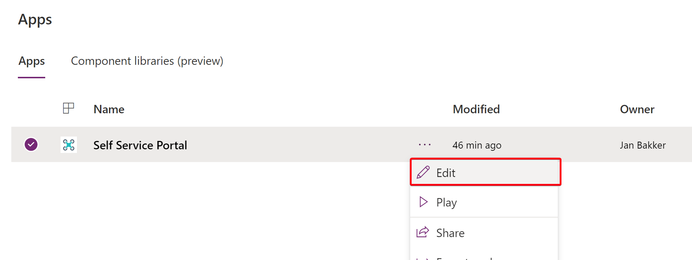

Accept the Office 365 connector by clicking **Alow**.

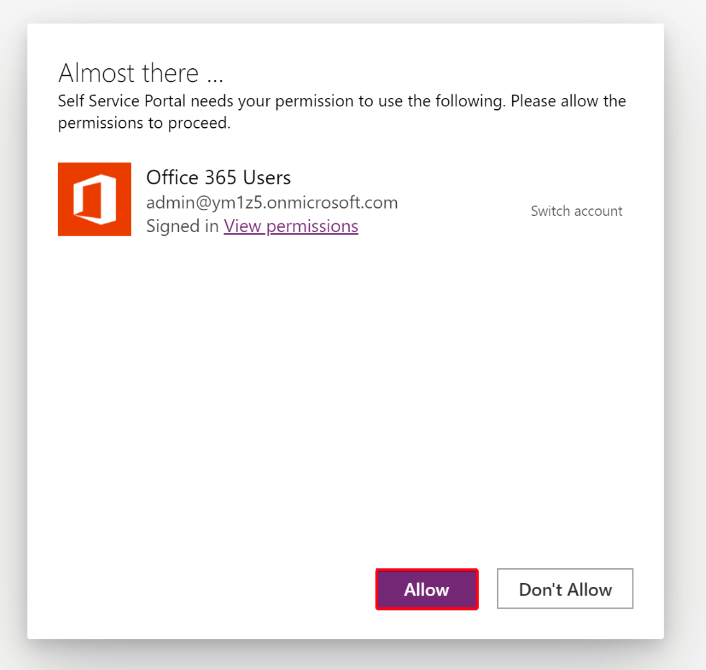

Now, the "settings" of the app are stored in the `OnStart` attribute of the app. This is where we need to make some adjustments.


To make the app work, all we need to do is to define the features and groupIDs. So here we will attach the Azure AD groups to the toggles and sliders.

In the navigation pane, select the **app** and after that the `Onstart` property. Expand the bar to edit the value.


Now, to define the features, enter the correct GroupID to each featureID. Also, add a description of each feature.


If you don't use all the features, just add dummy values. You can simply hide the corresponding toggles from the Power App.


🚀 We are now done with the basic set-up. Save the app after you did the modifications.

### Step 6 - Test the app

Now that we did the basic configuration, it's time to test the app. Leave the edit mode, and run the app in `Play` mode.


Hit the toggles to see if the user is being added to the correct group. Check the details of the flow history, and also check the Azure AD audit logs to check the results.


#### Debug mode

> 💡 You can also enable debug mode in the `Onstart` property of the app. This will give you insight in the the current memberships of the users, and many more. To enable the debug mode, set the value to `true`.


When enabled, a debug button will appear in the corner of the app, bringing you to another screen with detailed information.


## Add-ons

You can create additional flows to act on the group membership changes. You can send out emails or chats with additional information about the features such as manuals or instruction video's. I've created an additional blog to create those flows. It is very straightforward set-up, and can be done with default connectors. Read more about [How to act on group membership changes in Azure Active Directory](https://janbakker.tech/act-on-group-membership-changes-in-azure-active-directory/)


## Breakdown of the app and flow

This section will give a peek under the hood, on how the logic of the app is built. In short, the app work with two key elements: the Power App and a flow in Power Automate.

Here is an overview of the solution:

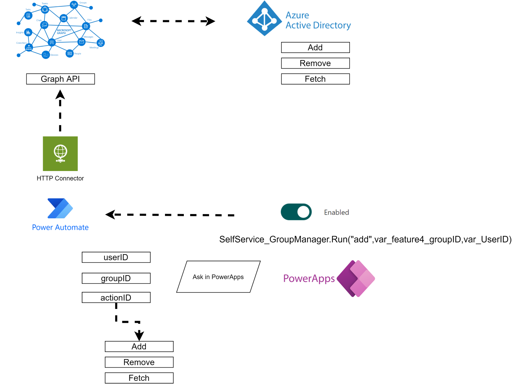

## The flow

Let's start with the flow. If we take a look at the first section, a lot of variables are being initiated.

- `groupIDs` is used to define all the Azure AD groups. This variable will be used against Graph API, to fetch the users' group membership.
- `tenantID` is used for authentication in the HTTP connector.
- `clientID` is used for authentication in the HTTP connector.
- `Secret` is used for authentication in the HTTP connector.
- `userID` is used as parameter to define the selected user.
- `groupID` is used as parameter to define the selected group.
- `actionID` can either be `add`, `remove`, or `fetch`. This is used as a parameter.
- `response` is used to capture the response and send back to Power Apps to give feedback. This is used within the notification bar.
- `CurrentGroups` is used in a `do-until` loop. This will fetch the current group membership of the user until it matches the expected state, being added or removed from the group. This is explained later on as well.

In the next section, two API calls are done to get more information about the user and the group. This is used in the response, but can also be used for additional steps like auditing, email notifications for example.


- `https://graph.microsoft.com/v1.0/users/userID` to retrieve user details
- `https://graph.microsoft.com/v1.0/groups/groupID` to retrieve group details

To avoid errors and `null` values, only a specific part of the JSON request is parsed.

```json
{
    "displayName": {
        "type": "string"
    },
    "givenName": {
        "type": "string"
    },
    "mail": {
        "type": "string"
    },
    "surname": {
        "type": "string"
    },
    "userPrincipalName": {
        "type": "string"
    }
}
```

After this step, the flow is using the `switch` feature, based on the `actionID` parameter:

- `add` : add user to the group
- `remove`: remove user from the group
- `fetch`: fetch the group membership of the user

## Case - add user to the group


This will add the user to the group, using the `userID` and `groupID` parameter. To make sure that the user is added to the group, the flow is fetching the group membership for the user until it gives back the selected groupID. If not, a delay of 5 seconds will occur, before the group membership is being fetched again. The variable `CurrentGroups` is used to check if the groups are added to the JSON response.

## Case - remove user from the group


The remove action is very similar to the previous add feature, only now the fetch action will check if the user is *deleted* from the group.

## Case - fetch group membership


This action is used to fetch the group membership of the selected user. It will use the `userID` and the `groupIDs` variables.

Because we are using the default Power Apps response action, we are adding the groups into a string using a `;` as a seperator. In Power Apps we are splitting this into a collecion. You could also use the (premium) response action, where you can define the schema as well. To avoid complexity, I used the default response method.


## The response variable

One variable that we did not discuss yet is the `response` variable. This variable is updated in the different cases, and at the end of the flow, sent back to Power Apps. This is done because you can only add 1 `Respond to a Power App` action in a single flow.


That's is. Not rocket science involved.

## The App

Now, on to the Power App. How does this work? I will break down the different building blocks that are used, as well as the different parameters that can be changed.

### The `Onstart` section

Like we discussed with the installation of the app, a few things are happening in the `onStart` section of the app.


1. The version of the app. This will show up in the header of the app. You can use this as a reference for your end-users, or the developers.
2. Debug mode on/off. On=`true`, Off=`false`. When enabled, this will show the debug icon. Debug mode can be used to keep an eye on all the variables and collections that are used in the app.
3. Notifications on/off. On=`true`, Off=`false`. When enabled, the native notification bar is used to give (more detailed) response to the user. This will show the `response` variable to the users.
4. Set the accent color of the app. This can be used to align with your tenant branding. Default is set to `Teal`, matching the Contoso look and feel.
5. Here, we define the variable `var_UserID`. This will grab the email/UPN of the current user, using the Office 365 connector.
6. Here, we define the variable `var_FullName`. This will be shown in the header.
7. You can easily change the messages that are shown to the user during the different actions.

### Section two


1. We already discussed this one in the installation steps. Here we define the features, and the corresponding Azure AD groups.
2. Here we create the collection of the current group membership of the user. This is need to set the default positions of the toggles. This is done in two steps: first we will run the flow with the `fetch` parameters. Next, we split this response into a collection. This will result in the `col_currentgroups` collection.
3. Here we set the default value for the slider. This will represent the current channel for the user, being member of feature group 1, 2, or 3. When the user is not a member of any of the three groups, `var_CurrentChannel` will stay at value 0.
4. Set the timer start value to `false`. This timer is used to fetch the groups after each action. More on that later.

### The spinner & timer

As soon as PowerApps calls the Power Automate flow, the spinner feature will kick in. This will block the user from doing anything while the flow runs, and will show an animated GIF, and a line of text to give feedback to the user. So almost every action will start with: `Set(var_Spinner,true);` This variable is used in the `visible` property of the spinner group. The spinner is placed upfront, so that all other elements are "greyed out". Only the header is visible, which is placed at the top.

The text that shows while the spinner runs, is set in the `onStart` property of the app.


The spinner will always be ended by the timer feature. This timer is called after each action is done. The timer is used to kick off some additional steps to make sure that the data is refreshed. The property `onTimerEnd` is set to:

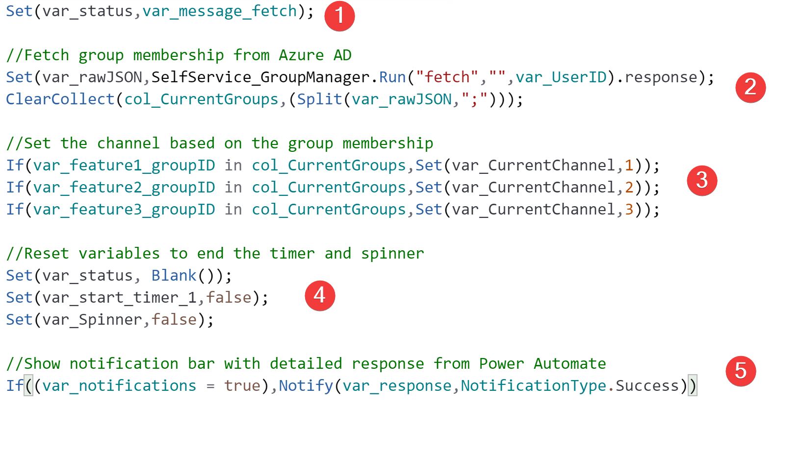

1. The message that shows during the spinner is updated, so that the users get's feedback on what's happening in the background.
2. The group membership is fetched from Azure AD, and the collection is refreshed.
3. This will set the slider value, based on the group memberships.
4. The timer and spinner are disabled.
5. If notifications are enabled, the notification bar will show the latest response from Power Automate.


### The collection with current groups

An important part of the app relies on the collection that holds the current groups of the user. This will tell the app what the default values of the slider and all the toggles should be. This collection is created when the app starts, and after each action, the collection is being updated.

`Set(var_rawJSON,SelfService_GroupManager.Run("fetch","",var_UserID).response);
ClearCollect(col_CurrentGroups,(Split(var_rawJSON,";")));`

You can check the collection with the debug mode enabled. This will also have a count value of the current groups in the collection.

### The slider

Let's talk about the slider. The value of the slider will represent group 1, 2 or 3" with the following values:

- `1=Slow`
- `2=Default`
- `3=Fast`

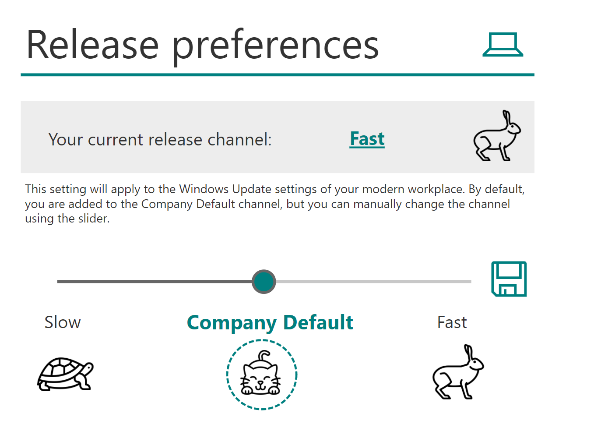

If you are not a member of either groups, the value will be set to `0`. When this happens, a message will show up.


The save button is only visible as the selected value is different than the current channel. When the save button is hit, these actions will take place:


## The toggles

Now, the main feature of this app are the toggles. These toggles will either add or remove the user from the Azure AD groups. Each toggle has three main properties:

1. `Default` The default value of the toggle (pulled from Azure AD when the app starts)
2. `OnCheck` The action that triggers that user to be added to specific group.
3. `OnUnCheck` The action that triggers that the user is removed from the group.

Let's have a look at the toggle for feature 4:


The `Default` value is: `If(var_feature4_groupID in col_CurrentGroups,true,false)`

This will check the groupID of feature 4 is present in the collection. If the group is found in the collection, the toggle will be `true` (enabled). Otherwise, it will be `false` (disabled).

The `OnCheck` property is set to:

```javascript
Set(var_Spinner,true);
Set(var_status,var_message_add);
If(!(var_feature4_groupID in col_CurrentGroups),Set(var_response,SelfService_GroupManager.Run("add",var_feature4_groupID,var_UserID).response)&Set(var_start_timer_1,true),false&Set(var_Spinner,false))
```

This will first kick off the spinner, and than checks if the groupID for that feature is already present in the collection. If not, it will kick off the `SelfService_Groupmanager` flow, and defines three parameters:

1. `"add"`. This is to tell the flow to *add* the user to the group.
2. `var_groupID`. This will tell the flow to what group the user needs to be added.
3. `var_userID`. This will tell the flow which user to add to the group.

If the groupID is detected in the collection, nothing will happen, and the spinner will stop.

The `OnUnCheck` propery is set to:

```javascript
Set(var_Spinner,true);
Set(var_status,var_message_remove);
If((var_feature4_groupID in col_CurrentGroups),Set(var_response,SelfService_GroupManager.Run("remove",var_feature4_groupID,var_UserID).response)&Set(var_start_timer_1,true),false&Set(var_Spinner,false))
```

>This will first kick off the spinner, and than checks if the groupID for that feature is already present in the collection. If yes, it will kick off the `SelfService_Groupmanager` flow, and defines three parameters:

1. `"remove"`. This is to tell the flow to *remove* the user to the group.
2. `var_groupID`. This will tell the flow from what group the user needs to be removed.
3. `var_userID`. This will tell the flow which user to remove from the group.

If the groupID is not detected in the collection, nothing will happen, and the spinner will stop. This logic is used for every toggle.

## More info buttons

Next to each toggle at the pilot section, you will find an icon with a question mark. When you click on that icon, the `var_info` and `var_info_content` variables are set. `var_info` will be used as a boolean for the `visible` property of the info field. The variable `var_info_content` will update the text that needs to be shown.
The close icon will set the `visible` property to `false` so the "pop-up" will be hidden.

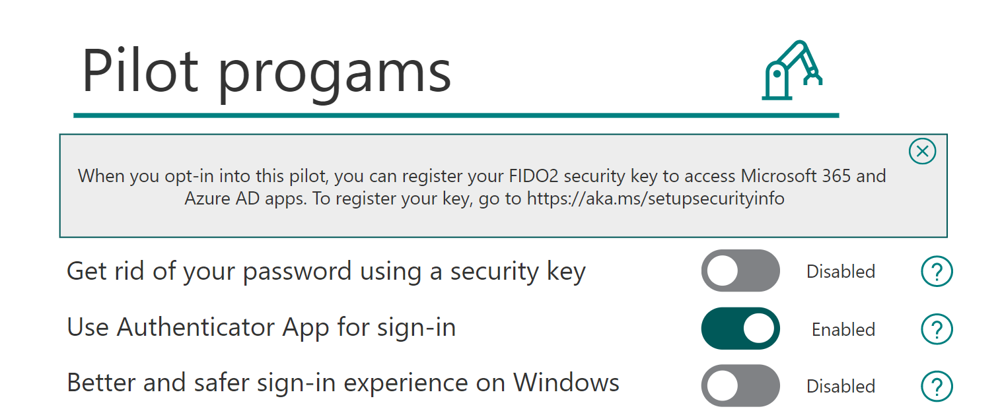

## Hide features

You can simply hide features by changing the `visible` property of the toggle and label to `false`.


## Change features

Now, the features in the sample app are just to get you inspired. The labels on the toggles can be changed very easy. Keep in mind that the app will only add or remove the user to/from the group; it does not tell the feature *what* to do. What will happen afterward, depends on where the groups are being configured.

Take the slider for example. This can be aligned with Windows Update for Business rings in Microsoft Endpoint Manager.

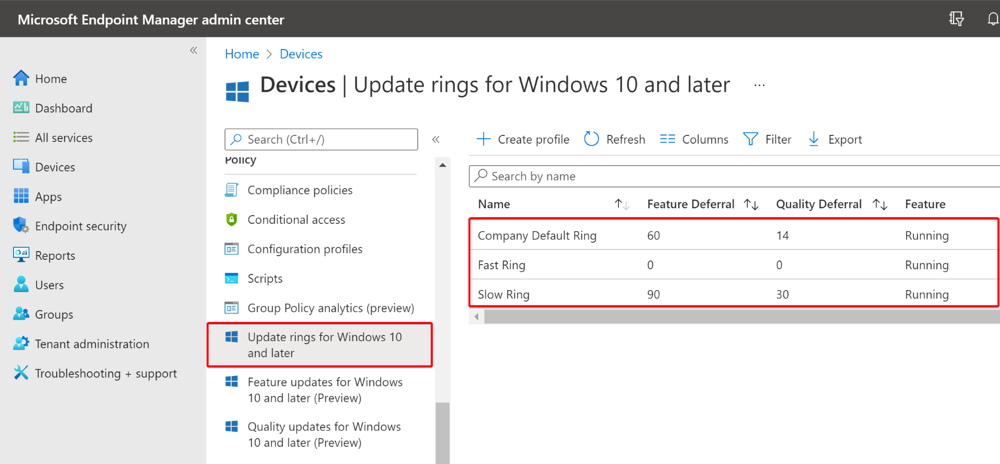

So when the user picks the fast channel, the user is added to feature group 3, that is assigned to the corresponding update ring in Microsoft Endpoint Manager (Intune).


The same goes for the other toggles. Most of the examples relate to authentication policies in Azure AD, for example:

Feature 4 refers to the FIDO2 authentication policy.
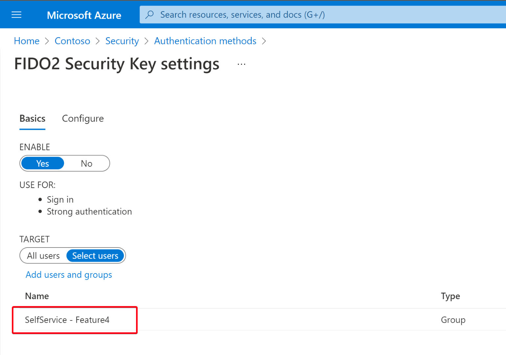

Feature 5 refers to the Authenticator app authentication policy.


Feature 6 refers to Azure AD Self Service Password Reset.


Feature 7 refers to Windows Hello for Business policy within Microsoft Endpoint Manager.


Feature 8 refers to the staged rollout capabilities for Password Hash Sync.


Feature 9 refers to the feature update policy in Microsoft Endpoint Manager.
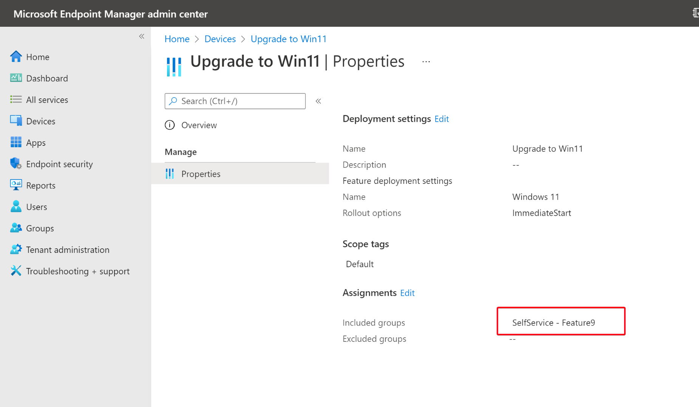

Features 10, 11, and 12 refer to group-based licensing (Azure Premium P1 needed).


## Add more feature groups

If you like to expand the app with more toggles/features, follow these steps:

- Create the corresponding group, and capture the groupID for that group. This can also be an existing group.
- Add the GroupID to the `GroupIDs` variable in the Power Automate flow. *Don't forget to add the comma!*


- Define the new feature in the `onStart` property of the Power App. Be careful with messing up the `Concurrent` feature. Because we are adding a new line, you should replace the `));` with `),`.
- The `));` is now added to your newly added line to close off the array.


- Now duplicate one of the existing toggles, and change the `var_featureID` to match with your new added feature number (13 in this example).

`onCheck` property


`onUnCheck` property


`Default` property


Also copy the icon with the question mark, and add a description in the `onSelect` property. Now add a new label to your toggle with any text you like.


And with that you have a working Power App that allows full self service 🚀.
