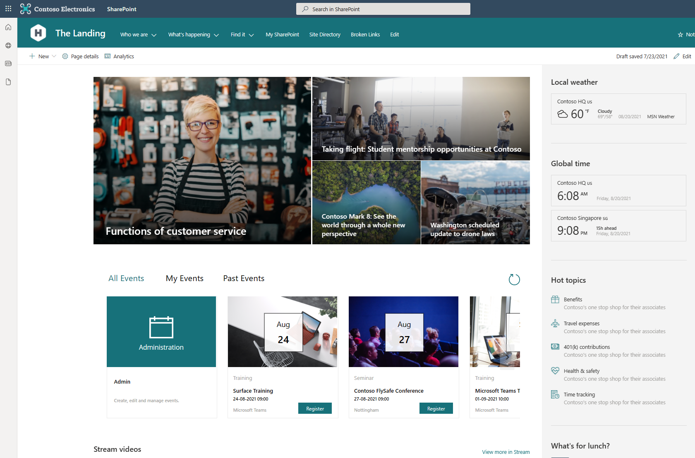

# SharePoint Event Registration Power App

## Summary

This is a proof of concept Power App that was designed to be embedded within a SharePoint site/page. I created it as an alternative to the out of the box 'Events' Web Part for those that want event registration functionality and would like it to look as out of the box as possible. The use of a low code/no code Power App means there is no need for custom development.

The look and feel has been designed to replicate that of the out of the box Web Part.

The solution is functionally complete but is provided as a POC for you to customise/extend as required.

  

## Features

This sample app is a great way to learn some fundamental Power Apps concepts like:

* Branding out-of-the-box controls
* Creating and using components
* Working with SharePoint as a data source
* Using and creating dialog boxes
* Power Fx Formulas
* Working with local collections
* Building custom UIs

## Applies to

* [Microsoft Power Apps](https://docs.microsoft.com/powerapps/)
* [Microsoft Power Automate](https://docs.microsoft.com/en-us/power-automate/)

## Compatibility


## Authors

Solution|Author(s)
--------|---------
Event Registration Power App | [Alex Clark](https://github.com/alexc-msft) ([@sharepointalex](https://www.twitter.com/sharepointalex) )

## Version history

Version|Date|Comments
-------|----|--------
1.0|Feb 4, 2022|Initial release

## Prerequisites
* SharePoint modern Team Site
* PnP PowerShell module
* Office 365 Group/Teams Team that will contain users who can create and edit events (Event admins)

### Using the sample

Follow the instructions below to deploy this sample to your tenant. Once deployed, the app is designed to be embedded within a SharePoint page.

I woild recommend using the 'Embed' Web Part and defining your own size. This works much better than the native Power Apps Web Part in terms of how it looks on the page. 

## Data Sources
 
* SharePoint (saving/retrieving events from the SharePoint lists)
* Office365Users (for retrieving the users' profile)
* Office365Groups (for retieving the details of the admins group)
* UploadEventImage (flow for uploading the image for an event)
* EventRegistration (flow to register a user for an event)
* EmailEventAttendees (flow to send an email to the attendees of an event)

## Minimal Path to Awesome

1.  Connect to your SharePoint site using PnP PowerShell - 

`Connect-PnPOnline -Url "Pathtoyoursharepointsite" -Interactive`

2.  Run the following PnP PowerShell cmdlet to apply the provisioning template - 

`Invoke-PnPSiteTemplate -Path "Pathtothetemplatefile" -ClearNavigation` 

Replace 'pathtothetemplatefile' with the local path to the template XML file e.g. "C:\users\johndoe\desktop\sitetemplate.xml"

3.  Verify the SharePoint site contains the 3 lists - 'Events', 'Event Images' and 'Event Attendees'. 

4. [Download](./solution/EventRegistrationApp.zip) the `.zip` from the `solution` folder.

5. Import the Power App using **Import canvas app** > **Upload** in the Power Apps portal (this will also import the included flows).

6. Edit the Power App and update the data sources - you will need to remove the 3 SharePoint lists from the data sources pane and re-add them. They may appear that they are pointing correctly but they will be pointing at the tenant the app was exported from. Simply remove them, point to your SharePoint site and add the 3 lists again.

7. Edit the flows - You will need to edit **each flow**. Update the value of the 'Events Site URL' variable to the URL of your SharePoint site. 

8. Edit the Power App and update the admins group - Open the Power App in edit mode and locate the 'OnStart' function. Update the following code, replacing the GUID with the Id of your admins group - 

`Office365Groups.ListGroupMembers("05d73b8d-a3d1-4eaf-8c7d-7593d6e35c33").value`

9. Save and publish the Power App. 

10. Get the unique Id for the Power App from your tenant - Navigate to the Power Apps portal, select the app and click 'Details' on the menu bar. Copy the 'App ID' value.

11. Embed the app in a SharePoint page. You can use the following embed code, replace the GUID after /apps/ with the Id you copied above. Feel free to change the size as you see fit.

`<iframe width="1024px" height="400px" src="https://web.powerapps.com/webplayer/iframeapp?source=iframe&amp;screenColor=rgba(104,101,171,1)&amp;appId=/providers/Microsoft.PowerApps/apps/6cfd9913-5dac-48f8-b096-520fdf9ece6c"></iframe>`

12. Republish your SharePoint page.

## Using the Source Code

You can also use the [Power Apps CLI](https://docs.microsoft.com/powerapps/developer/data-platform/powerapps-cli) to pack the source code by following these steps:

* Clone the repository to a local drive
* Pack the source files back into `.msapp` file:
  ```bash
  pac canvas pack --sources pathtosourcefolder --msapp pathtomsapp
  ```
  Making sure to replace `pathtosourcefolder` to point to the path to this sample's `sourcecode` folder, and `pathtomsapp` to point to the path of this solution's `.msapp` file (located under the `solution` folder)
* Use the `.msapp` file using **File** > **Open** > **Browse** in Power Apps Studio.
* Note - Packaging the source code and opening the app this way will not import the linked flows.

## Disclaimer

**THIS CODE IS PROVIDED *AS IS* WITHOUT WARRANTY OF ANY KIND, EITHER EXPRESS OR IMPLIED, INCLUDING ANY IMPLIED WARRANTIES OF FITNESS FOR A PARTICULAR PURPOSE, MERCHANTABILITY, OR NON-INFRINGEMENT.**

## Support

While we don't support samples, if you encounter any issues while using this sample, you can [create a new issue](https://github.com/pnp/powerapps-samples/issues/new?assignees=&labels=Needs%3A+Triage+%3Amag%3A%2Ctype%3Abug-suspected&template=bug-report.yml&sample=calendar-component&authors=@alexc-msft&title=sharepoint-events%20-%20).

For questions regarding this sample, [create a new question](https://github.com/pnp/powerapps-samples/issues/new?assignees=&labels=Needs%3A+Triage+%3Amag%3A%2Ctype%3Abug-suspected&template=question.yml&sample=calendar-component&authors=@alexc-msft&title=sharepoint-events%20-%20).

Finally, if you have an idea for improvement, [make a suggestion](https://github.com/pnp/powerapps-samples/issues/new?assignees=&labels=Needs%3A+Triage+%3Amag%3A%2Ctype%3Abug-suspected&template=suggestion.yml&sample=calendar-component&authors=@alexc-msft&title=sharepoint-events%20-%20).

## For more information

- [Blog post](http://www.sharepointalex.uk/sharepoint-online/sharepoint-event-registration-power-app/)


