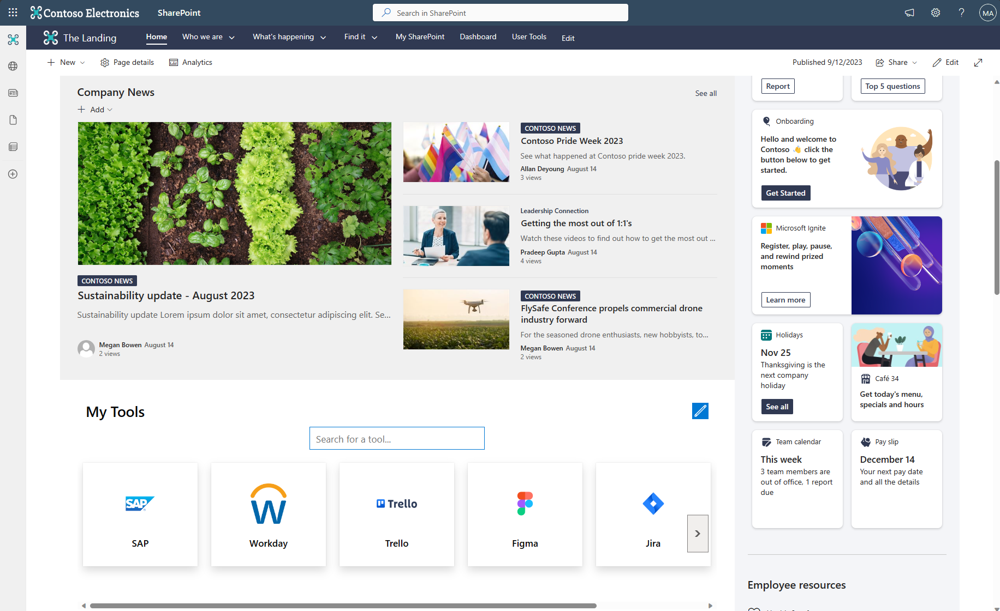
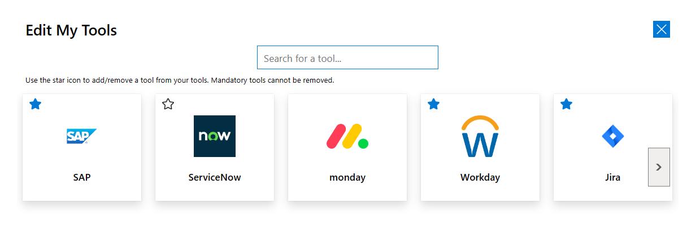
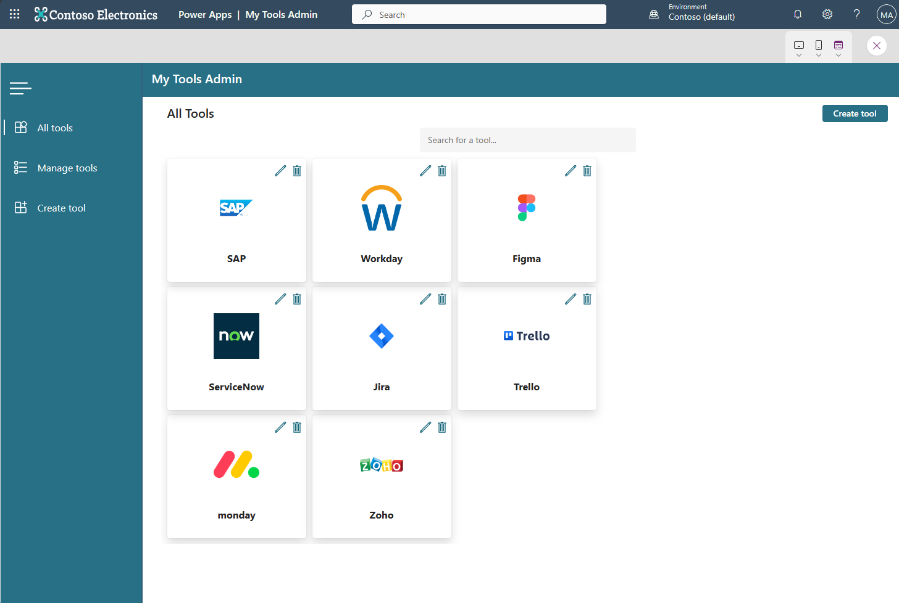
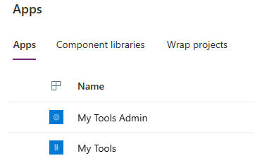
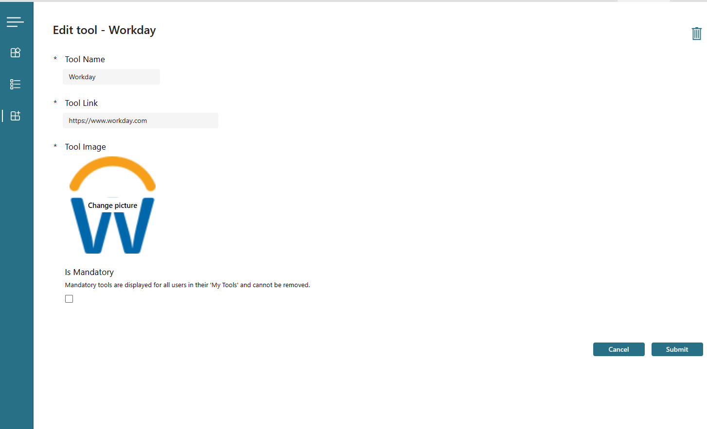
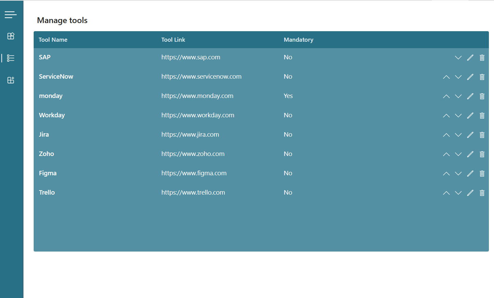

# SharePoint 'My Tools' Power App Solution

## Summary

This is a proof of concept Power Apps solution that was designed to be embedded within a SharePoint site/page as a Web Part. It is designed to provide the user with a customizable list of 'Tools' (known as 'My Tools') which are typically line of business systems that an organization uses and are provided as URLs. 

Through this toolbox, users can get quick access to apps they use frequently in their day to day work. This kind of solution works best when embedded within Intranet sites/Viva Connections.

This was created to fill a gap in SharePoint/Viva Connections and as an alternative to a custom developed SPFx solution. 

The use of a low code/no code Power App means there is no need for custom development.

The look and feel has been designed to replicate that of the out of the box Web Part.

The 'My Tools' end user app is fully responsive so can still render on a SharePoint page on a mobile device.

The solution also includes an 'Admin' Power App which is a separate canvas app, this admin app (typically designed to be accessed through Microsoft Teams or the Power Apps portal) provides a front end for managing tools.

Tools can be marked as 'mandatory' which means all users see the tool by default and it cannot be removed from their list.

The solution is functionally complete but is provided as a POC for you to customise/extend as required.

The end user app uses classic controls and the admin app uses a mix of the new modern controls and classic controls. The admin app is styled using the new Power Apps 'themes' functionality and can be changed simply by choosing a new theme.

The data source comprises of 2 SharePoint lists, one to store the tools and one to store the users and tools they have added to their toolbox. All queries in both Power Apps are delegable.

  







## Features

This sample app is a great way to learn some fundamental Power Apps concepts like:

* Branding out-of-the-box controls
* Creating and using components
* Working with SharePoint as a data source
* Using and creating dialog boxes
* Power Fx Formulas
* Working with local collections
* Building custom UIs
* Responsive design
* Using containers to build responsive layouts
* Working with modern controls

## Applies to

* [Microsoft Power Apps](https://docs.microsoft.com/powerapps/)
* [Microsoft Power Automate](https://docs.microsoft.com/en-us/power-automate/)

## Compatibility


## Authors

Solution|Author(s)
--------|---------
SharePoint My Tools Power App Solution | [Alex Clark](https://github.com/alexc-msft) ([@sharepointalex](https://www.twitter.com/sharepointalex) )

## Version history

Version|Date|Comments
-------|----|--------
1.0|Sep 11, 2023|Initial release

## Prerequisites
* SharePoint modern Team Site OR Communication Site
* Power Apps 'Creator kit' - https://learn.microsoft.com/en-us/power-platform/guidance/creator-kit/overview

### Using the sample

Follow the instructions below to deploy this sample to your tenant. Once deployed, the end user app (My Tools) is designed to be embedded within a SharePoint page.

I woild recommend using the 'Embed' Web Part and defining your own size. This works much better than the native Power Apps Web Part in terms of how it looks on the page. 

The recommended size is as follows:

Width: 1024px
Height: 340px

It is worth noting that the deployment instructions below assume a proficient level of knowledge of Power Apps and SharePoint Online.

All users who will use the solution will need a Power Apps 'seeded' license.

**Currently users cannot order their own tools, this is defined by the order set in the Admin app.**

## Data Sources
 
* SharePoint (for storing the tools and tools users have added to their toolbox)

## Minimal Path to Awesome

### Create supporting SharePoint lists

#### Tools

1. Create a new list named 'Tools' in your SharePoint site.
2. Create the following colummns:

***

Internal name: ToolName

Display name: Tool Name

Type: Single line of text


***


Internal name: ToolImage

Display name: Tool Image

Type: Image


***

Internal name: ToolLink

Display name: Tool Link

Type: Hyperlink

***

Internal name: IsMandatory

Display name: Is Mandatory

Type: Yes/No

Default value: No

***

Internal name: Order

Display name: Order

Type: Number

***

3. Edit the settings for the 'Title' field and set it to not required.

#### User Tools

1. Create a new list named 'UserTools' in your SharePoint site.
2. Rename the list and add a space so the name becomes 'User Tools'.
3. Create the following columns:

***

Internal name: ToolId

Display name: ToolId

Type: Number

***


Internal name: User

Display name: User

Type: Person or Group


***

3. Edit the settings for the 'Title' field and set it to not required.

### Import Power Apps solution

4. [Download](./solution/MyTools_1_0_0_0.zip) the unmanaged solution `.zip` file from the `solution` folder.

5. Import the Power Apps solution using **Solutions** > **Import solution** in the Power Apps portal. It is worth noting that the solution does not use environment variables at the time of writing due to a bug with SharePoint list environment variables where image columns are used.

6. Edit both the 'My Tools' and 'My Tools Admin' Apps and update the data sources - you will need to remove the 2 SharePoint lists from the data sources pane and re-add them. They may appear that they are pointing correctly but they will be pointing at the tenant the app was exported from. Simply remove them, point to your SharePoint site and add the 2 lists again.

7. Update the color in the OnStart event to match your SharePoint branding. Locate the below formula and update the hex code. This will update the colors in the app.

`
Set(
    gblMyToolsColor,
    "#0078d4"
);
`

8. Save and publish both Apps. 

9. Get the unique Id for the 'My Tools' Power App from your tenant - Navigate to the Power Apps portal, select the app and click 'Details' on the menu bar. Copy the 'App ID' value.

10. Embed the app in a SharePoint page. You can use the following embed code, replace the GUID after /apps/ with the Id you copied above. Feel free to change the size as you see fit.

`<iframe width="1024px" height="340px" src="https://web.powerapps.com/webplayer/iframeapp?source=iframe&amp;screenColor=rgba(104,101,171,1)&amp;appId=/providers/Microsoft.PowerApps/apps/6cfd9913-5dac-48f8-b096-520fdf9ece6c"></iframe>`

11. Republish your SharePoint page.

12. Share the app with ALL users that have access to/will use your SharePoint site.

13. Share the SharePoint lists with the same users as above, users need READ access to the 'Tools' list and READ/WRITE access to the 'User Tools' list. Admins will need WRITE access to both lists.

### How to use the solution

#### Creating, editing and deleting tools

Tools can be created, edited and deleted using the Admin app. Simply launch the admin app through Power Apps OR add the admin app to Teams and roll this out to admins.

The admin app is fairly self explanatory and consists of 3 screens:

- All Tools - View of all tools with options to Edit, Delete and search for tools.
- Manage Tools - Table view of all tools with options to Edit, Delete and change the order of tools. Changing the order of tools affects the order that they display to users.
- Create tool - Allows you to create a new tool using a simple form. 

Tools marked as mandatory will appear for all users in their toolbox even if they have not added it (they cannot remove mandatory tools).

  

 

#### End user app

Users can add/remove tools from their toolbox by clicking the 'Edit' icon. The star icon allows users to add/remove tools from their toolbox. Mandatory tools do not display this icon.

Users can search for tools using the searchbox in both 'Edit' mode and 'View' mode.

Clicking the tile for a tool launches the URL configured for the tool in a new window.

Tools are displayed in a horizontal gallery format and can be scrolled.

## Using the Source Code

You can also use the [Power Apps CLI](https://docs.microsoft.com/powerapps/developer/data-platform/powerapps-cli) to pack the source code by following these steps:

* Clone the repository to a local drive
* Pack the source files back into `.msapp` file:
  ```bash
  pac canvas pack --sources pathtosourcefolder --msapp pathtomsapp
  ```
  Making sure to replace `pathtosourcefolder` to point to the path to this sample's `sourcecode` folder, and `pathtomsapp` to point to the path of this solution's `.msapp` file (located under the `solution` folder)
* Use the `.msapp` file using **File** > **Open** > **Browse** in Power Apps Studio.
* Note - Packaging the source code and opening the app this way will not import the linked flows.

## Disclaimer

**THIS CODE IS PROVIDED *AS IS* WITHOUT WARRANTY OF ANY KIND, EITHER EXPRESS OR IMPLIED, INCLUDING ANY IMPLIED WARRANTIES OF FITNESS FOR A PARTICULAR PURPOSE, MERCHANTABILITY, OR NON-INFRINGEMENT.**

## Support

While we don't support samples, if you encounter any issues while using this sample, you can [create a new issue](https://github.com/pnp/powerapps-samples/issues/new?assignees=&labels=Needs%3A+Triage+%3Amag%3A%2Ctype%3Abug-suspected&template=bug-report.yml&sample=sharepoint-mytools&authors=@alexc-msft&title=sharepoint-mytools%20-%20).

For questions regarding this sample, [create a new question](https://github.com/pnp/powerapps-samples/issues/new?assignees=&labels=Needs%3A+Triage+%3Amag%3A%2Ctype%3Abug-suspected&template=question.yml&sample=sharepoint-mytools&authors=@alexc-msft&title=sharepoint-mytools%20-%20).

Finally, if you have an idea for improvement, [make a suggestion](https://github.com/pnp/powerapps-samples/issues/new?assignees=&labels=Needs%3A+Triage+%3Amag%3A%2Ctype%3Abug-suspected&template=suggestion.yml&sample=sharepoint-mytools&authors=@alexc-msft&title=sharepoint-mytools%20-%20).


