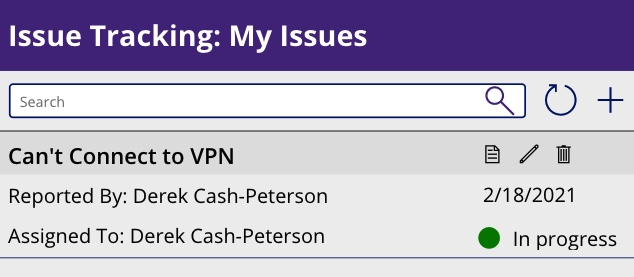
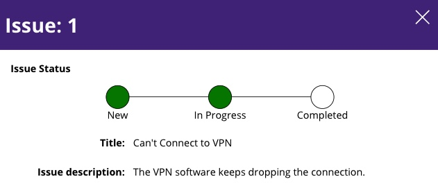
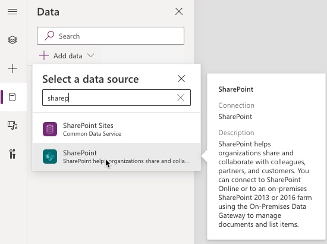
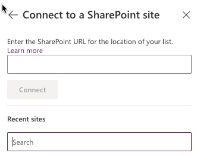
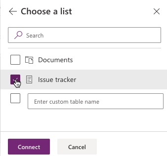

# Status Indicator

## Summary

This sample shows how to add a status indicator in a display form. This uses a train stop style user interface to show a progression of a status field from New to Completed. It provides the user with visibility into the status of their request providing a better experience for them.

### Home Screen

### Display Screen

## Applies to

* [Microsoft Power Apps](https://docs.microsoft.com/powerapps/)

## Compatibility

## Authors

Solution|Author(s)
--------|---------
Status-Indicator-PowerApp | [Derek Cash-Peterson](https://github.com/dcashpeterson) ([@spdcp](https://twitter.com/spdcp))

## Version history

Version|Date|Comments
-------|----|--------
1.0|February 24, 2021|Initial release

## Features

This sample demonstrates the following concepts:

* Showing a status indicator in a display form
* Uses a "train stop" style user interface to show a progression of a status

## Data Sources

This app uses SharePoint as a data source and requires a single issues list created from the SharePoint Lists **Issues Template**.

### Create New SharePoint data connection

1. In the **data** tab select **Add data** and type **SharePoint** in the search bar.  

2. Enter the url of the list where the **Issue tracker** list was created.  

3. Select **Issue tracker** from the listing of lists in the site and hit **Connect**.  

## Minimal Path to Awesome

* [Download](https://github.com/pnp/powerapps-samples/blob/main/samples/status-indicator/solution/Status-Indicator.msapp) the `.msapp` from the `solution` folder
* Use the `.msapp` file using **File** > **Open** > **Browse** within Power Apps Studio.
* Select the **Data** tab
* Delete **Issue tracker** from the list of data sources in the app
* Create a new SharePoint data source linked to the **Issue tracker** list in your environment
* Save and Publish

## Using the Source Code

  You can also use the [Power Apps Source Code tool](https://github.com/microsoft/PowerApps-Language-Tooling) to the code using these steps:

* Clone the repository to a local drive
* Pack the source files back into `.msapp` file:
  * [Power Apps Tooling Usage](https://github.com/microsoft/PowerApps-Language-Tooling)
* Use the `.msapp` file using **File** > **Open** > **Browse** in Power Apps Studio.

## Disclaimer

**THIS CODE IS PROVIDED *AS IS* WITHOUT WARRANTY OF ANY KIND, EITHER EXPRESS OR IMPLIED, INCLUDING ANY IMPLIED WARRANTIES OF FITNESS FOR A PARTICULAR PURPOSE, MERCHANTABILITY, OR NON-INFRINGEMENT.**

## Support

While we don't support samples, if you encounter any issues while using this sample, you can [create a new issue](https://github.com/pnp/powerapps-samples/issues/new?assignees=&labels=Needs%3A+Triage+%3Amag%3A%2Ctype%3Abug-suspected&template=bug-report.yml&sample=status-indicator&authors=@dcashpeterson&title=status-indicator%20-%20).

For questions regarding this sample, [create a new question](https://github.com/pnp/powerapps-samples/issues/new?assignees=&labels=Needs%3A+Triage+%3Amag%3A%2Ctype%3Abug-suspected&template=question.yml&sample=status-indicator&authors=@dcashpeterson&title=status-indicator%20-%20).

Finally, if you have an idea for improvement, [make a suggestion](https://github.com/pnp/powerapps-samples/issues/new?assignees=&labels=Needs%3A+Triage+%3Amag%3A%2Ctype%3Abug-suspected&template=suggestion.yml&sample=status-indicator&authors=@dcashpeterson&title=status-indicator%20-%20).

## For more information

- [Overview of creating apps in Power Apps](https://docs.microsoft.com/powerapps/maker/)
- [Power Apps canvas apps documentation](https://docs.microsoft.com/en-us/powerapps/maker/canvas-apps/)

