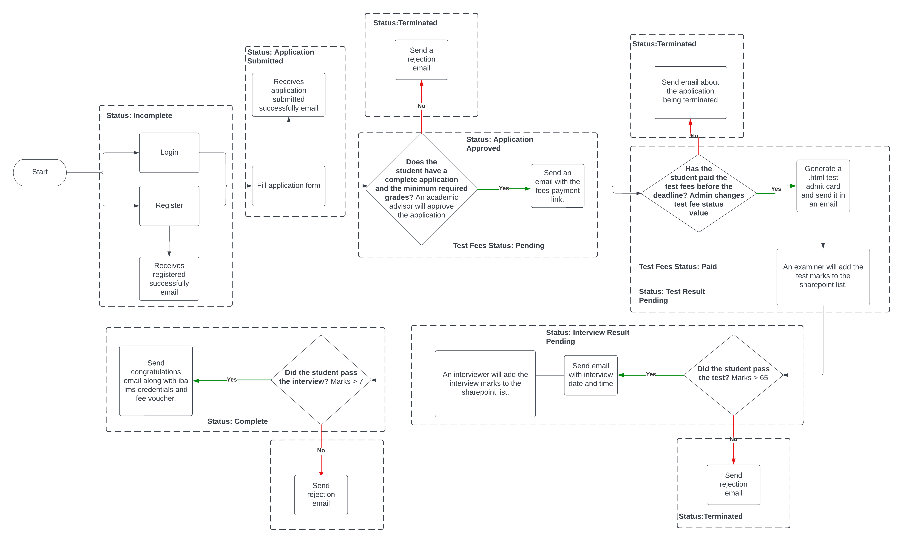
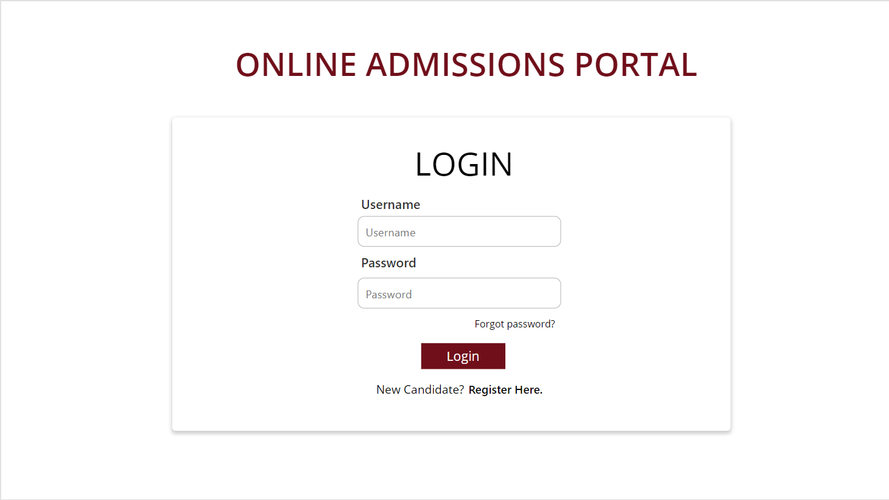
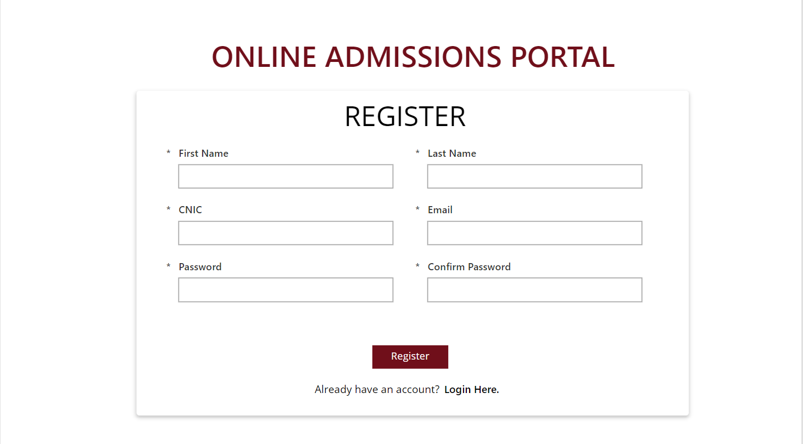
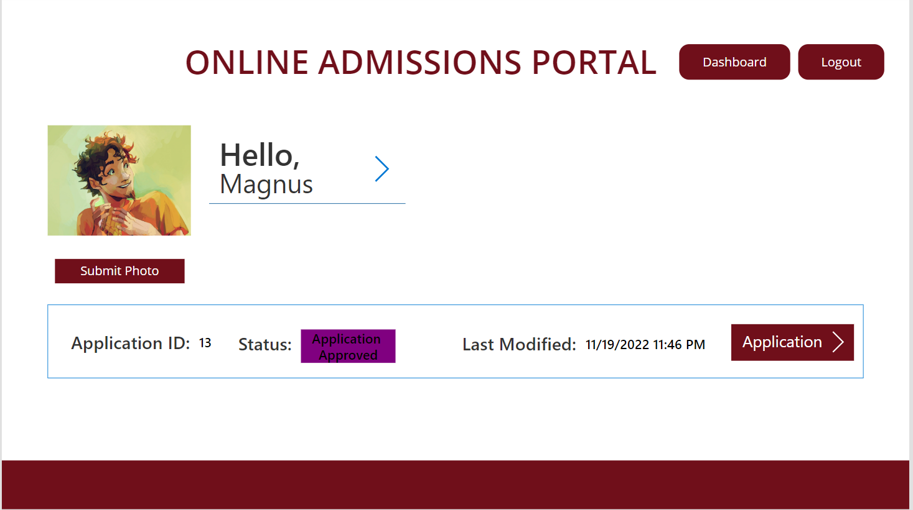


# Student Application Process
## Summary
This application is built for prospective students at a university/college. It allows them to register and apply for a program at the college/university by submitting relevant details and documents. 

By integrating Power Automate it becomes an end to end application where a student can submit an application and receive automatic emails regarding the status of their application. An admin approves the application and enters in test and interview scores. The student then receives the final email where they are either accepted or rejected into the university/college. You can find the entire application with the flows [here](https://drive.google.com/file/d/1DhIm47FtgJc2DvWGObuRVVE5kOLmsWuC/view?usp=sharing).

Flow of the application:


Login:


Register:


Dashboard:



## Applies to

* [Microsoft Power Apps](https://docs.microsoft.com/powerapps/)
* [Microsoft Power Automate](https://learn.microsoft.com/en-us/power-automate/)
* [Microsoft SharePoint]( https://learn.microsoft.com/en-us/sharepoint/dev/)

## Compatibility


## Authors

Solution|Author(s)
--------|---------
Student Application Process | [Samia Sohail Azim](https://github.com/sam-404), Institute of Business Administration

## Version history

Version|Date|Comments
-------|----|--------
1.0|December 4, 2022|Initial release

## Features
This sample illustrates the following concepts:

* A prospective student can register.
* A prospective student can login.
* They can fill in their personal details, academic details and essays.
* They can also upload documents.
* They can submit the form.
* Users can view the status of their profile and the Last Modified date on the dashboard
* Users can log out.

(If you're using the application with Power Automate flows):
* A user receives the following automatic emails: after successfully registering, reject/accept email after successfully completing the application and if accepted the email also contains the fee voucher for the examination test, reject/accept email regarding their test marks and if they are accepted the email contains interview date and time, reject/accept email regarding their interview marks and if they have secured admission the email contains credentials to login to the university's student portal.
* An admin can approve an application, enter test and interview marks through approval emails and cross check application with the student's documents.

## Prerequisites

You need to first register a user then only can you login.

## Data Sources
SharePoint List Used.

### UserList

This SharePoint list contains all the information of the student.  Set the list up as follows:

Enable the `ID` column in your SharePoint list by going to **+ Add Column** > Show/Hide Columns and ticking the box beside “ID”.

|Type|Internal Name|Required|Default Value|
|---|---|:---:|---|
|Single line of text|Title|No|Hello
|Choice|Status|No|
|Single line of text|CNIC|No|
|Single line of text|First Name|No|
|Single line of text|Last Name|No|
|Single line of text|Email|No|
|Single line of text|Password|No|
|Single line of text|Confirm Password|No|
|Single line of text|Address line 1|No|
|Single line of text|Address line 2|No|
|Single line of text|Address line 3|No|
|Number|Phone Number|No|
|Single line of text|City|No|
|Single line of text|Province/State|No|
|Number|Zipcode|No|
|Single line of text|Parent/Guardian Name|No|
|Single line of text|Parent/Guardian Phone No.|No|
|Single line of text|Parent/Guardian Relation|No|
|Choice|Gender|No|
|Choice|Country|No|
|Choice|Nationality|No|
|Date and Time|Date of Birth|No|
|Multiple lines of text|Essay 1|No|
|Multiple lines of text|Essay 2|No|
|Thumbnail|Student Picture|No|
|Choice|Preferred Major 1st Choice|No|
|Choice|Preferred Major 2nd Choice|No|
|Choice|High School Education|No|
|Single line of text|High School Name|No|
|Choice|College Education|No|
|Single line of text|College Name|No|
|Number|High School Equivalency|No|
|Number|College Equivalency|No|
|Choice|Test Fee Status|No|
|Number|Test Result|No|
|Number|Interview Result|No|

Choice values:
* Status: 
Incomplete
Test Result Pending
Interview Result Pending
Complete
Terminated
Application Submitted
Application Approved
* Gender:
Male
Female
Other
* Country and Nationality:
You can find a list of all countries [here](https://docs.google.com/spreadsheets/d/1wusfjmURFT_8TiF98ZNqc8V3mXhWkPzcNK2jI2RgIqI/edit?usp=sharing)
* Preferred Major 1st Choice and Preferred Major 2nd Choice:
Computer Science
Accounting & Finance
Business Administration
Social Sciences
Economics
Economics & Mathematics
* High School Education:
O Levels
Inter
Other
* College Education:
A Levels
Inter
Other
* Test Fees Status:
Pending
Paid
Done


## Minimal Path to Awesome

* [Download](./solution/studentApplicationProcess.msapp) the `.msapp` from the `solution` folder
* Within **Power Apps Studio**, use the `.msapp` file using **File** > **Open** > **Browse** and select the `.msapp` file you just downloaded.
* Select the **Data** tab
* Connect the app with the two SharePoint Lists created above.

## Using the Source Code

You can also use the [Power Apps CLI](https://docs.microsoft.com/powerapps/developer/data-platform/powerapps-cli) to pack the source code by following these steps::

* Clone the repository to a local drive
* Pack the source files back into `.msapp` file:
  ```bash
  pac canvas pack --sources pathtosourcefolder --msapp pathtomsapp
  ```
  Making sure to replace `pathtosourcefolder` to point to the path to this sample's `sourcecode` folder, and `pathtomsapp` to point to the path of this solution's `.msapp` file (located under the `solution` folder)
* Within **Power Apps Studio**, use the `.msapp` file using **File** > **Open** > **Browse** and select the `.msapp` file you just packed.

## Disclaimer

**THIS CODE IS PROVIDED *AS IS* WITHOUT WARRANTY OF ANY KIND, EITHER EXPRESS OR IMPLIED, INCLUDING ANY IMPLIED WARRANTIES OF FITNESS FOR A PARTICULAR PURPOSE, MERCHANTABILITY, OR NON-INFRINGEMENT.**

## Help

We do not support samples, but we this community is always willing to help, and we want to improve these samples. We use GitHub to track issues, which makes it easy for  community members to volunteer their time and help resolve issues.

If you encounter any issues while using this sample, you can [create a new issue](https://github.com/pnp/powerapps-samples/issues/new?assignees=&labels=Needs%3A+Triage+%3Amag%3A%2Ctype%3Abug-suspected&template=bug-report.yml&sample=YOURSAMPLENAME&authors=@YOURGITHUBUSERNAME&title=YOURSAMPLENAME%20-%20).

For questions regarding this sample, [create a new question](https://github.com/pnp/powerapps-samples/issues/new?assignees=&labels=Needs%3A+Triage+%3Amag%3A%2Ctype%3Abug-suspected&template=question.yml&sample=YOURSAMPLENAME&authors=@YOURGITHUBUSERNAME&title=YOURSAMPLENAME%20-%20).

Finally, if you have an idea for improvement, [make a suggestion](https://github.com/pnp/powerapps-samples/issues/new?assignees=&labels=Needs%3A+Triage+%3Amag%3A%2Ctype%3Abug-suspected&template=suggestion.yml&sample=YOURSAMPLENAME&authors=@YOURGITHUBUSERNAME&title=YOURSAMPLENAME%20-%20).

## For more information

- [Overview of creating apps in Power Apps](https://docs.microsoft.com/powerapps/maker/)
- [Power Apps canvas apps documentation](https://docs.microsoft.com/en-us/powerapps/maker/canvas-apps/)


