# Teams team Request Form

## Summary

This sample helps standardize the process of creating teams, especially for enterprise companies with limited user permissions to create Microsoft Teams teams. With the Power Apps Canvas app (build using Power Apps for Teams), you can implement a clear process for managing users' requests to create teams in Microsoft Teams. The included Power Automate flow automatically hendles all steps to create a team and channels. All request's information is stored in the SharePoint list.

## Applies to

* [Microsoft Power Apps](https://docs.microsoft.com/powerapps/)
* [Microsoft Power Automate](https://docs.microsoft.com/power-automate/)

## Compatibility

> Don't worry about this section, we'll take care of it. Unless you really want to...

## Authors

Solution|Author(s)
--------|---------
Teams-team-request-form | [Katerina Chernevskaya](https://github.com/Katerina-Chernevskaya) ([LinkedIn](https://www.linkedin.com/in/katerinachernevskaya/)), Awara IT Academyy

## Version history

Version|Date|Comments
-------|----|--------
1.0|April 17, 2023|Initial release

## Features

This sample illustrates the following concepts:

* Multi-step form created using Power Apps for Teams to easily maintain user acces to the app
* Responsive design of the Power Apps Canvas app allows convinient work on different devices
* Storing rich text for the welcome message that allows to use formatting and emoji
* Power Automate flow triggered automaticcaly when the data submited from Power Apps Canvas app; the flow creates a new team in Microsoft Teams using information submitted using the Power Apps Canvas app

## Prerequisites

* If your tenant has restrictions on creating teams in Microsoft Teams for users, you must have an Azure AD Premium license and be a member of the security group whose members are allowed to create teams. Please follow [this](https://learn.microsoft.com/en-us/microsoft-365/solutions/manage-creation-of-groups?view=o365-worldwide) guide to assign the license and configure the group.
* A team in Microsoft Teams where the sample will be installed. Provision the Dataverse for Teams in this team in advance. 
*Please note that members of this group will be able to submit request for the new team creation and these requests will be completed automatically by the Power Automate flow (the part of the solution).*
* A SharePoint list created in the SharePoint site for the team mentioned above. Please see details about columns below.

## Solution Components

The following solution components are used in this sample:

* New Team Request (Canvas app)
* Create a new Team per request (Cloud flow)

### MySample List

This SharePoint list contains stores request's information and uses in the cloud flow.
Set the list up as follows:

* Go to the SharePoint site created for your Microsoft Teams' team.
* On the `Home` page click `New`, select `List` in the dropdown menu and on the pop-up window choose `Blank list`. 

* Type the name for your new list: `TeamsRequest`
* Add 9 columns to your list:

|Type|Internal Name|Required|
|---|---|---|
|Multiple lines of text|Description|No|
|Single line of text|Kind|No|
|Person or Group|Requestor|No|
|Person or Group (allow multiple selections)|Participants|No|
|Single line of text|ParticipantsText|No|
|Multiple lines of text (Specify the type of text to allow: Rich text)|WelcomeMessage|No|
|Single line of text|Channel1|No|
|Single line of text|Channel2|No|
|Single line of text|Channel3|No|

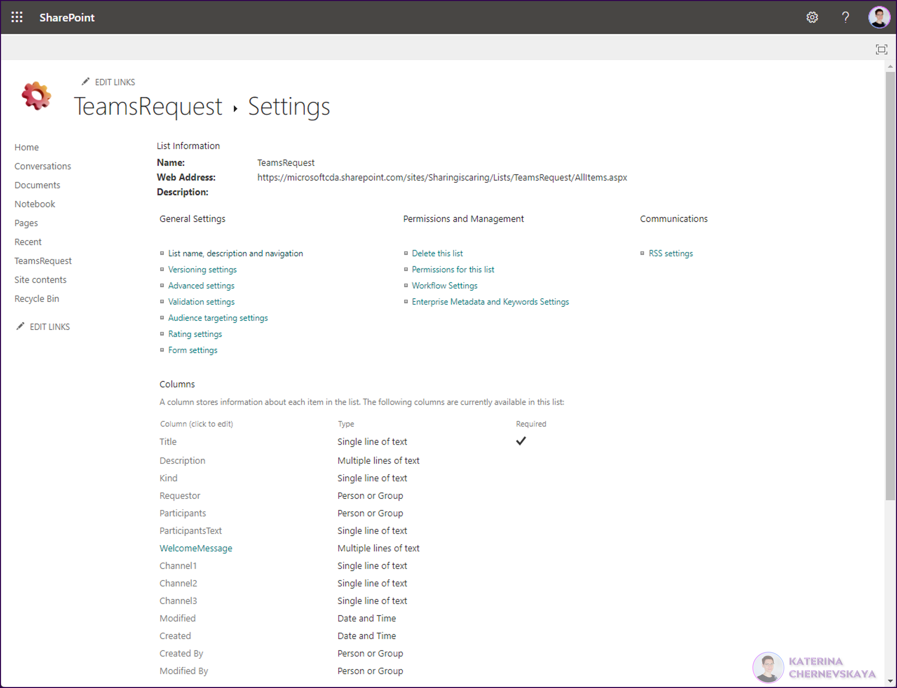

## Minimal Path to Awesome

* Download the `.zip` from the `solution` folder
* Open `Power Apps` app in Microsoft Teams, choose the team where you would like to install the solution and click `Import your solution`
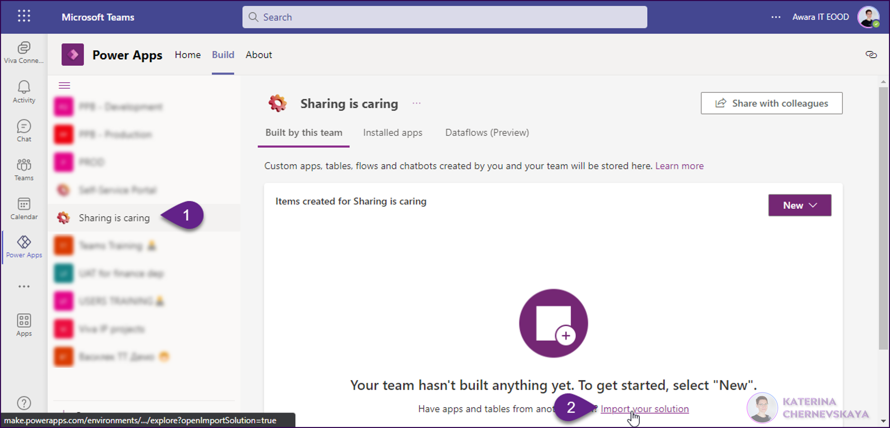
* Click `Browse` and select the solution you downloaded, then click `Next`
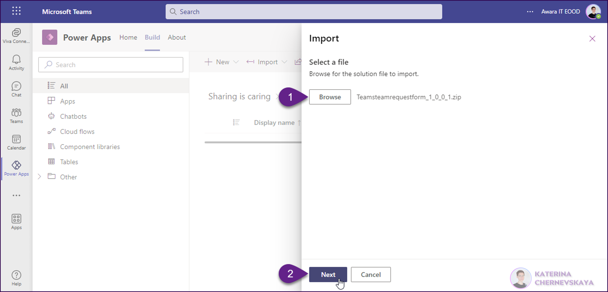
* On the next screen click `Import`
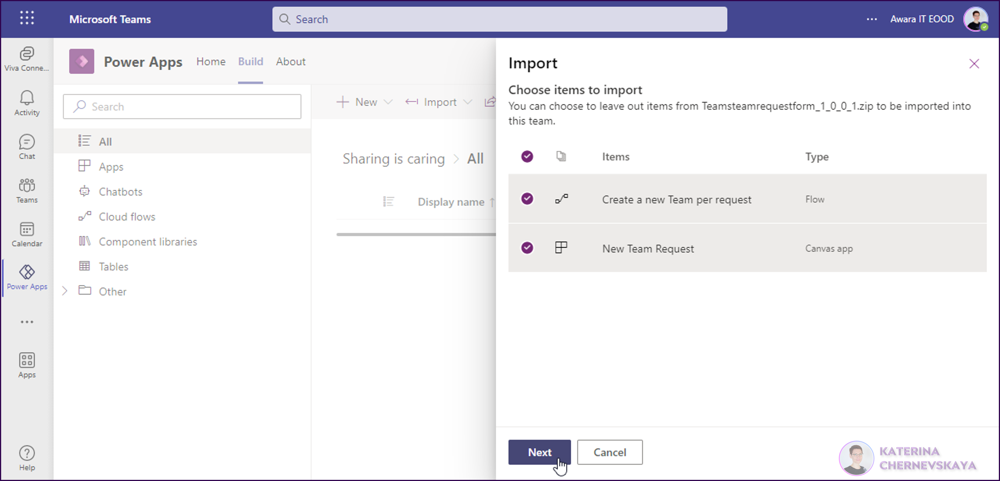
* Once the import will be completed go to `Cloud flows` tab, click on three dots near to the `Create a new Team per request` flow and select `Edit`
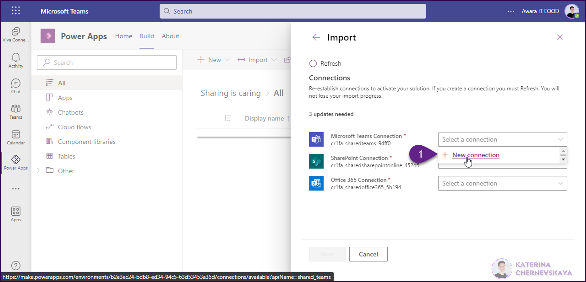
*Please note that after import you can see a warning message about missing connections. We will resolve this in the next steps.*

* Expand the first step (SharePoint trigger) and click `New connection reference`. Provide your credentials for the connection if needed
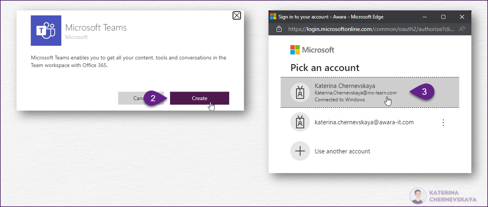
* Once the connection will be created change the Site Address and the List Name
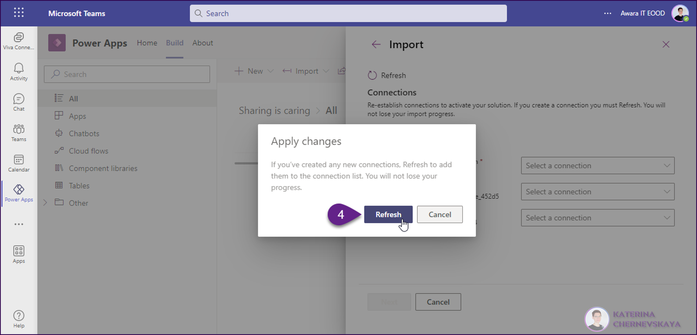
* Repeat configuration connection step for the all actions in the flow which are marked with the yellow triangle
* On the last step `Send an email (V2)` switch to the `Code view` and check that the link has the same code as shown on the image below. Edit if needed. Once everything is ok - click `Save`
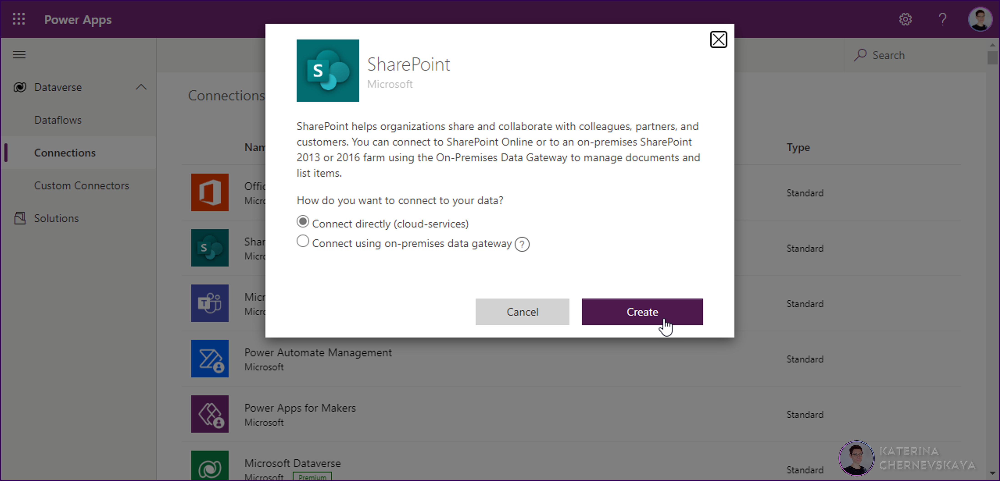
* Click on three dots near to the `New Team Request` Canvas App and select `Edit`
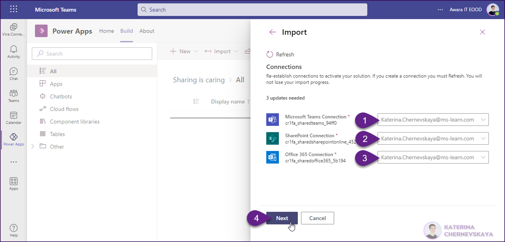
* On the next screen click `Allow`
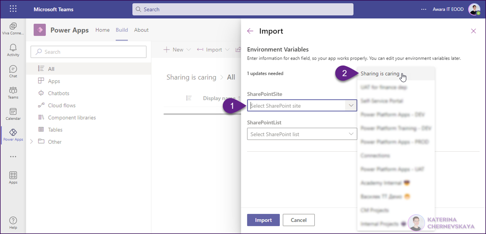
* Replace the SharePoint datasource: remove existing and add yours, select your SharePint site and list
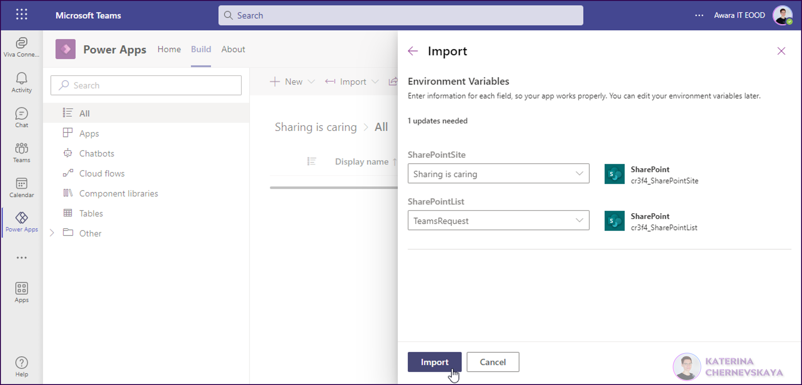
* Save, publish and pin the app in your team
* Go back to your solution, select the cloud flow `Create a new Team per request` and click on `Turn on`
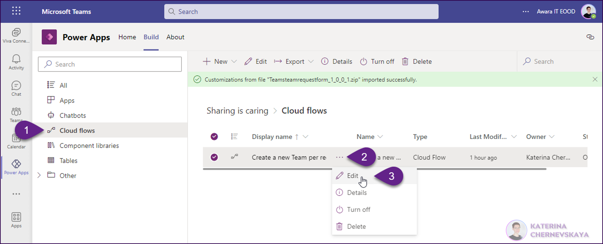

Once all steps will be completed users will be able to use this app to submit requests for team creation in Microsoft Teams, even if they don't have permissions to create a team manually in Microsoft Teams.

## Disclaimer

**THIS CODE IS PROVIDED *AS IS* WITHOUT WARRANTY OF ANY KIND, EITHER EXPRESS OR IMPLIED, INCLUDING ANY IMPLIED WARRANTIES OF FITNESS FOR A PARTICULAR PURPOSE, MERCHANTABILITY, OR NON-INFRINGEMENT.**

## Help

> Note: don't worry about this section, we'll update the links.

We do not support samples, but we this community is always willing to help, and we want to improve these samples. We use GitHub to track issues, which makes it easy for  community members to volunteer their time and help resolve issues.

If you encounter any issues while using this sample, you can [create a new issue](https://github.com/pnp/powerapps-samples/issues/new?assignees=&labels=Needs%3A+Triage+%3Amag%3A%2Ctype%3Abug-suspected&template=bug-report.yml&sample=YOURSAMPLENAME&authors=@YOURGITHUBUSERNAME&title=YOURSAMPLENAME%20-%20).

For questions regarding this sample, [create a new question](https://github.com/pnp/powerapps-samples/issues/new?assignees=&labels=Needs%3A+Triage+%3Amag%3A%2Ctype%3Abug-suspected&template=question.yml&sample=YOURSAMPLENAME&authors=@YOURGITHUBUSERNAME&title=YOURSAMPLENAME%20-%20).

Finally, if you have an idea for improvement, [make a suggestion](https://github.com/pnp/powerapps-samples/issues/new?assignees=&labels=Needs%3A+Triage+%3Amag%3A%2Ctype%3Abug-suspected&template=suggestion.yml&sample=YOURSAMPLENAME&authors=@YOURGITHUBUSERNAME&title=YOURSAMPLENAME%20-%20).

## For more information

- [Overview of creating apps in Power Apps](https://docs.microsoft.com/powerapps/maker/)
- [Power Apps canvas apps documentation](https://docs.microsoft.com/en-us/powerapps/maker/canvas-apps/)

