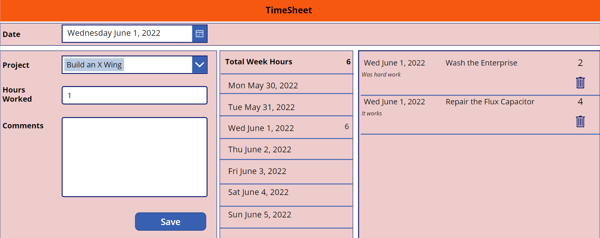

# Title of the sample
Timesheet using Dataverse

## Summary

Short summary on functionality and used technologies.

A Power App made for user work timesheets. The app is made up of 3 core components

- Dataverse – Where all the data is stored
- Model Driven App – Manage the Timesheet administration. e.g. Entering new projects
- Canvas App – Where each user enters their time against a project

## Applies to

* [Microsoft Power Apps](https://docs.microsoft.com/powerapps/)

## Compatibility

> Don't worry about this section, we'll take care of it. Unless you really want to...

## Authors

Darren Lutchner

Solution|Author(s)
--------|---------
folder name | [Author Name] https://github.com/Dlutchy ([@yourtwitterhandle] https://twitter.com/assist_365, 365 Assist

## Version history

Version|Date|Comments
-------|----|--------
1.0|June 01, 2022|Initial release

## Features

> Description of the sample with possible additional details than in short summary.

This sample illustrates the following concepts:

- Storing projects and timesheet data in Dataverse Tables.
- A Canvas App that allows timesheet entry against projects. Showing timesheet entries and summary for each day and total for a week.
- A Model Driven App for administrators where projects are created and timesheets managed.

## Data Sources

The data is stored in 2 Dataverse tables.
- Projects
- Timesheets

## Minimal Path to Awesome

* [Download](./solution/TimeSheetCommunityDemo_x_x_x_x.zip) the `.zip` from the `solution` folder
* Open **Power Apps Studio** (https://make.powerapps.com/)
* [Optional] Choose environment
* Go to Menu item **Solutions **
* Select **Import Solutions** 
* Browse for downloded '.zip' file. Select **Next**.
* Select **Import**

## Disclaimer

**THIS CODE IS PROVIDED *AS IS* WITHOUT WARRANTY OF ANY KIND, EITHER EXPRESS OR IMPLIED, INCLUDING ANY IMPLIED WARRANTIES OF FITNESS FOR A PARTICULAR PURPOSE, MERCHANTABILITY, OR NON-INFRINGEMENT.**

## Help

> Note: don't worry about this section, we'll update the links.

We do not support samples, but we this community is always willing to help, and we want to improve these samples. We use GitHub to track issues, which makes it easy for  community members to volunteer their time and help resolve issues.

If you encounter any issues while using this sample, you can [create a new issue](https://github.com/pnp/powerapps-samples/issues/new?assignees=&labels=Needs%3A+Triage+%3Amag%3A%2Ctype%3Abug-suspected&template=bug-report.yml&sample=YOURSAMPLENAME&authors=@YOURGITHUBUSERNAME&title=YOURSAMPLENAME%20-%20).

For questions regarding this sample, [create a new question](https://github.com/pnp/powerapps-samples/issues/new?assignees=&labels=Needs%3A+Triage+%3Amag%3A%2Ctype%3Abug-suspected&template=question.yml&sample=YOURSAMPLENAME&authors=@YOURGITHUBUSERNAME&title=YOURSAMPLENAME%20-%20).

Finally, if you have an idea for improvement, [make a suggestion](https://github.com/pnp/powerapps-samples/issues/new?assignees=&labels=Needs%3A+Triage+%3Amag%3A%2Ctype%3Abug-suspected&template=suggestion.yml&sample=YOURSAMPLENAME&authors=@YOURGITHUBUSERNAME&title=YOURSAMPLENAME%20-%20).

## For more information

- [Overview of creating apps in Power Apps](https://docs.microsoft.com/powerapps/maker/)
- [Power Apps canvas apps documentation](https://docs.microsoft.com/en-us/powerapps/maker/canvas-apps/)

