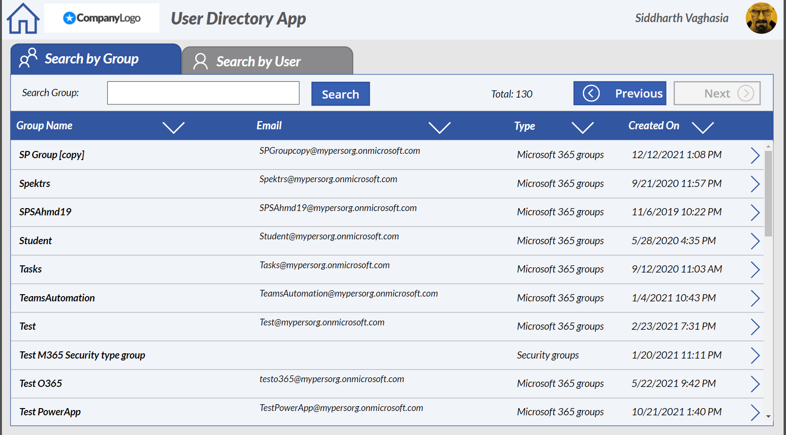
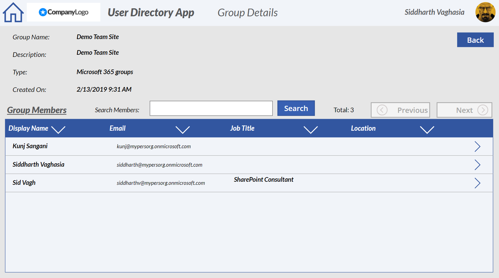
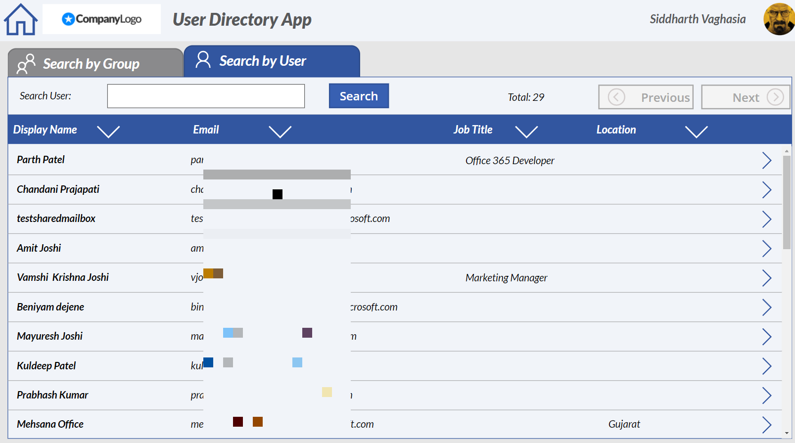

# Users and Groups Directory App Sample

## Summary
A custom connector and Graph API based PowerApp to which can be used as User and Group Directory. This app was meant to explore concept of consuming Graph API using custom connector.


Please use the [guide](https://siddharthvaghasia.com/2022/01/24/import-guide-for-user-and-group-directory-powerapp-sample/) in this repo to follow step by step instructions on how to setup in your tenant.

### Browse/Search Groups




### Group detail Screen



### Browse/Search Users



### User Detail Screen


## Applies to

* [Microsoft Power Apps](https://docs.microsoft.com/powerapps/)


## Compatibility


## Authors

Solution|Author(s)
--------|---------
user-group-directory | [Siddharth Vaghasia](https://github.com/siddharth-vaghasia) ([@siddh_me](https://twitter.com/siddh_me))


## Version history

Version|Date|Comments
-------|----|--------
1.0|Jan 24, 2022|Initial release

## Features/Brief

•	Browse/ search users and group from this App

•	Display Group detail and its information along with the all the users in the group

•	Display user and its information along with the groups the user is part of...

•	Ready to use Custom connector Open API definition to configure.

•	Explore the concept of using Graph API with custom connectors.

•	Step by step guidance on how to import the app in your tenant.


## Prerequisites

Permission to create Azure AD App Registration

Global Admin Access to provide admin consent

Premium license for user to use the app

## Data Sources
Graph API

### Custom Connector Swagger Definition

* [Swagger JSON file](solution/UserDirectoryGraphAPI.swagger.json)

## Minimal Path to Awesome

* Please use the [guide](https://siddharthvaghasia.com/2022/01/24/import-guide-for-user-and-group-directory-powerapp-sample/) in this repo to follow step by step instructions on how to setup in your tenant.


## Using the Source Code

You can also use the [Power Apps CLI](https://docs.microsoft.com/powerapps/developer/data-platform/powerapps-cli) to pack the source code by following these steps::

* Clone the repository to a local drive
* Pack the source files back into `.msapp` file:
  ```bash
  pac canvas pack --sources pathtosourcefolder --msapp pathtomsapp
  ```
  Making sure to replace `pathtosourcefolder` to point to the path to this sample's `sourcecode` folder, and `pathtomsapp` to point to the path of this solution's `.msapp` file (located under the `solution` folder)
* Within **Power Apps Studio**, use the `.msapp` file using **File** > **Open** > **Browse** and select the `.msapp` file you just packed.

## Disclaimer

**THIS CODE IS PROVIDED *AS IS* WITHOUT WARRANTY OF ANY KIND, EITHER EXPRESS OR IMPLIED, INCLUDING ANY IMPLIED WARRANTIES OF FITNESS FOR A PARTICULAR PURPOSE, MERCHANTABILITY, OR NON-INFRINGEMENT.**

## Help

We do not support samples, but we this community is always willing to help, and we want to improve these samples. We use GitHub to track issues, which makes it easy for  community members to volunteer their time and help resolve issues.

If you encounter any issues while using this sample, you can [create a new issue](https://github.com/pnp/powerapps-samples/issues/new?assignees=&labels=Needs%3A+Triage+%3Amag%3A%2Ctype%3Abug-suspected&template=bug-report.yml&sample=YOURSAMPLENAME&authors=@siddharth-vaghasia&title=user-group-directory).

For questions regarding this sample, [create a new question](https://github.com/pnp/powerapps-samples/issues/new?assignees=&labels=Needs%3A+Triage+%3Amag%3A%2Ctype%3Abug-suspected&template=question.yml&sample=YOURSAMPLENAME&authors=@siddharth-vaghasia&title=user-group-directory).

Finally, if you have an idea for improvement, [make a suggestion](https://github.com/pnp/powerapps-samples/issues/new?assignees=&labels=Needs%3A+Triage+%3Amag%3A%2Ctype%3Abug-suspected&template=suggestion.yml&sample=YOURSAMPLENAME&authors=@siddharth-vaghasia&title=user-group-directory).

## For more information

- [Overview of creating apps in Power Apps](https://docs.microsoft.com/powerapps/maker/)
- [Power Apps canvas apps documentation](https://docs.microsoft.com/en-us/powerapps/maker/canvas-apps/)


